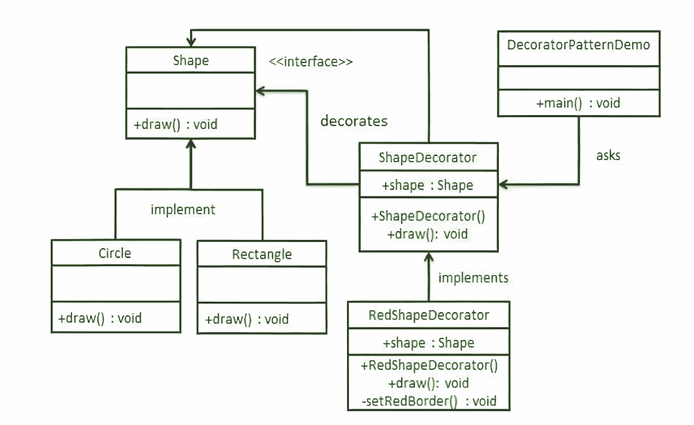

# Java 中的装饰器设计模式，示例

> 原文:[https://www . geesforgeks . org/decorator-design-pattern-in-Java-with-example/](https://www.geeksforgeeks.org/decorator-design-pattern-in-java-with-example/)

装饰器设计模式允许我们向对象动态添加功能和行为，而不影响同一类中其他现有对象的行为。我们使用继承来扩展类的行为。这发生在编译时，该类的所有实例都获得扩展行为。

*   装饰模式允许用户在不改变现有对象结构的情况下向其添加新功能。所以，对原来的类没有改变。
*   装饰器设计模式是一种结构模式，它为现有的类提供包装。
*   装饰器设计模式使用抽象类或组合接口来实现包装器。
*   装饰器设计模式创建装饰器类，它包装原始类，并通过保持类方法的签名不变来提供额外的功能。
*   装饰器设计模式最常用于应用单一责任原则，因为我们将功能划分为具有独特关注领域的类。
*   装饰者设计模式在结构上几乎类似于责任链模式。

> 要记住的要点
> 
> 1.  装饰器设计模式有助于提供运行时修改能力，因此更加灵活。当选择较多时，易于维护和扩展。
> 2.  装饰者设计模式的缺点是它使用了大量相似类型的对象(装饰者)
> 3.  装饰器模式在 [Java IO 类](https://www.geeksforgeeks.org/java-io-packag/)中大量使用，比如 [FileReader](https://www.geeksforgeeks.org/different-ways-reading-text-file-java/) 、[buffere reader](https://www.geeksforgeeks.org/java-io-bufferedreader-class-java/)、[T7】等。](https://www.geeksforgeeks.org/java-io-bufferedreader-class-java/)

**程序:**

1.  创建一个接口。
2.  创建实现相同接口的具体类。
3.  创建实现上述相同接口的抽象装饰器类。
4.  创建一个具体的装饰器类来扩展上面的抽象装饰器类。
5.  现在使用上面创建的具体装饰器类来装饰接口对象。
6.  最后，验证输出

**实施:**

我们将创建一个形状接口和实现该形状接口的具体类。然后，我们将创建一个抽象装饰器类 ShapeDecorator，实现 Shape 接口，并将 Shape 对象作为其实例变量。

1.  “Shape”是接口的名称
2.  “矩形”类和“圆形”类将是实现“形状”接口的具体类。
3.  “ShapeDecorator”是我们实现相同“Shape”接口的抽象 Decorator 类。
4.  RedShapeDecorator 是一个实现 ShapeDecorator 的具体类。
5.  装饰或图案装饰，我们的演示类将使用红色形状装饰器来装饰形状对象。



**步骤 1:** 创建一个名为“形状”的界面

**例**

## Java 语言(一种计算机语言，尤用于创建网站)

```java
// Interface named Shape
// Shape.java
public interface Shape {
    void draw();
}
```

**步骤 2:** 创建实现相同接口的具体类。Rectangle.java 和 Circle.java 如下

**例**

## Java 语言(一种计算机语言，尤用于创建网站)

```java
// Class 1
// Class 1 will be implementing the Shape interface

// Rectangle.java
public class Rectangle implements Shape {

    // Overriding the method
    @Override public void draw()
    {
        // /Print statement to execute when
        // draw() method of this class is called
        // later on in the main() method
        System.out.println("Shape: Rectangle");
    }
}
```