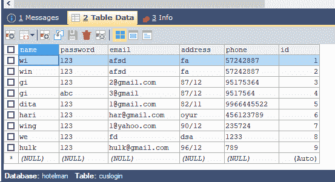
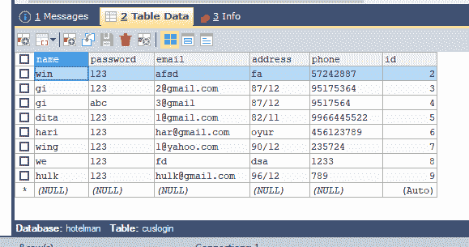

# 使用 JDBC 删除表格中的内容

> 原文:[https://www . geesforgeks . org/delete-contents-from-table-use-JDBC/](https://www.geeksforgeeks.org/delete-contents-from-table-using-jdbc/)

JDBC(Java 数据库连接)是 Java 编程语言和各种数据库(如 Oracle、SQL、PostgreSQL 等)之间的标准 API(应用程序接口)。它连接前端(用于与用户交互)和后端(用于存储数据)。

**进场:**

**1。** **CREATE DATABASE:** 使用 sqlyog 创建一个数据库，在其中创建一些表，并填充其中的数据，以便删除表的内容。例如，在这里，将数据库命名为“hotelman”，表名为“cuslogin”和“adminlogin”。以“cuslogin”表为例。

 

**2。** **CREATE CONNECTION:** 打开 Netbeans，创建一个新包。在包中，打开一个新的 java 文件，键入下面的 JDBC 连接代码，并用 connection.java 保存文件名。

## Java 语言(一种计算机语言，尤用于创建网站)

```java
// Create JDBC Connection
import java.sql.*;

public class connection {

    Connection con = null;

    public static Connection connectDB()

    {

        try {

            Class.forName("com.mysql.jdbc.Driver");

            Connection con = DriverManager.getConnection(
                "jdbc:mysql://localhost:3306/hotelman",
                "root", "1234");
            // here,root is the username and 1234 is the
            // password,you can set your own username and
            // password.
            return con;
        }
        catch (SQLException e) {

            System.out.println(e);
        }
    }
}
```

**3。删除表格中的内容:**从 id 为 1 的“cuslogin”表格中删除客户详细信息。

1.  用 sql 查询初始化一个字符串，如下所示
    字符串 sql=“从 cuslogin 中删除，其中 id=1 ”;
2.  初始化 Connection 类的以下对象，准备好 Statement 类(jdbc 需要的)并与数据库连接如下
    Connection con = null；
    prepared statement p = null；
    con = connection . connectdb()；
3.  现在，在 prepareStatement 内部添加步骤 3.1 的 sql 查询，执行如下
    p = con . prepare statement(SQL)；
    p . execute()；
4.  在同一个包中打开一个新的 java 文件(这里是 result.java)，并输入完整的代码(如下所示)，从表“cuslogin”中删除 id 为 1 的客户的详细信息。

**注意:**result.java 和 connection.java 这两个文件应该在同一个包中，否则程序不会给出想要的输出！！

## Java 语言(一种计算机语言，尤用于创建网站)

```java
/*package whatever //do not write package name here */
import java.sql.*;
public class result {

    public static void main(String[] args)
    {
        Connection con=null;
        PreparedStatement p=null;
        con=connection.connectDB();
        try{
            String sql="delete from cuslogin where id=1";
             p =con.prepareStatement(sql);
             p.execute();
        }catch(SQLException  e){
            System.out.println(e);

        }
    }

}
```

**输出:**



id 为 1 的客户已被删除。