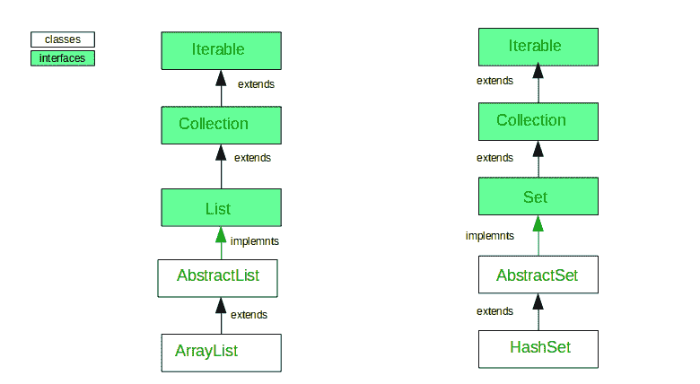

# Java 中数组列表和 HashSet 的区别

> 原文:[https://www . geesforgeks . org/ArrayList-and-hashset-in-Java/](https://www.geeksforgeeks.org/difference-between-arraylist-and-hashset-in-java/)之间的差异

以下是数组列表和哈希集之间的一些区别。

1.  **传承:**
    
2.  **实现:**
    实现:ArrayList 实现 List 接口，而 HashSet 在 Java 中实现 Set 接口。
3.  **内部实现:**
    ArrayList 由 Array 支持，而 HashSet 由 HashMap 支持。
4.  **重复:**
    数组列表允许重复值，而哈希集不允许重复值。
5.  **构造函数:**
    ArrayList 有三个构造函数，分别是 ArrayList()，ArrayList(int capacity)ArrayList(int Collection c)，而 HashSet 有四个构造函数，分别是 HashSet()，HashSet(int capacity)，HashSet(Collection c)和 HashSet(int capacity，float loadFactor)
6.  **排序:**
    ArrayList 维护插入它们的对象的顺序，而 HashSet 是一个无序集合，不维护任何顺序。
7.  **索引:**
    ArrayList 是基于索引的我们可以通过调用 get(index)方法来检索对象，也可以通过调用 remove(index)方法来移除对象，而 HashSet 是完全基于对象的。HashSet 也不提供 get()方法。
8.  **空对象:**
    数组列表不适用任何限制，我们可以添加任意数量的空值，而 HashSet 允许一个空值。
9.  **Syntax:**
    **ArrayList:-**ArrayList list=new ArrayList();

    哈希集:-

    HashSet set=new HashSet();

**数组列表示例**

```java
// Java program to demonstrate working of ArrayList in Java

import java.io.*;
import java.util.*;

class ArrayListTest {

    public static void main(String[] args)
        throws IOException
    {
        // size of ArrayList
        int n = 5;

        // declaring ArrayList with initial size n
        List<Integer> al = new ArrayList<>(n);

        // Appending the new element at the end of the list
        for (int i = 1; i <= n; i++) {
            al.add(i);
        }

        // Printing elements
        System.out.println(al);

        // Remove element at index 3
        al.remove(3);

        // Displaying ArrayList after deletion
        System.out.println(al);

        // Printing elements one by one
        for (int i = 0; i < al.size(); i++) {
            System.out.print(al.get(i) + " ");
        }
    }
}
```

**输出:**

```java
[1, 2, 3, 4, 5]
[1, 2, 3, 5]
1 2 3 5 

```

**HashSet 示例**

```java
// Java program to demonstrate working of HashSet

import java.util.HashSet;
import java.util.Set;

class HashSetDemo {

    public static void main(String[] args)
    {

        // Create a HashSet
        Set<Integer> hs = new HashSet<>();

        // add elements to HashSet
        hs.add(1);
        hs.add(2);
        hs.add(3);
        hs.add(4);

        // Duplicate removed
        hs.add(4);

        // Displaying HashSet elements
        for (Integer temp : hs) {
            System.out.print(temp + " ");
        }
    }
}
```

**输出:**

```java
1 2 3 4 

```