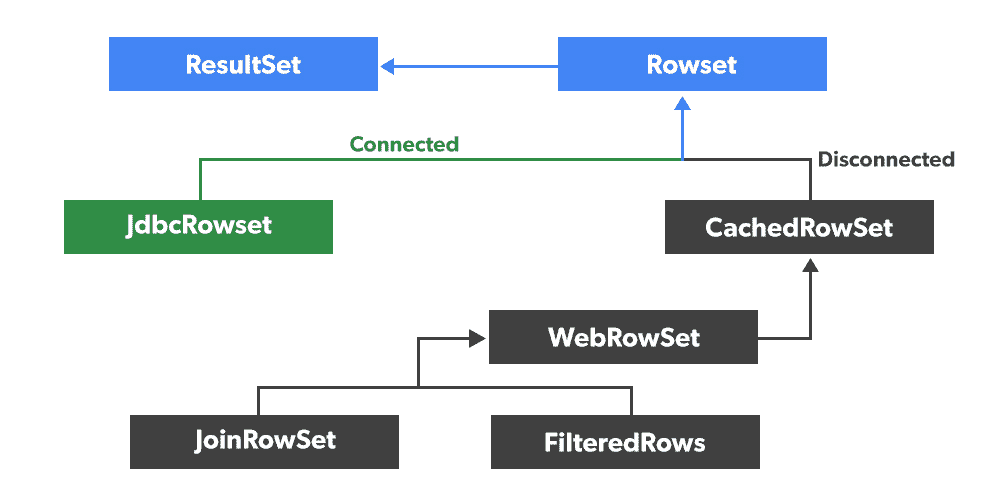

# Java JDBC 中连接行集和断开行集的区别

> 原文:[https://www . geesforgeks . org/connected-vs-disconnected-rowset-in-Java-JDBC/](https://www.geeksforgeeks.org/difference-between-connected-vs-disconnected-rowset-in-java-jdbc/)的区别

行集是结果集对象的包装。它可以连接到数据库，也可以从数据库断开，还可以序列化。它通过设置属性来维护一个 JavaBean 组件。您可以通过网络传递行集对象。默认情况下，行集对象是可滚动和可更新的。

此图将让您对结果集和行集类层次结构有更多的了解。找出哪个行集实现是连接的，哪个是断开的也很有用。您可以看到行集接口有两个主要的实现，连接的 JdbcRowSet 和断开的 CachedRowSet。



行集对象有两种类型，如下所示:

*   连接的行集
*   断开的行集

让我们如下讨论上述两种类型:

**类型 1:** 连接行集

连接的行集对象使用 JDBC 驱动程序连接到数据库。它与数据库建立连接，并执行所需的操作。连接将一直保持到行集对象关闭。

**类型 2:** 断开的行集

断开连接的行集对象仅在读取和写入数据库时连接到数据库。断开连接的行集对象在处理数据时不保持与数据库/数据源的连接，因此它独立运行。

断开连接的行集对象与连接的[行集对象](https://www.geeksforgeeks.org/what-is-rowset-in-java-jdbc/)几乎相同，只是它们是:

*   与连接的行集对象相比，重量更轻。
*   可序列化。
*   能够发送数据到轻量级客户端，如手机等。

JDBC 提供了四个类来表示断开连接的行集对象，如下所示:

1.  CachedRowSet
2.  网络浏览器
3.  JoinRowSet
4.  过滤器数据集

让我们详细讨论上面的每一个类，以了解它们的功能如下:

**第 1 类:CachedRowSet**

CachedRowSet 是断开的行集的基本实现。它连接到数据源，从中读取数据，断开与数据源的连接并处理检索到的数据，重新连接到数据源，并写入修改。

**第 2 类:网络行集:**

网络行集扩展了缓存行集。

**第 3 类:连接行集**

这能够将数据发送到轻量级客户端，如手机等。

**第 4 类:filteredowset:**

这使您能够减少行集中可见的行数。

现在进入偏心概念，以便找出连接行集和断开行集之间的区别

正如我们在上面已经提到的，连接和断开的行集之间的主要区别是，前者总是保持数据库连接，而后者不保持。它连接到数据库，获取数据，然后关闭连接。它们之间还有一些不同之处:

**1)** 断开的数据库只有在它们想要读或写时才连接到数据库，在它们与数据库断开的所有时间，另一方面，连接的数据库使 JDBC 连接始终保持活动状态。

**2)** 只有来自 JDBC 4.1 API 的 JdbcRowSet 是连接的，其余像 CachedRowSet、WebRowSet 都是断开连接的 RowSet 实现。

**3)** 断开的行集是可序列化的，这就是为什么适合通过网络发送的原因

此表很好地比较了 JDBC 应用编程接口中不同行集实现所支持的功能。

<figure class="table">

| 特征 | JdbcRowSet | cachedrowset | 网络浏览器 |
| --- | --- | --- | --- |
| 可滚动 | 不允许 | 不允许 | 不允许 |
| 可更新的 | 不允许 | 不允许 | 不允许 |
| 连接的 | 不允许 | 不允许 | 不允许 |
| 不连贯的 |   | 不允许 | 不允许 |
| 可序列化 |   | 不允许 | 不允许 |
| 生成 XML |   |   | 不允许 |
| 使用 XML |   |   | 不允许 |

</figure>

**Java 中的行集**

**实现:**我们将使用 RowSet 而不是 ResultSet 接口来检索员工的记录。到目前为止，您可能只看到一个 ResultSet 对象返回查询结果，但是从 JDBC 4.1 API，您可以使用 RowSet 实现的任何实现来查询数据库和检索结果。

*   在下面的 JDBC 示例中，我们将使用 JdbcRowSet 类。要创建 JdbcRowSet 的对象，需要一个 RowSetFactory，可以使用 RowSetProvider 的[***【new factory()】***](https://www.geeksforgeeks.org/what-is-rowset-in-java-jdbc/)方法创建。
*   一旦有了行集的对象，就可以通过调用它们各自的 setProperties()方法来传递数据库 URL、用户名和密码等配置详细信息，如 *setURL()、*T2】set username()和 *setPassword()* 。
*   配置完成后，是时候指定我们的 SQL SELECT Query 了，我们将使用一个名为***【setCommand()***的方法来提供查询。现在，您可以通过调用 execute()方法来执行查询。你注意到一个更干净简单的 API 了吗？
*   执行查询后，是时候检索数据了，这与您习惯于从 ResultSet 中调用各种 getXXX()方法非常相似。您只需要在 while 循环中通过检查 [*hasNext()方法*](https://www.geeksforgeeks.org/difference-between-next-and-hasnext-method-in-java-collections/) 并逐行获取数据来迭代行集。

**例**

## Java 语言(一种计算机语言，尤用于创建网站)

```
// Java Program to illustrate how to use RowSet,
// RowSetProvider, and RowSetFactory in JDBC

// Importing required classes
import java.sql.*;
import javax.sql.rowset.*;

// Main class
// RowSetDemo
public class GFG {

    // Main driver method
    public static void main(String[] args)
    {

        // Setting username and password to access database
        String url
            = "jdbc:mysql://localhost:3306/addressBook";
        String userName = "root";
        String password = "mysql123";

        // Try block to check for exceptions
        try {

            // Step 1: Create a factory object for rowset
            RowSetFactory rowSetFactory
                = RowSetProvider.newFactory();

            // Step 2: Creating a JDBC rowset object from
            // the factory
            JdbcRowSet rowSet
                = rowSetFactory.createJdbcRowSet();

            // Step 3: Setting connection properties
            rowSet.setUrl(url);
            rowSet.setUsername(userName);
            rowSet.setPassword(password);

            // Step 4: Setting SQL Query to execute
            rowSet.setCommand("SELECT * FROM contact");

            // Step 5: Executing an SQL query
            rowSet.execute();

            // Print and display the attributes
            System.out.println(
                "id \tName \tDepartment \tEmail \tSalary");

            // Iterating over RowSet object
            // using next() method
            while (rowSet.next()) {

                // Print and display all employee
                // attributes
                System.out.println(
                    rowSet.getInt("id") + "\t"
                    + rowSet.getString("name") + "\t"
                    + rowSet.getString("department") + "\t"
                    + rowSet.getString("email") + "\t"
                    + rowSet.getString("salary"));
            }
        }

        // Catch block to handle the exceptions
        catch (SQLException sqle) {

            // Display the exception along with line number
            // using printStackTrace() method
            sqle.printStackTrace();
        }
    }
}
```

**输出:**

```
Id      Name    Department      Email                   Salary
1       Jack    Sales           jack@bluechip.com       9000
2       Jill    Marketing       jill@bluechip.com       8000
3       Tom     Accounts        tom@bluechip.com        7000
```

> 从上面的输出可以清楚地看出，行集用于从数据库中检索数据，而不是结果集。