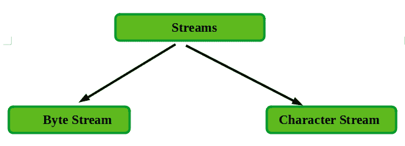
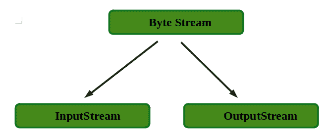
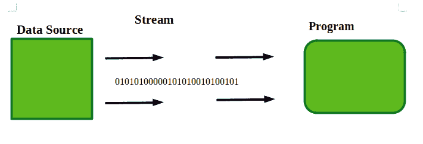

# Java 中输入流和输出流的区别

> 原文:[https://www . geesforgeks . org/Java 中输入流和输出流的区别/](https://www.geeksforgeeks.org/difference-between-inputstream-and-outputstream-in-java/)

一个**流**可以定义为数据的序列或者连续的数据流。流是处理输入/输出的一种清晰的方式。流有两种类型，如下所示:



在上图中，我们的输入流和输出流将驻留在字节流中。所以让我们讨论字节流。

**1。字节流:**字节流提供了一种处理字节输入和输出的便捷方式。字节流被进一步划分为不同的类，但是最上层的类描述如下:



**1.1 InputStream:**InputStream 是描述流输入的字节流的抽象类，用于读取，可以是文件、图像、音频、视频、网页等。没关系。因此，InputStream 一次从一个源项目中读取数据。



**1.2 OutputStream:**OutputStream 是描述流输出的字节流的抽象类，用于将数据写入文件、图像、音频等。因此，输出流一次向目标写入一个数据。


### 输入流和输出流的区别

<figure class="table">

| **InputStream** | 输出流 |
| --- | --- |
| 1.这是一个描述流输入的抽象类。 | 1.这是一个描述流输出的抽象类。 |
| 2.输入流一次从源中读取一次数据。 | 2.输出流一次将数据写入目标。 |
| 3.输入流由执行以下操作方法组成:

*   从输入流中读取下一个字节的数据，并在文件末尾返回-1:**公共抽象 int read()抛出 IOException**
*   关闭当前输入流:**公共 int 可用()抛出 IOException**
*   返回可从当前输入流中读取的字节数的估计值: **public void close()抛出 IOException**

 | 3.输出流由执行以下操作的方法组成:

*   向当前输出流写入一个字节:**公共无效写入(int)引发 IOException**
*   将字节数组写入当前输出流:**公共无效写入(字节[])引发 IOException**
*   刷新当前输出流:**公共无效刷新()引发 IOException**
*   关闭当前输出流。:**公共无效关闭()抛出 IOException**

 |
| 4.输入流的类型有:

*   文件输入流
*   字联传讯
*   FilterInputStream
*   ObjectInputStream

在这些类型中，最重要和最常用的类型是文件输入流。 | 4.输出流的类型有:

*   文件输出流
*   字节数组输出流
*   FilterOutputStream
*   ObjectOutputStream

在这些类型中，最重要和最常用的类型是文件输出流。 |

</figure>

### 输入流的程序:

在本程序中，文件 gfg.txt 由“GEEKSFORGEKS”**组成。**

**注意:**如果文件保存在保存 java 程序的相同位置，那么按照下面的程序操作。如果文件保存在某个特定的位置，那么写下细节。

```java
FileInputStream fileIn=new FileInputStream("C:\\gfg.txt"); 
```

## Java 语言(一种计算机语言，尤用于创建网站)

```java
// Imported to use methods
import java.io.FileInputStream;

// Main Class
public class InputStreamExample {
    public static void main(String args[])
    {
        // Reading from Source file
        try {
            FileInputStream fileIn
                = new FileInputStream("gfg.txt");
            int i = 0;
            while ((i = fileIn.read()) != -1) {
                System.out.print((char)i);
            }
            fileIn.close();
        }
        catch (Exception e) {
            System.out.println(e);
        }
    }
}
```

**输出:**

```java
GEEKSFORGEEKS 
```

### 输出流程序

这里 gfg.txt 文件为空，保存在保存 Java 程序的相同位置。这个程序在空文件中写入 GeeksforGeeks，如果在文件中成功写入文本，将显示消息“文件成功更新”。

## Java 语言(一种计算机语言，尤用于创建网站)

```java
// Imported to use inbuilt methods
import java.io.FileOutputStream;

// Main class
public class OutputStreamExample {
    public static void main(String args[])
    {
        // Writing in file gfg.txt
        try {
            FileOutputStream fileOut
                = new FileOutputStream("gfg.txt");
            String s = "GeeksforGeeks";

            // converting string into byte array
            byte b[] = s.getBytes();
            fileOut.write(b);
            fileOut.close();
            System.out.println(
                "file is successfully updated!!");
        }
        catch (Exception e) {
            System.out.println(e);
        }
    }
}
```

**输出:**

```java
file is successfully updated!!
```

当我们再次使用第一个程序读取文件时，输出如下所示:

```java
GeeksforGeeks
```