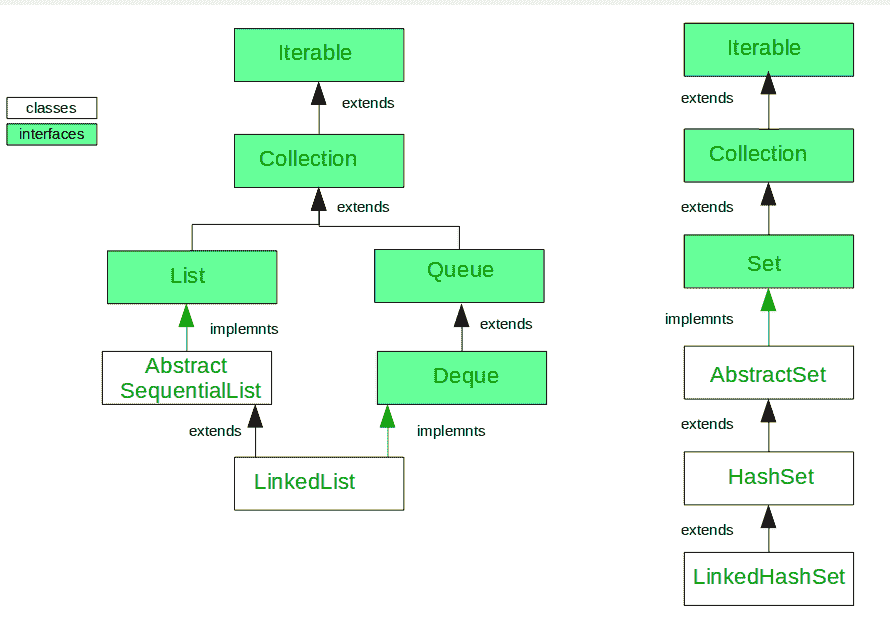

# Java 中 LinkedList 和 LinkedHashSet 的区别

> 原文:[https://www . geesforgeks . org/linked list-and-linked hashset-in-Java/](https://www.geeksforgeeks.org/difference-between-linkedlist-and-linkedhashset-in-java/)之间的差异

在本文中，您将了解 java 中 LinkedList 和 LinkedHashSet 之间的区别。

**前提条件:** [链表](https://www.geeksforgeeks.org/linked-list-in-java/) : [链表](https://www.geeksforgeeks.org/linkedhashset-in-java-with-examples/)

LinkedList 类实现了 List 和 Deque 接口，并从 AbstractSequentialList 类扩展而来。LinkedList 类使用双向链表来存储元素。它提供了一个链表数据结构。

Java LinkedHashSet 类是一个哈希表和链表实现的集合接口。它继承了 HashSet 类，实现了 Set 接口。Set 接口的 LinkedHashSet 实现，它们之间存在一些差异。

##### 让我们看看 Java 中链接表和链接表的区别

1.  **传承:**
    
2.  **内部如何工作**
    Java LinkedList 类使用双链表来存储元素，而 LinkedHashSet 内部使用 [LinkedHashMap](https://www.geeksforgeeks.org/linkedhashmap-class-java-examples/) 来存储其元素。
3.  **唯一性:**
    LinkedList 类可以包含重复的元素，而 LinkedHashSet 只像 HashSet 一样包含唯一的元素。
4.  **插入:**
    链接列表在双链表的情况下，我们可以从两边添加或删除元素，而 LinkedHashSet 插入在最后。
5.  **构造函数:**
    LinkedList 有两个构造函数 LinkedList()和 LinkedList(集合 o)，而 LinkedHashSet 有四个构造函数 HashSet()，HashSet(集合 c)，LinkedHashSet(int 容量)和 LinkedHashSet(int 容量，float fillRatio)
6.  **插入、移除和检索操作:**
    链接列表 O(n)阶的插入、移除和检索操作性能，而 LinkedHashSet 也给出 O(1)阶的插入、移除和检索操作性能。
7.  **比较元素:**
    LinkedList 使用 equals()方法 LinkedHashSet 也使用 equals()和 hashCode()方法来比较元素。
8.  **空元素:**
    LinkedList 允许任意数量的空值，而 LinkedHashSet 也最多允许一个空元素。
9.  **Syntax:**
    LinkedList syntax is:public class LinkedList extends AbstractSequentialList implements List, Deque, Cloneable, Serializable

    LinkedHashSet 语法更低：

    public class LinkedHashSet extends HashSet implements Set, Cloneable, Serializable

**链接列表示例:**

```
// Java code for Linked List implementation

import java.util.*;

public class Test {
    public static void main(String args[])
    {
        // Creating object of class linked list
        LinkedList<String> object = new LinkedList<String>();

        // Adding elements to the linked list
        // and see carefully element are duplicate, null
        object.add("A");
        object.add("B");
        object.addLast("C");
        object.addFirst("D");
        object.add(2, "E");
        object.add(null);
        object.add(null);
        System.out.println("Linked list : " + object);
        System.out.println("Size of List:" + object.size());
    }
}
```

**输出:**

```
Linked list : [D, A, E, B, C, null, null]
Size of List:7

```

**linked hashset 示例:**

```
import java.util.LinkedHashSet;
public class Demo {
    public static void main(String[] args)
    {
        LinkedHashSet<String> linkedset = new LinkedHashSet<String>();

        // Adding element to LinkedHashSet
        linkedset.add("A");
        linkedset.add("B");
        linkedset.add("C");
        linkedset.add("D");

        System.out.println("Original LinkedHashSet:" + linkedset);
        System.out.println("Size of LinkedHashSet = " + linkedset.size());

        // trying to add duplicate
        linkedset.add("A");
        System.out.println("After adding duplicate element " + linkedset);
        System.out.println("Size of LinkedHashSet = " + linkedset.size());

        // trying to add null value more than one
        linkedset.add(null);
        linkedset.add(null);
        System.out.println("After adding two null element " + linkedset);
        System.out.println("Size of LinkedHashSet = " + linkedset.size());
    }
}
```

**输出:**

```
Original LinkedHashSet:[A, B, C, D]
Size of LinkedHashSet = 4
After adding duplicate element [A, B, C, D]
Size of LinkedHashSet = 4
After adding two null element [A, B, C, D, null]
Size of LinkedHashSet = 5

```