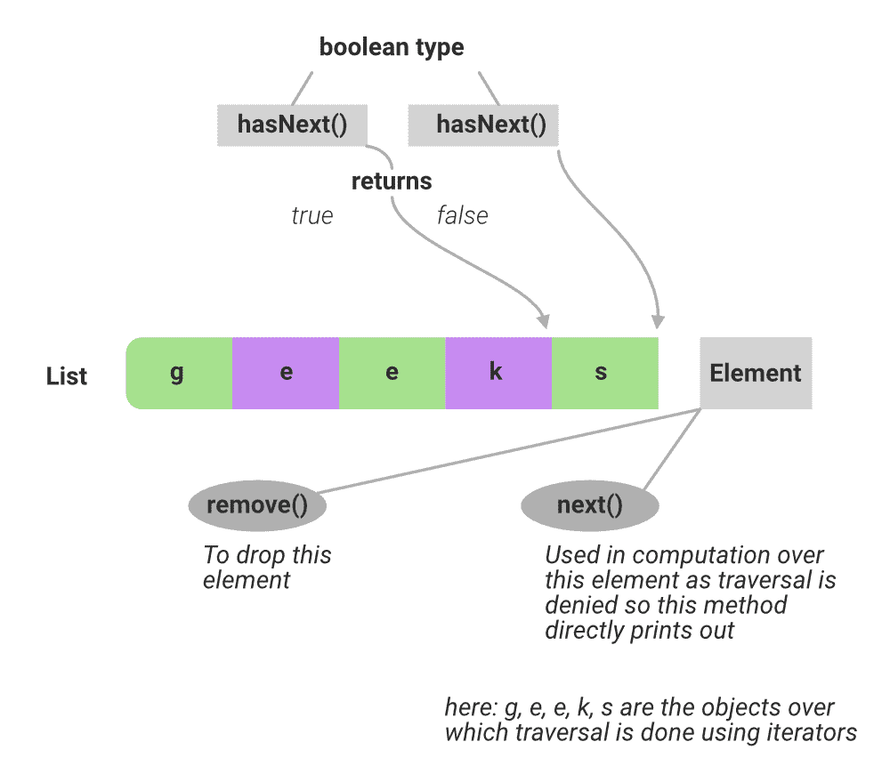

# Java 集合中 next()和 hasNext()方法的区别

> 原文:[https://www . geesforgeks . org/next-and-has next-in-method-Java-collections/](https://www.geeksforgeeks.org/difference-between-next-and-hasnext-method-in-java-collections/)

在 Java 中，使用对象动态存储对象。现在为了遍历这些对象，对每个循环、迭代器和比较器使用**和**来完成。这里将讨论迭代器。迭代器接口允许一个接一个地访问容器中的元素，这间接表示只在转发方向上检索集合中的元素。

这个接口折衷了三种方法:

1.  *下一个()*
2.  [*【hasnext()*](https://www.geeksforgeeks.org/scanner-hasnextint-method-in-java-with-examples/)
3.  *移除()*



**(甲)** [hasNext()](https://www.geeksforgeeks.org/scanner-hasnextint-method-in-java-with-examples/) 法

hasNext()方法用于检查列表中是否还有剩余的元素。这个方法是*一个*布尔类型的方法*，*只返回真和假，正如讨论的那样，因为它只是用于检查目的。迭代器和列表迭代器的 hasNext()方法返回 true，如果在遍历期间用来检查指向元素是否有下一个元素的集合对象。如果不是，它就返回 false。所以，

```
Return Value:
        True  - if iteration has more elements 
        False - if iteration has no more elements
```

**返回类型:**布尔值

**示例:**

## Java 语言(一种计算机语言，尤用于创建网站)

```
// Java program to demonstrate
// the use of hasNext() method

// Importing java input output classes
// Importing all classesfrom
// java.util package
import java.io.*;
import java.util.*;

// Class
class GFG {

    // Main driver method
    public static void main(String[] args)
    {
        // Creating an ArrayList
        // Declaring the ArrayList
        ArrayList<String> list = new ArrayList<String>();

        // Adding (appending) new elements at
        // the end of the List
        // Custom inputs
        list.add("Geeks");
        list.add("for Geeks");

        // Declaring the Iterator
        Iterator<String> iterator = list.iterator();

        // Printing hasNext() values
        // Prints true because iterator has two more values
        System.out.println(iterator.hasNext());

        // Go to next value using next() method
        iterator.next();

        // Prints true because iterator has one more values
        System.out.println(iterator.hasNext());

        // Go to next value using next() method
        iterator.next();

        // Prints false because iterator has no more values
        System.out.println(iterator.hasNext());
    }
}
```

**Output:**

```
true
true
false
```

**(乙)** *下()*法

如果在 where hasNext()之后有一个元素返回 false，在这个元素上要执行一些操作，那么这个方法被用来显示这个元素，在这个方法的帮助下，应该在这个元素上执行操作。迭代器和列表迭代器的 *next()* 方法返回集合的下一个元素。而如果需要移除这个元素的话就使用 remove()方法。

**返回类型:**同集合如数组列表、链表*、*等。

**返回值:**迭代中的下一个元素。

**异常:**如果迭代没有更多元素，抛出[nosucheelementexception](https://www.geeksforgeeks.org/java-util-linkedlist-get-getfirst-getlast-java/)**T5。**

**示例:**

## Java 语言(一种计算机语言，尤用于创建网站)

```
// Java program to demonstrate
// the use of next() method

// Importing java input output classes
import java.io.*;
// Importing all classes from
// java.util package
import java.util.*;

// Class
class GFG {

    // Main driver method
    public static void main(String[] args)
    {
        // Creating an ArrayList
        // (Declaring ArrayList of String type)
        ArrayList<String> list = new ArrayList<String>();

        // Adding elements to above List at
        // the end of the list
        // Custom inputs
        list.add("Element1");
        list.add("Element2");
        list.add("Element3");

        // Declaring the Iterator
        Iterator<String> iterator = list.iterator();

        // Printing values showcasing next() method which
        // shows traversal over elements
        // only in forward direction

        // Prints first element traversed
        System.out.println(iterator.next());

        // Prints the succeeding element
        System.out.println(iterator.next());

        // Prints another eleemnt succeeding
        // to previous element
        System.out.println(iterator.next());
    }
}
```

**Output:**

```
Element1
Element2
Element3
```