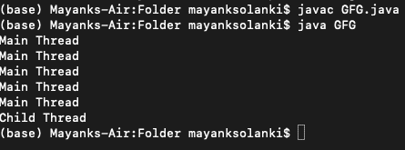

# Java 中睡眠和屈服方法的区别

> 原文:[https://www . geeksforgeeks . org/Java 中睡眠和屈服方法的区别/](https://www.geeksforgeeks.org/difference-between-sleep-and-yield-method-in-java/)

在 java 中，如果一个线程在特定的时间内不想执行任何操作，那么我们应该使用 sleep()方法，这将导致当前正在执行的线程停止指定的毫秒数。

**语法:**

```
public static native void sleep( long ms) throws InterruptedException ;
// The above method put the thread in sleep for a specified number of millisecond
```

```
public static void sleep(long ms , int ns) throws InterruptedException
// The above method also put the thread in sleep for a specified number of milliseconds
// plus specified number of nanoseconds
```

**方法 1:** [*睡眠()*方法](https://www.geeksforgeeks.org/timeunit-sleep-method-in-java-with-examples/)

java 中的每一个 sleep()方法都会抛出一个[中断异常](https://www.geeksforgeeks.org/how-a-thread-can-interrupt-an-another-thread-in-java/)，这是一个选中的异常，因此每当我们强制使用 sleep 方法时，我们都应该通过 try-catch 或 throws 关键字来处理它，否则我们会得到编译时错误。

**实现:**这里，我们在“ *println* 语句之后，让主线程休眠 5 秒。所以每张幻灯片打印需要 5 秒钟。

**例**

## Java 语言(一种计算机语言，尤用于创建网站)

```
// Java Program to illustrate sleep method

// Importing all input output classes
import java.io.*;
// Importing all utility classes from
// java.util package
import java.util.*;

// Main class
class GFG {

    // Main driver method
    public static void main(String[] args)
        throws InterruptedException
    {

        // Iterating using simple for loops
        for (int i = 0; i <= 10; i++) {

            // Printing the current thread slide
            System.out.println("slide-" + i);

            // Putting the main thread to sleep for 5 second
            Thread.sleep(5000);
        }

        // Here after every  5 seconds a slide will be
        // printed
    }
}
```

**输出:**


> 注意:此处幻灯片-1 将在 5000 纳秒后在幻灯片-0 后打印，因此请务必申请所有其他幻灯片。因此，在运行时状态下，显示的输出将花费一定的执行时间。

**方法二:** *产量()*方法

它会导致暂停当前正在执行的线程，以便有机会等待具有相同优先级的线程。如果没有等待线程或者所有等待线程的优先级都很低，那么同一个线程可以继续执行。如果多个线程以相同的优先级等待，那么哪个等待线程会有机会，我们不能说这取决于线程调度器。当线程再次获得机会时，它会屈服，这也取决于线程调度器。

**语法:**

```
public static native void yield( );
```

**实施:**

**例**

## Java 语言(一种计算机语言，尤用于创建网站)

```
// Java Program to illustrate yield() method

// Importing input output classes
import java.io.*;
// Importing all utility classes
import java.util.*;

// Class 1
// Helper class extending Thread class

// Creating a thread in our myThread class
// by extending the Thread class

class myThread extends Thread {

    // Method in helper class
    // Declaring run method
    public void run()
    {

        // Displaying the message
        System.out.println("Child Thread");

        // Calling yield() method
        Thread.yield();
    }
}

// Class 2
// Main class
class GFG {

    // Main driver method
    public static void main(String[] args)
        throws InterruptedException
    {

        // Creating a thread object in the main() method
        // of our helper class above
        myThread t = new myThread();

        // Starting the above thread created
        // using the start() method
        t.start();

        // Iterating using for loop
        // over custom taken size equals 5
        for (int i = 0; i < 5; i++) {
            // Display message
            System.out.println("Main Thread");
        }
    }
}
```



输出解释:

在上面的程序中，如果我们在注释行 *Thread.yield()* 两个线程会同时执行，我们不能期望哪个线程会先完成。如果我们不评论 *Thread.yield()* 方法，那么因为主线程将获得更多次机会，并且首先完成主线程的机会很高。

最后，我们完成了这两种方法，让我们最后总结一下它们之间的区别。

<figure class="table">

| 财产 | 产量法 | 睡眠方法 |
| --- | --- | --- |
| 目的 | 如果一个线程想要暂停它的执行来给剩余的具有相同优先级的线程机会，那么我们应该使用 yield 方法。 | 如果一个线程在特定的时间内不想执行任何操作，那么我们应该使用 sleep 方法 |
| 超载 | 这个方法没有重载 | 睡眠方法过载。 |
| 例外 | 这个方法不会抛出异常 | 此方法引发中断异常 |
| 当地的 | 此方法是本机的 | 在这两个重载方法中，只有 sleep(long ms)是重载的，而另一个不是。 |
| 放弃监视器 | 这种方法放弃了监视器。 | 这个方法不会导致当前正在执行的线程放弃监视器。 |

</figure>