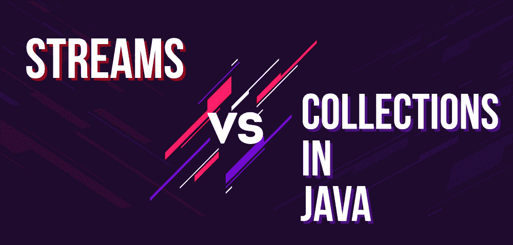

# Java 中流和集合的区别

> 原文:[https://www . geesforgeks . org/Java 中流和集合的区别/](https://www.geeksforgeeks.org/difference-between-streams-and-collections-in-java/)

A **集合**是内存中的数据结构，保存数据结构当前拥有的所有值。在我们将集合中的每个元素添加到集合之前，必须对其进行计算。可以对集合执行搜索、排序、插入、操作和删除等操作。它提供了许多接口，如( [Set](https://www.geeksforgeeks.org/set-in-java/) 、 [List](https://www.geeksforgeeks.org/list-interface-java-examples/) 、 [Queue](https://www.geeksforgeeks.org/list-interface-java-examples/) 、[de Queue](https://www.geeksforgeeks.org/deque-interface-java-example/))和类，如( [ArrayList](https://www.geeksforgeeks.org/arraylist-in-java/) 、 [Vector](https://www.geeksforgeeks.org/java-util-vector-class-java/) 、 [LinkedList](https://www.geeksforgeeks.org/linked-list-in-java/) 、 [PriorityQueue](https://www.geeksforgeeks.org/priority-queue-class-in-java-2/) 、 [HashSet](https://www.geeksforgeeks.org/priority-queue-class-in-java-2/) )。



另一方面，IStream 是 Java 8 中引入的一个应用编程接口，用于处理对象集合。流是支持各种方法的对象序列，这些方法可以通过流水线来产生所需的结果。流应用编程接口用于处理对象集合。流是支持各种方法的对象序列，这些方法可以通过流水线来产生所需的结果。

**Java 流的特点是:**

*   流不是数据结构，而是从集合、数组或输入/输出通道获取输入。
*   流不改变原始的数据结构，它们只根据流水线方法提供结果。流只根据流水线方法提供结果，不改变原始数据结构。
*   每个中间操作都被延迟执行，并作为结果返回一个流，因此各种中间操作可以被流水线化。终端操作标记流的结尾并返回结果。

**示例 1:** 集合

## Java 语言(一种计算机语言，尤用于创建网站)

```
// Java Program to Illustrate Collection

// Importing required classes
import java.io.*;
import java.util.*;

// Main class
class GFG {

    // Main driver method
    public static void main(String[] args)
    {
        // Creating an instance of list
        List<String> CompanyList = new ArrayList<>();

        // Adding elements using add() method
        CompanyList.add("Google");
        CompanyList.add("Apple");
        CompanyList.add("Microsoft");

        // Now creating a comparator
        Comparator<String> com
            = (String o1, String o2) -> o1.compareTo(o2);

        // Sorting the list
        Collections.sort(CompanyList, com);

        // Iterating using for each loop
        for (String name : CompanyList) {

            // Printing the elements
            System.out.println(name);
        }
    }
}
```

**Output**

```
Apple
Google
Microsoft
```

**示例:**溪流

## Java 语言(一种计算机语言，尤用于创建网站)

```
// Java Program to Demonstrate streams

// Importing required classes
import java.io.*;
import java.util.*;

// Main class
class GFG {

    // Main driver method
    public static void main(String[] args)
    {
        // Creating an empty Arraylist
        List<String> CompanyList = new ArrayList<>();

        // Adding elements to above ArrayList
        CompanyList.add("Google");
        CompanyList.add("Apple");
        CompanyList.add("Microsoft");

        // Sorting the list
        // using sorted() method and
        // printing using for-each loop
        CompanyList.stream().sorted().forEach(
            System.out::println);
    }
}
```

**Output**

```
Apple
Google
Microsoft
```

让我们把它们之间的区别列表如下:

<figure class="table">

| 

**STREAMS**

 | 

**收藏**

 |
| --- | --- |
| 它不存储数据，而是对源数据结构(即集合)进行操作。 | 它存储/保存数据结构当前在特定数据结构(如集合、列表或映射)中拥有的所有数据， |
| 他们使用像 lambda 这样的函数接口，这使得它非常适合编程语言。 | 他们不使用功能接口。 |
| Java 流是可消费的，即:为了遍历这个流，每次都需要创建它。 | 它们是非消耗性的，即:可以多次遍历而无需再次创建。 |
| Java 流支持顺序和并行处理。 | 它支持并行处理，并行处理对实现高性能非常有帮助。 |
| 所有的 Java 流 API 接口和类都在 j **ava.util.stream** 包中。 | 像 **IntStream** 、 **LongStream** 和 **DoubleStream** 这样的基元类型的特定类在集合中使用，因为像 int 这样的基元数据类型在使用自动装箱的集合中很长，并且这些操作可能需要很多时间。 |
| 流是不可修改的，即不能在流中添加或删除元素。 | 这些是可修改的，也就是说，人们可以很容易地在集合中添加或删除元素。 |
| 只需提及操作，就可以在内部迭代流。 | 使用循环在外部迭代集合。 |

</figure>