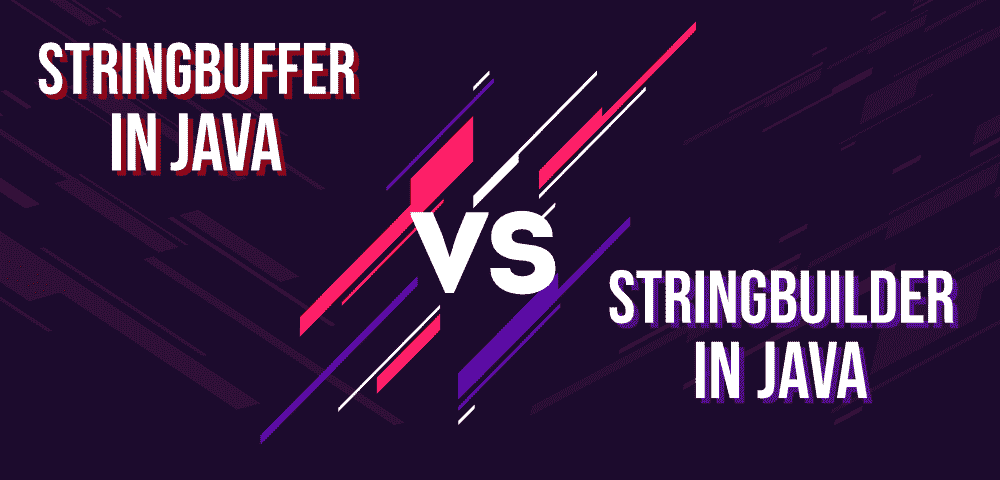

# Java 中 StringBuffer 和 StringBuilder 的区别

> 原文:[https://www . geeksforgeeks . org/stringbuffer-and-stringbuilder-in-Java/](https://www.geeksforgeeks.org/difference-between-stringbuffer-and-stringbuilder-in-java/)之间的差异

Java 中的字符串是由一个字符数组在内部支持的 T2 对象。因为数组是不可变的(不能增长)，所以字符串也是不可变的。每当对字符串进行更改时，就会创建一个全新的字符串。然而，java 提供了多个可以使用字符串的类。两个这样的类是 StringBuffer 和 StringBuilder。在本文中，我们将看到这两个类之间的区别。



**[StringBuffer 类](https://www.geeksforgeeks.org/stringbuffer-class-in-java/) :** StringBuffer 是 String 的对等类，提供了字符串的大部分功能。该字符串表示固定长度、不可变的字符序列，而 StringBuffer 表示可增长和可写的字符序列。StringBuffer 可以在中间插入字符和子字符串，也可以附加到末尾。它会自动增长，为这种添加腾出空间，并且通常会预分配比实际需要更多的字符，以留出增长空间。为了创建字符串缓冲区，需要创建一个对象(即)，如果我们希望创建一个名为 str 的新字符串缓冲区，那么:

```
StringBuffer str = new StringBuffer();

```

**示例:**下面是一个实现 StringBuffer 类的示例。

```
// Java program to demonstrate
// the StringBuffer class

public class GFG {

    // Driver code
    public static void main(String args[])
    {

        // Creating a new StringBuffer
        StringBuffer str
            = new StringBuffer("Hello");

        str.append(" World!");

        System.out.println(str);
    }
}
```

**Output:**

```
Hello World!

```

**[StringBuilder 类](https://www.geeksforgeeks.org/stringbuilder-class-in-java-with-examples/) :** 类似于 StringBuffer，Java 中的 StringBuilder 代表一个可变的字符序列。因为 Java 中的字符串类创建了一个不可变的字符序列，所以 StringBuilder 类提供了一个字符串类的替代，因为它创建了一个可变的字符序列。StringBuilder 的功能与 StringBuffer 类非常相似，因为两者都提供了一种字符串类的替代方法，即创建一个可变的字符序列。与 StringBuffer 类似，为了创建一个名为 str 的新字符串，我们需要创建一个 StringBuilder 的对象(即):

```
StringBuilder str = new StringBuilder(); 

```

**示例:**下面是一个实现 StringBuilder 类的示例。

```
// Java program to demonstrate
// the StringBuilder class

public class GFG {

    // Driver code
    public static void main(String args[])
    {

        // Creating a new StringBuilder
        StringBuilder str
            = new StringBuilder("Hello");

        str.append(" World!");

        System.out.println(str);
    }
}
```

**Output:**

```
Hello World!

```

### 从 StringBuffer 到 StringBuilder 的转换

StringBuffer 不能直接转换为 StringBuilder。我们首先需要使用内置的方法*将 StringBuffer 转换为 String 对象*。在将其转换为字符串对象后，我们可以简单地使用类的[构造函数](https://www.geeksforgeeks.org/constructors-in-java/)创建一个字符串构建器。例如:

```
// Java program to demonstrate
// the conversion between the
// StringBuffer and StringBuilder
// class

public class GFG {

    // Driver code
    public static void main(String args[])
    {
        StringBuffer sbr
            = new StringBuffer("Geeks");

        // Conversion from StringBuffer
        // object to the String object
        String str = sbr.toString();

        // Creating a new StringBuilder
        // using the constructor
        StringBuilder sbl
            = new StringBuilder(str);

        System.out.println(sbl);
    }
}
```

**Output:**

```
Geeks

```

### 从 StringBuilder 到 StringBuffer 的转换

与上面的转换类似，StringBuilder 不能直接转换为 StringBuffer。我们首先需要使用内置的方法*将 StringBuilder 转换为 String 对象*。现在，我们可以使用构造函数创建一个 StringBuilder。例如:

```
// Java program to demonstrate
// the conversion between the
// StringBuilder and StringBuffer
// class

public class GFG {

    // Driver code
    public static void main(String args[])
    {
        StringBuilder sbr
            = new StringBuilder("Geeks");

        // Conversion from StringBuilder
        // object to the String object
        String str = sbr.toString();

        // Creating a new StringBuffer
        // using the constructor
        StringBuffer sbl
            = new StringBuffer(str);

        System.out.println(sbl);
    }
}
```

**Output:**

```
Geeks

```

### StringBuilder 与 Java 中的 StringBuffer

| 字符串缓冲类 | 字符串生成器类 |
| --- | --- |
| Java 中存在 StringBuffer。 | StringBuilder 是在 Java 5 中引入的。 |
| StringBuffer 是同步的。这意味着多个线程不能同时调用 StringBuffer 的方法。 | StringBuilder 是异步的。这意味着多个线程可以同时调用 StringBuilder 的方法。 |
| 由于同步，StringBuffer 被称为线程安全类。 | 由于其异步特性，StringBuilder 不是一个线程安全类。 |
| 由于同步，StringBuffer 比 StringBuilder 慢很多。 | 由于没有对多线程进行初步检查，StringBuilder 比 StringBuffer 快得多。 |