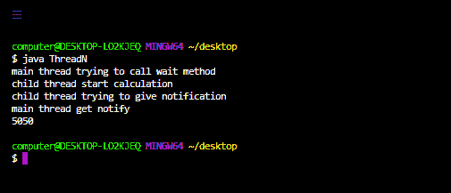

# Java 中 wait()和 notifyall()的区别

> 原文:[https://www . geesforgeks . org/wait-and-notifyall-in-Java/](https://www.geeksforgeeks.org/difference-between-wait-and-notifyall-in-java/)的区别

多线程是一个 Java 特性，它允许程序的两个或多个部分同时执行，以最大限度地利用 CPU。这种程序的每个部分都称为一个线程。因此，线程是进程中的轻量级进程。 [多线程](https://www.geeksforgeeks.org/multithreading-in-java/)程序可能经常会出现多个线程试图访问相同资源，最终产生错误结果的情况。

因此，需要通过某种同步方法来确保在 time.Java 的给定点只有一个线程可以访问资源，这提供了一种创建线程的方法，并通过使用同步块来[同步](https://www.geeksforgeeks.org/synchronized-in-java/)它们的任务。Java 中的同步块用 Synchronized 关键字标记。Java 中的同步块是在某个对象上同步的。同一对象上同步的所有同步块一次只能有一个线程在其中执行。

我们将在后面讨论这些差异，让我们先来看看它们是如何相互关联的，具体讨论如下:

1.  等待()方法
2.  notifyAll()方法

**1。** *等待()*方法

在多线程中，两个线程可以通过使用 wait()方法进行线程间通信。期望更新的线程负责调用 *wait()* 方法，然后线程将立即进入等待状态。 *wait()* 方法存在于 java.lang.Object 类中，而不在 Thread 类中，因为线程可以在任何 java 对象上调用该方法。要调用任何 java 对象的 *wait()* 方法，线程应该是该对象的所有者，即线程应该拥有该对象的锁，即线程应该在同步区域内。因此，我们只能从同步区域调用 wait()方法，否则我们将得到一个说 IllegalMonitorStateException 的 RuntimeException。如果线程在任何对象上调用 *wait()* 方法，它会立即释放该特定对象的锁，并进入等待状态。

**语法:**

```java
public  final void wait()
```

上述方法导致当前线程无限期等待，直到 notify()或 notifyAll()为此对象调用。

```java
public final native void wait( long microsecond)
```

```java
public final void wait( long microsecond , int nanosecond)
```

使用上面的两个方法，我们可以指定一个超时，在此之后线程将被自动唤醒。我们可以使用 notify()或 notifyAll()方法在达到超时之前唤醒线程。

> 注意:请记住，每个 *wait()* 方法都会抛出中断异常，这是一个选中的异常，因此，每当我们强制使用 wait()方法时，我们都应该通过 try-catch 或 throws 关键字来处理这个中断异常，否则我们会得到编译时错误。

**2** 。notifyAll()方法

同样的 *wait()* 的方法 notifyAll()方法用于线程间通信。该线程负责执行更新，并且在执行一些更新之后，它负责调用 *notifyAll()* 方法，然后等待的线程将获得该通知并继续执行更新的项目。 *notifyAll()* 也存在于 [*java.lang 中。对象类*](https://www.geeksforgeeks.org/object-class-in-java/) 。要在任何对象上调用 *notifyAll()* 方法，它们应该是该对象的所有者，即线程应该在同步区域内。因此，我们只能从同步区域调用 *notifyAll()* 方法，否则我们会得到一个说 IllegalMonitorStateExceptiom 的 RuntimeException。可以使用 *notifyAll()* 方法向特定对象的所有等待线程发出通知，但是即使多个线程得到通知，但执行将一个接一个地执行，因为线程需要锁定，并且一次只有一个锁可用。

**语法:**

```java
public final native void notifyAll()
```

**实施:**

在下面的例子中，我们创建了一个名为‘myThread’的类，通常它在程序中是这样命名的，它扩展了我们的 Thread 类，而 Thread 类本身又扩展了 ***java.lang。**线程类*。此类覆盖了 ***线程类*** 中可用的 *run()* 方法。线程在 *run()* 方法中开始其生命周期。在驱动类 ThreadN 中，我们创建一个对象，调用 start 方法开始执行一个线程，并调用 *ThreadN 类*中的 *run()* 方法，我们同步了 T1 线程，并将其置于[等待状态。](https://www.geeksforgeeks.org/lifecycle-and-states-of-a-thread-in-java/)在 *myThread 类*中，我们同步了 run 方法，在计算了 sum 之后，我们使用 *notifyAll()* 方法来通知等待的线程。

**例**

## Java 语言(一种计算机语言，尤用于创建网站)

```java
// Java Program to illustrate difference between
// wait() and notifyAll() method

// Importing java classes
// Input output classes
import java.io.*;
import java.lang.*;
// All utility classes from
// java.util package
import java.util.*;

// Creating a thread in our myThread class
// by extending the Thread class

// Class 1
// Helper class
class myThread extends Thread {

    // Declaring sum variable and
    // initializing with zero
    // as the current final sum
    // as it is before iteration
    int sum = 0;

    // Method in helper class
    // Declaring run method
    public void run()
    {

        // Synchronizing this method
        synchronized (this)
        {
            // Calculating the sum

            // Display mwssage
            System.out.println(
                "child thread start calculation");

            // Iterating to calculate the sum
            for (int i = 0; i <= 100; i++)

                // Updating the current sum where
                // last updated sum is final sum
                sum += i;

            // Display mwssage
            System.out.println(
                "child thread trying to give notification");

            // This keyword refers to current object itself

            // Notifing the current waiting thread
            // using notifyAll() method
            this.notifyAll();
        }
    }
}

// Class 2
// Main class
class ThreadN {

    // Main driver method
    public static void main(String[] args)
        throws InterruptedException
    {

        // Creating a thread object
        // in the main() method of 
        // our helper class above 
        myThread t1 = new myThread();

        // Starting the above thread created
        // using the start() method
        t1.start();

        // Synchronizing the thread
        synchronized (t1)
        {
            // Display message
            System.out.println(
                "main thread trying to call wait method");

            // Putting the thread in the waiting state
            // using the wait() method
            t1.wait();

            // Display message
            System.out.println("main thread get notify");

            // Print and display the sum
            System.out.println(t1.sum);
        }
    }
}
```

**Output**

```java
main thread trying to call wait method
child thread start calculation
child thread trying to give notification
main thread get notify
5050

```

> 现在，如果相同的程序在终端/CMD 上运行，用于自定义用户定义的输入，那么硬编码输入如下所示



> 从上述程序中得出的结论验证了 [*【等待】(*)和](https://www.geeksforgeeks.org/differences-between-wait-and-join-methods-in-java/) [*【通知所有】(*](https://www.geeksforgeeks.org/difference-notify-notifyall-java/) 方法之间的关键区别如下:

1.  [*wait()*](https://www.geeksforgeeks.org/differences-between-wait-and-join-methods-in-java/) 用于将线程置于等待状态，而 [*notifyAll()*](https://www.geeksforgeeks.org/difference-notify-notifyall-java/) 方法唤醒特定对象的所有等待线程。
2.  如果线程在任何对象上调用 *wait()* 方法，它会立即释放该特定对象的锁，但是如果线程在任何对象上调用 *notifyAll()* 方法，它也会释放该特定对象的锁，但不会立即释放。
3.  *wait()* 方法抛出[中断异常](https://www.geeksforgeeks.org/how-a-thread-can-interrupt-an-another-thread-in-java/)，而 *notifyAll()* 方法不抛出任何中断异常。