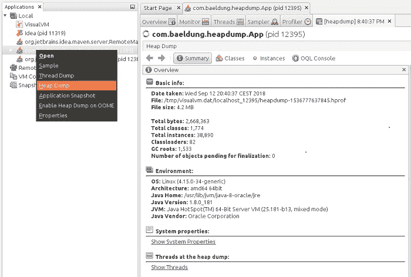
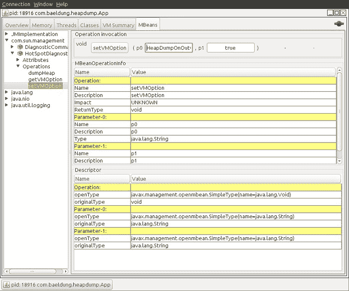
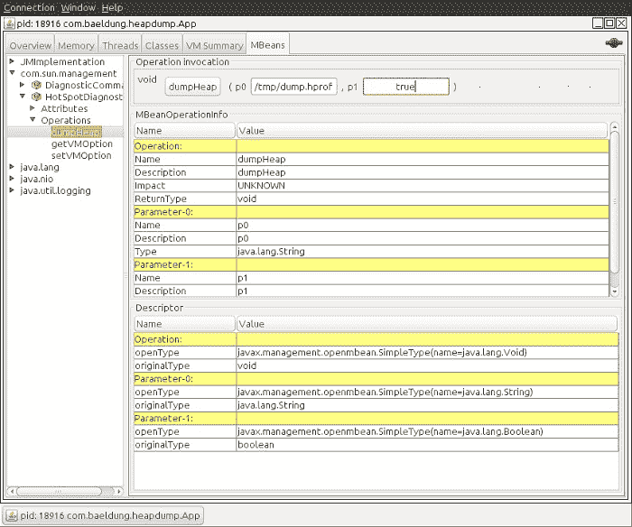

# 捕获 Java 堆转储的不同方式

> 原文:[https://www . geesforgeks . org/不同的捕获方式-Java-堆-转储/](https://www.geeksforgeeks.org/different-ways-to-capture-java-heap-dumps/)

Head dump 是在某个时刻 JVM 内存中所有对象的快照。它们对于解决内存泄漏问题和优化 Java 应用程序中的内存使用非常有用。头转储通常存储在二进制格式的“hprof”文件中。我们可以使用像“jhat”或“JVisualVM”这样的工具来打开和分析这些文件。此外，对于 Eclipse 用户来说，使用 MAT 是非常常见的。现在我们将通过多种工具和方法来生成驼峰，我们将展示它们之间的主要区别。

JDK 有几种工具可以用不同的方式捕捉垃圾场。所有这些工具都位于 JDK 主目录中的 bin 文件夹下。因此，只要该目录包含在系统路径中，我们就可以从命令行启动它们。

在接下来的步骤中，我们将看到如何使用这些工具来捕获头部转储。

**方法:**

1.  jmap
2.  断续器
3.  杰文
4.  自动捕获磁头转储
5.  JMX

让我们详细讨论上面列出的每一种方法，以便更好地理解它们。

**方法 1:** jmap

jmap 是一个工具，用来打印关于运行中的 JVM 内存的统计数据。我们可以将其用于本地或远程进程。要使用 jmap 捕获头转储，我们需要使用转储选项:

```java
 jmap -dump:[live],format=b,file=<file-path> <pid>
```

除了这个选项，我们还应该指定几个参数:

*   live:如果设置，它只打印具有活动引用的对象，并丢弃准备进行垃圾收集的对象。此参数是可选的
*   format=b:指定转储文件将采用二进制格式。如果不设置结果是一样的
*   文件:转储将写入的文件
*   PID:Java 进程的 id

> **注意:**我们可以通过使用‘jps’命令轻松得到一个 Java 进程的 PID。请记住，jmap 是在 JDK 作为实验工具引入的，它不受支持**。**因此，在某些情况下，可能最好使用其他工具来代替。

**例**

```java
jmap -dump:live,format=b,file=/tmp/dump.hprof 12587
```

**方法二:** jcmd

“jcmd”是一个非常完整的工具，它通过向 JVM 发送命令请求来工作。我们必须在运行 Java 进程的同一台机器上使用它。它的许多命令之一是 GC.heap-dump。我们可以通过指定进程的 pid 和输出文件路径来获得堆转储:

```java
 jcmd <pid> GC.head_dump <file-path>
```

我们可以使用之前使用的相同参数来执行它:

```java
jcmd 12587  GC.head_dump  /tmp/dump.hprof
```

与 jmap 一样，生成的转储是二进制格式的。

**方法 3:**jvvisualvm

JVisualVM 是一个带有图形用户界面的工具，允许我们监控、排除故障和分析 Java 应用程序。图形用户界面很简单，但非常直观和易于使用。它的众多选项之一允许我们捕捉头部倾倒。如果我们右键单击一个 Java 进程并选择“Head Dump”选项，该工具将创建一个堆转储，并在一个新的选项卡中打开它:



如上所述，我们可以找到在“基本信息”部分创建的文件的路径。从 JDK9 开始，VISUAL VM 不包含在 Oracle JDK 和开放 JDK 发行版中。因此，如果我们使用的是 Java 9 或更新的版本，我们可以从 VisualVM 开源项目站点获取 JVM。

**方法 4:** 自动捕获磁头倾卸

我们上面展示的所有工具都旨在特定时间手动捕获磁头转储。在某些情况下，我们希望在发生 java.lang.OutOfMemoryError 时获得堆转储，以便帮助我们调查错误:

对于这些情况，Java 提供了 HeadDumpOnOutOfMemoryError 命令行选项，该选项在抛出 java.lang.OutOfMemoryError 时生成堆转储:

```java
java -XX:+HeadDumpOnOutOfMemoryError
```

默认情况下，它将转储存储在一个 **java_pid < pid >中。hprof** 文件在我们运行应用程序的目录中。如果我们想指定另一个文件或目录，我们可以在 HeadDumpPath 选项中设置它:

```java
java -XX:+HeadDumpOnOutOfMemoryError -XX:HeapDumpPath=<file-or-dir-path>
```

当我们的应用程序使用此选项耗尽内存时，我们将能够在日志中看到包含堆转储的已创建文件:

```java
java.lang.OutOfMemoryError: Requested array size exceeds VM limit
During heap to java_pid12587.hprof...
  Exception in thread "main" Head dump file created [4744371 bytes in 0.029 secs]
  java.lang.OutOfMemoryError: Requested array size exceeds VM limit 
  at com.baeldung.heapdump.App.main(App.java:7)
```

在上面的例子中，它被写入 java_pid2587.hprof 文件。正如我们所看到的，这个选项非常有用，当使用这个选项运行应用程序时没有开销。因此，强烈建议始终使用此选项，尤其是在生产中。最后，这个选项也可以在运行时通过使用**hotpotdiagnostic MBean**来指定。为此，我们可以使用 **JConsole** 并将**heapdumpoontomemoryerror**VM 选项设置为 true:



**方法 5:** JMX

我们将在本文中介绍的最后一种方法是使用 JMX。我们将使用我们在上一节中简要介绍的 HotSpotDiagnostic MBean。这个 MBean 提供了一个接受两个参数的转储堆方法:

*   outputFile:转储文件的路径。文件应该有 hprof 扩展名
*   live:如果设置为 true，它只转储内存中的活动对象，就像我们之前看到的 jmap 一样

现在有两种方法可以调用这个方法来捕获头转储:

**使用 HotSpotDiagnostic MBean 最简单的方法是使用 JMX 客户端，如 JConsole。**如果我们打开 JConsole 并连接到一个正在运行的 Java 进程，我们可以导航到 MBeans 选项卡，并在 **com.sun.management 下找到 HotSpotDiagnostic】在这些操作中，我们可以找到我们之前描述过的 dumpHead 方法:**



如图所示，我们只需要在 p0 和 p1 文本字段中引入参数 outputFile 和 live，以便执行 dumpHeap 操作。

**实现:**捕获堆转储的方式

使用 HotSpotDiagnostic MBean 的另一种方法是从 Java 代码中以编程方式调用它。为此，我们需要获取一个 MBeanServer 实例，以便获取在应用程序中注册的 MBean。之后，我们只需要获取一个 HotSpotDiagnosticMXBean 的实例，并将其称为 dumpHeap 方法。

```java
public static void dumpHeap(String filePath, boolean live) throws IOException {
MBeanServer server = ManagementFactory.getPlatformMBeanServer();
HotSpotDiagnosticMXBean mxBean = ManagementFactory.newPlatformMXBeanProxy
  (server, "com.sun.management:type=HotSpotDiagnos
  tic",
HotSpotDiagnosticMXBean.class);
mxBean.dumpHeap(filePath, live);
}
```

请注意 **hprof** 文件不能被覆盖。因此，在创建打印堆转储的应用程序时，我们应该考虑这一点。如果我们做不到这一点，我们将得到一个例外:

```java
Exception in thread "main" java.io.IOException: File exists 
at sun.management.HotSpotDianostic.dumpHeap0(Native Method) at 
sun.management.HotSpotDiagnostic.dumpHeap(HotSpotDiagnostic.java:60)
```

> **结论:**我们必须始终记住的最后一条规则是在运行 Java 应用程序时始终使用-**heapdumponetomemoryeror**选项。