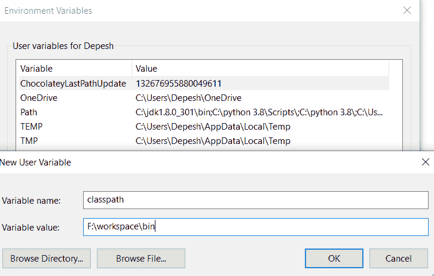

# 在 Java 中设置类路径的不同方式

> 原文:[https://www . geeksforgeeks . org/不同方式设置 java 类路径/](https://www.geeksforgeeks.org/different-ways-to-set-a-classpath-in-java/)

**Java 虚拟机(JVM)** 使用类路径定位执行代码的类文件。如果没有设置类路径，并且类文件与 java 文件不在同一个目录中，那么 JVM 将无法找到所需的类文件，并且会抛出一个错误([Java . lang . class notfoundexception](https://www.geeksforgeeks.org/how-to-solve-java-lang-classnotfoundexception-in-java))。


JVM 解释代码时出错

### 设置类路径的方法

有五种不同的方法来设置类路径。这些是:

*   -cp
*   -类路径
*   –类路径
*   使用“设置类路径”命令进行临时设置
*   使用环境变量窗口的永久设置

–**CP**、**–**类路径、**–类路径**方法的局限性在于只能为当前命令行设置类路径，在下一个命令行中，如果直接访问需要的类，会得到一个 Exception

**语法:**

```java
>java -cp <directory_location> <class name>
```

**示例:**

## Java 语言(一种计算机语言，尤用于创建网站)

```java
// This code is located in F:\workspace\src
// It's class file is located in F:\workspace\bin
class GFG {
    public static void main(String[] args)
    {
        System.out.println("GFG!");
    }
}
```


如何使用-cp 命令设置类路径

### 命令行设置–

```java
>java -cp <directory_location> <class name>
```

**或**

```java
>java -classpath <directory_location> <class name>
```

**或**

```java
>java --class-path <directory_location> <class name>
```

*   如果我们想访问所有命令行的类路径，我们必须设置类路径命令选项。
*   **“设置类路径”**命令选项的限制是类路径设置仅适用于当前命令提示符。

### 临时设置:

```java
>set classpath=<directory_location>
```


使用“设置类路径”命令临时设置类路径

如果我们想为所有命令提示永久设置类路径，我们必须在环境变量部分设置类路径。

### 永久设置:

1.  首先，右击“这台电脑”。
2.  单击属性。
3.  单击“高级系统设置”。
4.  单击“环境变量”。
5.  在“用户变量部分”，单击“新建”按钮。
6.  输入变量名:类路径[类路径之间不要有空格]变量值:<directory_location>(例如在我的 F:\workspace\bin 中)</directory_location>
7.  单击确定->确定->确定。
8.  关闭所有窗口，打开一个新的命令提示符，然后运行 java 命令



环境变量设置


永久类路径设置

我们必须包括**。；**在类路径中开始，以便 **JVM** 可以分别访问当前工作目录和所需类文件的目录。

```java
>java -cp <.;directory_location> <class name>
```

### “.”的重要性在类路径中

如果设置类路径指向一个目录，如果不放置(点)，编译器和 **JVM** 都找不到当前工作目录下可用的类。**“.”**代表当前工作目录。当前工作目录不是保存的文件夹。java 文件，打开命令提示符的文件夹路径。

### 在类路径中包含多个路径的语法

我们必须用**分号**分隔每个文件夹位置。

```java
java -cp ./folder1/*;./folder2/*;./folder3/* com.xyz.MainClass
```

> **注意–**编译器和 JVM 从类路径中查找类所遵循的算法是**先来先执行。**

### 路径和类路径搜索算法优先级之间的差异

*   命令提示符软件将优先显示工作目录。在当前的工作目录中，如果二进制文件不可用，只考虑路径变量。
*   编译器和 **JVM** 首先查找类路径。
*   如果没有创建类路径，那么只有它们会在当前工作目录中搜索。
*   如果创建了类路径，它们不会查看当前的工作目录，只会查看类路径文件夹。

> **注意–**一般在开发者社区，推荐前 4 种类型，他们尽量避免使用使用环境变量窗口的永久设置。