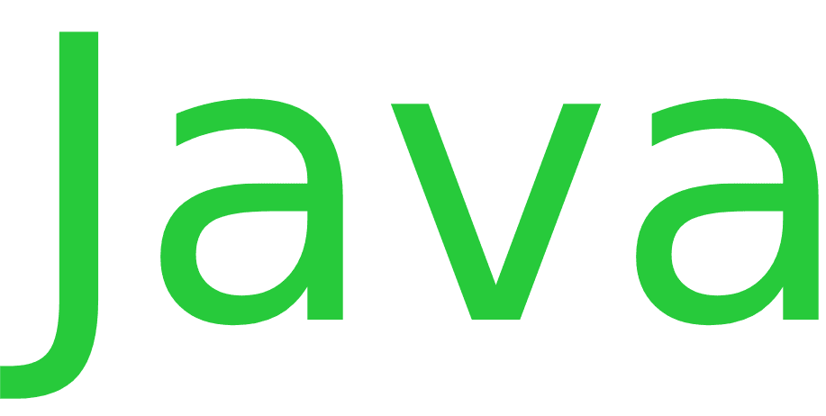

# Java 语言的缺点

> 原文:[https://www . geesforgeks . org/Java 语言的缺点/](https://www.geeksforgeeks.org/disadvantages-of-java-language/)

[Java](https://www.geeksforgeeks.org/java/) 的一些缺点是:

1- **性能**
与 [C](https://www.geeksforgeeks.org/c/) / [C++](https://www.geeksforgeeks.org/c-plus-plus/) 相比，Java 程序运行时间要长得多。

2- **内存**
由于 Java 程序运行在 [Java 虚拟机](https://www.geeksforgeeks.org/jvm-works-jvm-architecture/)之上，消耗的内存更多。

3- **成本**
由于内存和处理要求更高，硬件成本增加。

4- **低级编程**
Java 中不支持低级编程，就像指针缺失一样。

5- **垃圾收集**
Java 中没有垃圾收集的控制。那就是程序员没有任何权利控制垃圾收集。Java 不提供 delete()，free()之类的函数。

6- **无无符号类型**与 C/C++不同，Java 不支持无符号 int、无符号 char、…等。但是在 Java 8 中，引入了无符号长整型和无符号整型的 API(请看[这篇甲骨文文档](https://blogs.oracle.com/darcy/unsigned-integer-arithmetic-api-now-in-jdk-8))。

除了上述所有缺点之外，由于其可维护性和平台无关性，Java 是软件行业中使用最多的语言之一(请参见[本](https://www.geeksforgeeks.org/top-10-programming-languages-of-the-world-2019-to-begin-with/))。