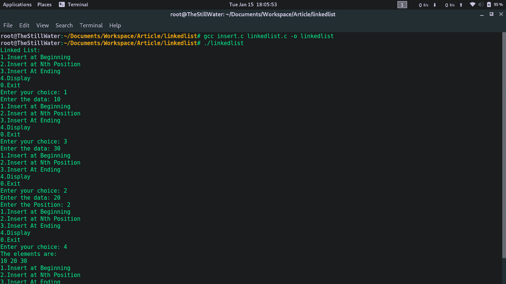
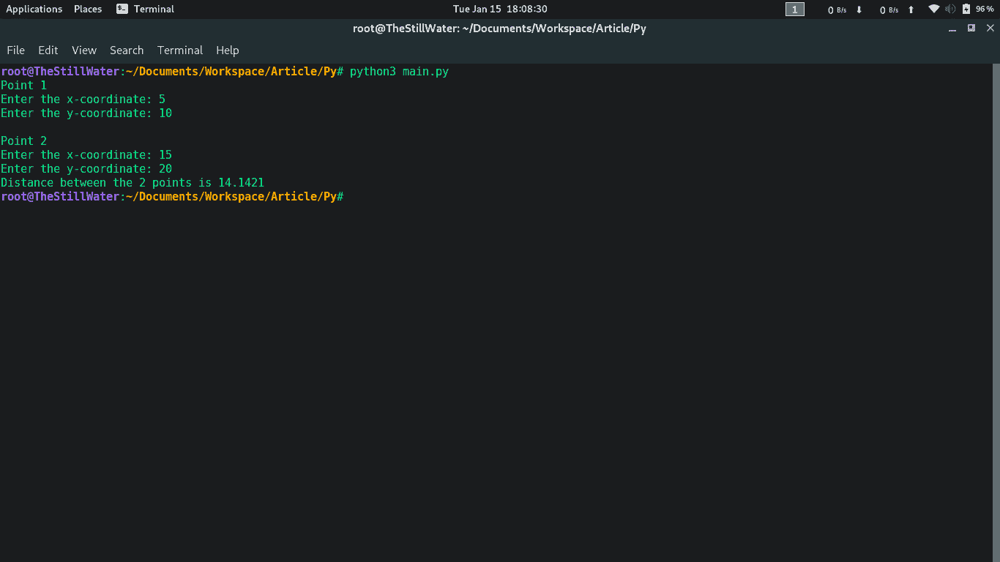
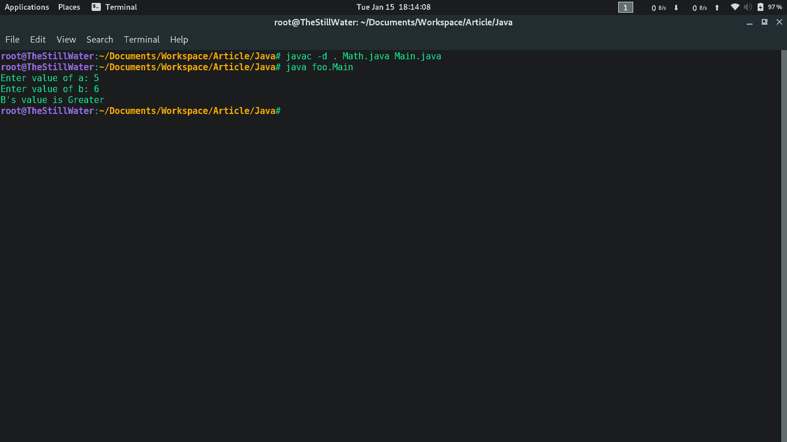

# 用 C/C++、Java 和 Python 将一个大文件分成独立的模块

> 原文:[https://www . geeksforgeeks . org/将一个大文件分割成单独的模块-in-c-c-Java-和-python/](https://www.geeksforgeeks.org/dividing-a-large-file-into-separate-modules-in-c-c-java-and-python/)

如果你曾经想写一个大型程序或软件，最常见的菜鸟错误是直接跳进去，试着把所有必要的代码都写在一个单独的程序中，然后试着以后调试或扩展。

这种方法注定会失败，通常需要从头开始重写。

因此，为了解决这种情况，我们可以尝试将问题分成多个子问题，然后尝试逐个解决。

这样做，不仅让我们的任务变得更容易，还可以让我们从高级程序员那里实现，同时也提升了**代码的可重用性**。

如果你从 GitHub 或 GitLab 或类似的任何其他网站上查看任何开源项目，我们可以看到大型程序是如何被“分散”到许多子模块中的，其中每个单独的模块都对程序的特定关键功能做出贡献，并且开源社区的各种成员聚集在一起贡献或维护这样的文件或存储库。

现在，最大的问题在于如何“分解”不是理论上的，而是程序上的。

我们将在流行的语言中看到一些不同类型的这种划分，比如 C/C++、Python 和 Java。

*   ### [Jump to C/C++](#C_CPP)

*   ### [跳转到](#Python)蟒蛇

*   ### [Jump to Java](#Java)

## C/C++

出于说明的目的，

让我们假设在一个单独的程序中有所有基本的**链表插入**。由于有许多方法(函数)，我们不能通过在强制主函数之上编写所有的方法定义来打乱程序。但是即使我们这样做了，也会出现方法排序的问题，其中一个方法需要在另一个之前，等等。

所以为了解决这个问题，我们可以在程序开始时声明所有的原型，然后是 main 方法，在它下面，我们可以以任何特定的顺序定义它们:

**节目:**

## fulllinkedlist 足球俱乐部

```java
// Full Linked List Insertions

#include <stdio.h>
#include <stdlib.h>

//--------------------------------
// Declarations - START:
//--------------------------------

struct Node;
struct Node* create_node(int data);
void b_insert(struct Node** head, int data);
void n_insert(struct Node** head, int data, int pos);
void e_insert(struct Node** head, int data);
void display(struct Node* temp);

//--------------------------------
// Declarations - END:
//--------------------------------

int main()
{
    struct Node* head = NULL;

    int ch, data, pos;

    printf("Linked List: \n");
    while (1) {
        printf("1.Insert at Beginning");
        printf("\n2.Insert at Nth Position");
        printf("\n3.Insert At Ending");
        printf("\n4.Display");
        printf("\n0.Exit");
        printf("\nEnter your choice: ");
        scanf("%d", &ch);

        switch (ch) {
        case 1:
            printf("Enter the data: ");
            scanf("%d", &data);
            b_insert(&head, data);
            break;

        case 2:
            printf("Enter the data: ");
            scanf("%d", &data);

            printf("Enter the Position: ");
            scanf("%d", &pos);
            n_insert(&head, data, pos);
            break;

        case 3:
            printf("Enter the data: ");
            scanf("%d", &data);
            e_insert(&head, data);
            break;

        case 4:
            display(head);
            break;

        case 0:
            return 0;

        default:
            printf("Wrong Choice");
        }
    }
}

//--------------------------------
// Definitions - START:
//--------------------------------

struct Node {
    int data;
    struct Node* next;
};

struct Node* create_node(int data)
{
    struct Node* temp
        = (struct Node*)
            malloc(sizeof(struct Node));
    temp->data = data;
    temp->next = NULL;

    return temp;
}

void b_insert(struct Node** head, int data)
{
    struct Node* new_node = create_node(data);

    new_node->next = *head;
    *head = new_node;
}

void n_insert(struct Node** head, int data, int pos)
{
    if (*head == NULL) {
        b_insert(head, data);
        return;
    }

    struct Node* new_node = create_node(data);

    struct Node* temp = *head;

    for (int i = 0; i < pos - 2; ++i)
        temp = temp->next;

    new_node->next = temp->next;
    temp->next = new_node;
}

void e_insert(struct Node** head, int data)
{
    if (*head == NULL) {
        b_insert(head, data);
        return;
    }

    struct Node* temp = *head;

    while (temp->next != NULL)
        temp = temp->next;

    struct Node* new_node = create_node(data);
    temp->next = new_node;
}

void display(struct Node* temp)
{
    printf("The elements are:\n");
    while (temp != NULL) {
        printf("%d ", temp->data);
        temp = temp->next;
    }
    printf("\n");
}

//--------------------------------
// Definitions - END
//--------------------------------
```

**编译代码:**我们可以通过以下方式编译上述程序:

```java
gcc linkedlist.c -o linkedlist
```

而且有效！

**上述代码中的潜在问题:**
我们已经可以看到程序的潜在问题，代码根本不容易处理，无论是单独还是在一组中。

如果有人想使用上述程序，那么这个人面临的许多问题包括:

1.  **需要通过完整的源文件**来改进或增强一些功能。
2.  **不能轻易重用**程序作为其他项目的框架。
3.  **代码非常混乱**并且一点也不吸引人，使得浏览代码非常困难。

在集团项目或大型项目的情况下，上述方法保证提高整体支出、精力和故障率。

**正确的方法:**

我们在每个以“#include”开头的 C/C++程序中都可以看到这些行。
这意味着包括在“库”标题**下声明的所有函数(。h 文件)**并可能在 **library.c/cpp** 文件中定义。

这些行在编译期间由预处理器处理。

我们可以手动尝试为自己的目的创建这样一个库。

**需要记住的重要事情:**

1.  ".文件只包含原型声明(如函数、结构)和全局变量。
2.  ".c/cpp”文件包含真正的实现(头文件中声明的定义)
3.  当一起编译所有的源文件时，确保同一函数、变量等没有多个定义。为了同一个项目。(非常重要)
4.  使用**静态函数**限制到声明它们的文件。
5.  使用 **extern** 关键字来使用引用外部文件的变量。
6.  如果使用 C++的话，注意命名空间一定要使用**namespace _ name::function()**避免冲突。

**将程序分成更小的代码:**
查看上面的程序，我们可以看到这个大程序是如何被分成合适的小部分，然后很容易地进行工作的。

上述程序本质上有两个主要功能:
1)创建、插入数据并将其存储到节点中。
2)显示节点

因此，我可以相应地划分程序，例如:
1)主文件- >驱动程序，插入模块的漂亮包装，以及我们使用附加文件的地方。
2)插入- >真正的实现就在这里。

牢记上述要点，该计划分为:

> **链接列表 c** - >包含驱动程序
> T3【插入】c - >包含插入代码
> 
> **链接列表. h** - >包含必要的节点声明
> **插入. h** - >包含必要的节点插入声明

在每个头文件中，我们从:

```java
#ifndef FILENAME_H  
#define FILENAME_H 

Declarations...

#endif

```

我们将声明写在 **#ifndef、#define 和#endif** 之间的原因是为了防止数据类型、变量等标识符的多次声明。当在属于同一项目的新文件中调用相同的头文件时。

对于此示例程序:

**insert.h** - >包含节点插入的声明以及节点本身的声明。

需要记住的一件非常重要的事情是，编译器可以在头文件中看到声明，但是如果您试图编写代码**涉及到在其他地方声明的声明的**定义，这将导致错误，因为编译器会编译每个声明。c 在进入链接阶段之前单独归档。

一个包含节点及其显示声明的帮助文件，这些声明将被包含在使用它们的文件中。

**insert.c** - >通过**包含节点声明# Include“linked list . h”**，其中包含声明以及在 insert.h 下声明的方法的所有其他定义

**linkedlist.c** - >简单包装器包含一个无限循环，提示用户在所需位置插入整数数据，还包含显示列表的方法。

**最后要记住的一点是，盲目地将文件包含到彼此中可能会导致多次重新定义并导致错误。**

记住以上几点，你应该仔细划分合适的子程序。

## linkedlist . h .链接列表

```java
// linkedlist.h

#ifndef LINKED_LIST_H
#define LINKED_LIST_H

struct Node {
    int data;
    struct Node* next;
};

void display(struct Node* temp);

#endif
```

## insert.h

```java
// insert.h

#ifndef INSERT_H
#define INSERT_H

struct Node;
struct Node* create_node(int data);
void b_insert(struct Node** head, int data);
void n_insert(struct Node** head, int data, int pos);
void e_insert(struct Node** head, int data);

#endif
```

## insert.c

```java
// insert.c

#include "linkedlist.h"
// "" to tell the preprocessor to look
// into the current directory and
// standard library files later.

#include <stdlib.h>

struct Node* create_node(int data)
{
    struct Node* temp = (struct Node*)malloc(sizeof(struct Node));
    temp->data = data;
    temp->next = NULL;

    return temp;
}

void b_insert(struct Node** head, int data)
{
    struct Node* new_node = create_node(data);

    new_node->next = *head;
    *head = new_node;
}

void n_insert(struct Node** head, int data, int pos)
{
    if (*head == NULL) {
        b_insert(head, data);
        return;
    }

    struct Node* new_node = create_node(data);

    struct Node* temp = *head;

    for (int i = 0; i < pos - 2; ++i)
        temp = temp->next;

    new_node->next = temp->next;
    temp->next = new_node;
}

void e_insert(struct Node** head, int data)
{
    if (*head == NULL) {
        b_insert(head, data);
        return;
    }

    struct Node* temp = *head;

    while (temp->next != NULL)
        temp = temp->next;

    struct Node* new_node = create_node(data);
    temp->next = new_node;
}
```

## linkedlist 足球俱乐部

```java
// linkedlist.c
// Driver Program

#include "insert.h"
#include "linkedlist.h"
#include <stdio.h>

void display(struct Node* temp)
{
    printf("The elements are:\n");
    while (temp != NULL) {
        printf("%d ", temp->data);
        temp = temp->next;
    }
    printf("\n");
}

int main()
{
    struct Node* head = NULL;

    int ch, data, pos;

    printf("Linked List: \n");
    while (1) {
        printf("1.Insert at Beginning");
        printf("\n2.Insert at Nth Position");
        printf("\n3.Insert At Ending");
        printf("\n4.Display");
        printf("\n0.Exit");
        printf("\nEnter your choice: ");
        scanf("%d", &ch);

        switch (ch) {
        case 1:
            printf("Enter the data: ");
            scanf("%d", &data);
            b_insert(&head, data);
            break;

        case 2:
            printf("Enter the data: ");
            scanf("%d", &data);

            printf("Enter the Position: ");
            scanf("%d", &pos);
            n_insert(&head, data, pos);
            break;

        case 3:
            printf("Enter the data: ");
            scanf("%d", &data);
            e_insert(&head, data);
            break;

        case 4:
            display(head);
            break;

        case 0:
            return 0;

        default:
            printf("Wrong Choice");
        }
    }
}
```

最后，我们保存它们并编译如下。

```java
**gcc insert.c linkedlist.c -o linkedlist**
```

瞧，它编译成功了，让我们快速检查一下，以防万一:

**输出:**



对于 C++来说，除了通常的语言特性/实现更改之外，它基本上保持不变。

## 计算机编程语言

这里没那么难。通常，首先要做的是创建一个**虚拟环境**。这是必须的，以防止由于各种版本依赖等原因而破坏一堆脚本。例如，您可能希望在一个项目中使用某个模块的 1.0 版本，但是这个最新版本不推荐使用 0.9 版本中提供的功能，您更喜欢在这个新项目中使用旧版本，或者只是希望在不破坏旧项目和现有项目的情况下升级库。解决方案是每个独立项目/脚本的隔离环境。

**如何安装虚拟环境:**
如果尚未安装，请使用 **pip** 或 **pip3** 安装**虚拟环境**:

```java
**pip install virtualenv**
```

**为每个项目/脚本设置隔离环境:**
下一步导航到某个目录以存储您的项目，然后:

> **virtualenv app _ Name**#(Or)
> **virtualenv-p/path/To/py3(Or)2.7 app _ Name**#针对特定解释器依赖关系
> **源 app _ Name/bin/激活** #开始工作
> **停用** #退出

现在，您可以使用 pip 来安装所有需要的模块，它们作为这个独立项目的独立部分，并且您不需要担心系统范围的脚本中断。随着虚拟环境和源被激活，

```java
pip install pip install pandas==0.22.0
```

要做的一件重要的事情是创建一个名为:

```java
**__init__.py**
```

这样做是为了将目录视为包含包，并访问目录内的子模块。如果不创建这样的文件，Python 将不会显式地在项目目录中查找子模块，任何访问它们的尝试都会产生错误。

**将以前保存的模块导入新文件:**
现在，您可以通过以下任一方式开始将以前保存的模块导入新文件:

> **从模块导入子模块**导入模块
> **#(或)从模块导入子模块 1，子模块 2
> **从模块导入*** #(或)从模块导入子模块***

第一行允许您通过 module.feature()或 module.variable.
访问引用。第二行允许您直接访问所提到的特定模块的引用。第三行允许您直接访问所有引用。例如:feature1()，feature2()等。

**单个杂乱文件的示例:**

## Point.py

```java
# point.py

class Point:

    def __init__(self):
        self.x = int(input ("Enter the x-coordinate: "))
        self.y = int(input ("Enter the y-coordinate: "))

    def distance (self, other):
        return ((self.x - other.x)**2 + (self.y - other.y)**2) ** 0.5 

if __name__ == "__main__":

    print("Point 1")
    p1 = Point () 

    print("\nPoint 2")
    p2 = Point ()

    print( "Distance between the 2 points is {:.4f}".format (p1.distance(p2)))
```

如果 __name__ == "__main__": "看起来很奇怪的“**”用于防止在其他模块中导入时执行其下的代码。**

我们可以简单地将点实现抽象为一个单独的文件，并使用一个主文件来满足我们的确切需求。

**将代码分成更小的部分:**
程序可以这样划分:
1)主文件- >驱动程序，创建，操作和使用对象。
2)点文件- >我们可以使用笛卡尔平面中的点来定义的所有方法。

该示例程序包含:

**Helper.py** - >包含一个包含距离等方法的 Point 类，还包含 init 方法，帮助自动初始化所需的 x 和 y 变量。

**Main.py** - >创建两个对象并找出它们之间距离的主程序。

## Helper.py

```java
# Helper.py

class Point:

    def __init__(self):
        self.x = int(input ("Enter the x-coordinate: "))
        self.y = int(input ("Enter the y-coordinate: "))

    def distance (self, other):
        return ((self.x - other.x)**2 + (self.y - other.y)**2) ** 0.5 
```

## Main.py

```java
# Main.py

from Helper import Point

def main ():
    print("Point 1")
    p1 = Point () 

    print("\nPoint 2")
    p2 = Point ()

    print( "Distance between the 2 points is {:.4f}".format (p1.distance(p2)))

main ()
```

**输出:**



## Java 语言(一种计算机语言，尤用于创建网站)

它类似于 Python。导航到新目录保存项目文件，并在所有子程序中写入:

```java
**package app_name;**
```

在起点上，像往常一样创建一个类。
通过再次编写:package app_name 将模块导入到新的 java 程序中，并简单地引用该特定的 **module.function()** ，因为它们属于同一个包(存储在同一个目录中)，java 隐式地添加了以下几行，但是如果您需要从不同的包导入新的模块，那么可以通过以下方式进行:

```java
import package.*; 
import package.classname; 
import static package.*;
Fully Qualified Name      
//  eg: package.classname ob = new classname ();

```

第一种和第二种方式看起来类似于 python 的 **from…import** 语法，但是您必须显式声明该类。为了从…导入语法风格中实现这样一种不推荐但是 pythonic 式的**方式，你必须使用第三种方法，即**导入静态**来实现类似的结果，但是无论如何你必须使用完全限定的名称来防止冲突并消除人类的误解。**

**单个杂乱文件的示例:**

## Check.java

```java
// Check.java

import java.util.*;

class Math {
    static int check(int a, int b)
    {
        return a > b ? 'a' : 'b';
    }
}

class Main {
    public static void main(String args[])
    {

        Scanner s = new Scanner(System.in);

        System.out.print("Enter value of a: ");
        int a = s.nextInt();

        System.out.print("Enter value of b: ");
        int b = s.nextInt();

        if (a == b)
            System.out.println("Both Values are Equal");
        else
            System.out.printf("%c's value is Greater\n",
                              Math.check(a, b));
    }
}
```

再一次有了划分和抽象的范围。我们可以创建多个独立的文件来处理数字，这里举个例子，我们可以划分

**将代码分成更小的部分:**
程序可以这样划分:
1)主文件- >驱动程序，在这里写操控性代码。
2)数学文件- >关于数学的所有方法(这里部分实现了检查功能)。

示例程序包含:

**Math.java**->属于 foo 包，一个数学类，包含方法检查，只能比较 2 个不包含不等式。

**Main.java**->主程序以 2 个数字为输入，打印 2 中的较大者。

## Math.java

```java
// Math.java

package foo;

public class Math {
    public static int check(int a, int b)
    {
        return a > b ? 'A' : 'B';
    }
}
```

## Main.java

```java
// Main.java
// Driver Program

package foo;

import java.util.*;

class Main {
    public static void main(String args[])
    {

        Scanner s = new Scanner(System.in);

        System.out.print("Enter value of a: ");
        int a = s.nextInt();

        System.out.print("Enter value of b: ");
        int b = s.nextInt();

        if (a == b)
            System.out.println("Both Values are Equal");
        else
            System.out.printf("%c's value is Greater\n",
                              Math.check(a, b));
    }
}
```

**编译:**

```java
javac -d /path file1.java file2.java 
```

有时您可能希望将类路径设置为指向某个地方，请使用:

> **设置类路径=路径/到/位置**
> 
> //(或)将 java 和 javac 的开关都作为
> **javac-CP/path/to/location file.java**
> 
> //(或)
> **Java-类路径/路径/到/位置文件**

默认情况下，它指向当前目录，即“**”。**”

**执行代码:**

> **java packagename。Main** //这里的例子是:“java foo。主”

**输出:**
