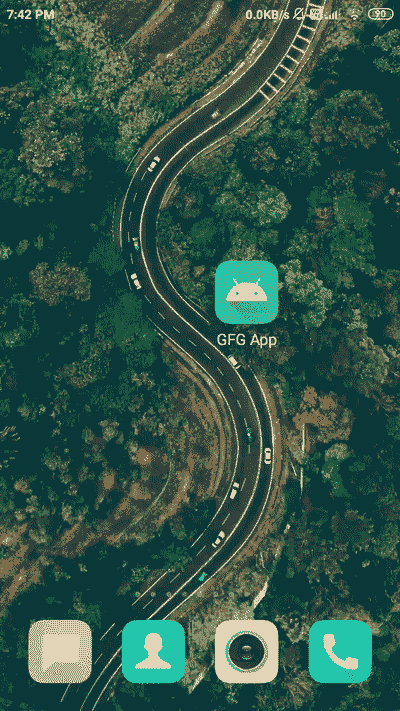

# 在安卓中使用 DragLinearLayout 进行拖放，示例

> 原文:[https://www . geeksforgeeks . org/拖放使用-draglalinelayout-in-Android-with-example/](https://www.geeksforgeeks.org/drag-and-drop-using-draglinearlayout-in-android-with-example/)

在大多数待办事项列表应用程序中，我们需要创建一个视图，以便用户可以根据自己的优先级对日常任务进行优先排序。为了让这个功能发挥作用，他应该能够拖放视图项目。为了在我们的应用程序中添加这种类型的功能，我们必须在我们的应用程序中使用**draglalinelayout**。在本文中，我们将了解如何为每个视图添加拖放功能来更改视图位置。对于这个特性，我们必须为 DragLinearLayout 添加一个库。

## DragLinearLayout 库的实现

使用 DragLinearLayout，我们可以创建一个父视图，在其中我们可以拖动我们的子项目。下面给出了一个示例 GIF，从中我们可以了解到本文要做什么。注意，我们将使用 **Java** 语言来实现这个项目。



### 逐步实施

**第一步:创建新项目**

要在安卓工作室创建新项目，请参考[如何在安卓工作室创建/启动新项目](https://www.geeksforgeeks.org/android-how-to-create-start-a-new-project-in-android-studio/)。确保选择 **Java** 作为编程语言。

**第二步:添加依赖项进行构建. gradle(模块:app)**

导航到**渐变脚本>构建.渐变(模块:应用)**，并在依赖项部分添加以下依赖项。

> 实现“com . jmedeisis:draglalinelayout:1 . 1 . 0”

现在同步项目。

**第三步:修改 strings.xml 文件**

下面是 **strings.xml** 文件的代码。

## 可扩展标记语言

```
<resources>
    <string name="app_name">GFG App</string>
    <string name="image_desc">image</string>
    <string name="dsa_course">DSA Course</string>
    <string name="geeks_for_geeks">Geeks for Geeks</string>
</resources>
```