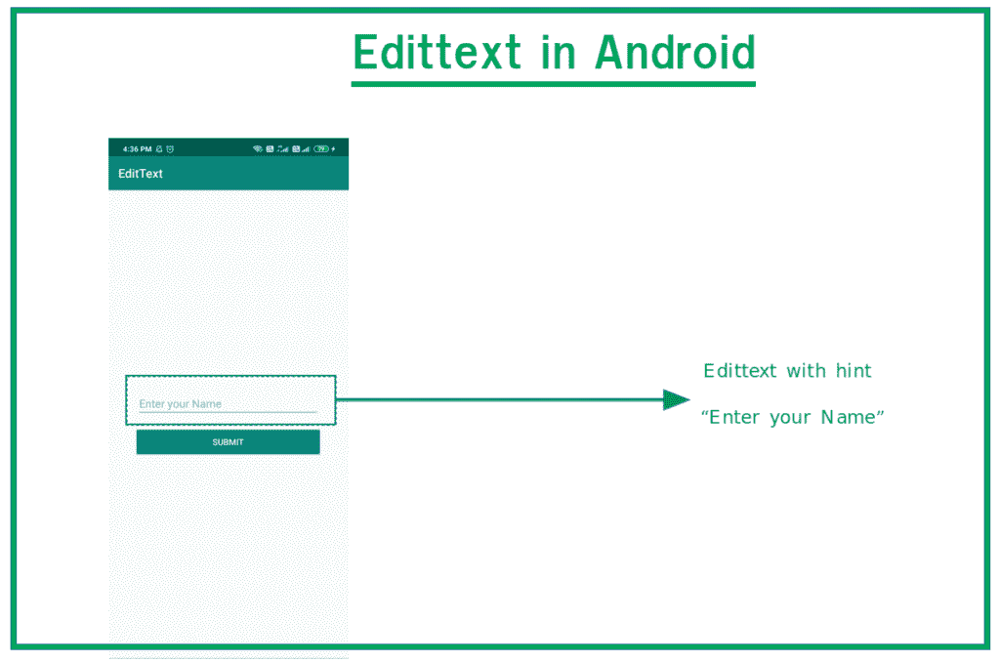
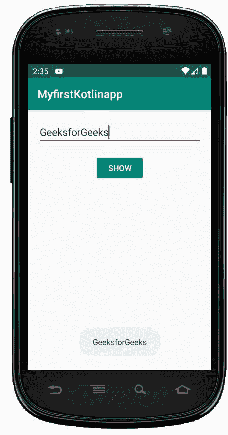

# 使用 Java 在安卓中编辑文本小部件，示例

> 原文:[https://www . geesforgeks . org/edittext-widget-in-Android-using-Java-with-examples/](https://www.geeksforgeeks.org/edittext-widget-in-android-using-java-with-examples/)

**小部件**是指[用户界面](https://www.geeksforgeeks.org/user-interface-ui/)的元素，帮助用户与安卓应用交互。**编辑文本**是许多可用于从用户处检索文本数据的小部件之一。

**编辑文本**是指显示一个空文本字段的小部件，用户可以在其中输入所需的文本，该文本将在我们的应用程序中进一步使用。

**类语法:**

```java
public class EditText
extends TextView
```

**等级等级:**

```java
java.lang.Object
  ↳android.view.View
     ↳ android.widget.TextView
          ↳ android.widget.EditText
```

**语法:**

```java
<SomeLayout>
    .
    .
    <Edittext
        android:SomeAttribute1 = "Value of attribute1"
        android:SomeAttribute2 = "Value of attribute2"
        .
        .
        android:SomeAttributeN = "Value of attributeN"/>
    .
    .
</SomeLayout>
```

这里的布局可以是任何布局，如相对、线性等(参考本文了解更多关于布局的信息)。在本文下面给出的表中，属性可能很多。

**示例:**

```java
 <RelativeLayout
      xmlns:android="http://schemas.android.com/apk/res/android"
      android:layout_width="match_parent"
      android:layout_height="match_parent"
      tools:context=".MainActivity"
      android:gravity="center">>

    <Edittext
        android:id="@+id/text_view_id"
        android:layout_height="wrap_content"
        android:layout_width="wrap_content"
        android:text="GeeksforGeeks" />

    <Button
        android:id="@+id/button_id"
        android:layout_width="300dp"
        android:layout_height="40dp"
        android:layout_below="@+id/edittext_id"
        android:layout_marginTop="20dp"
        android:text="Submit"
        android:textColor="#fff"
        android:background="@color/colorPrimary"/>

 </RelativeLayout>
```



**如何在安卓应用中包含编辑文本:**

*   首先[新建一个安卓应用](https://www.geeksforgeeks.org/android-how-to-create-start-a-new-project-in-android-studio/)，或者拿一个已有的应用去编辑。在这两种情况下，必须有一个 [**XML 布局活动**](https://www.geeksforgeeks.org/android-ui-layouts/) 文件和一个 [**Java 类**](https://www.geeksforgeeks.org/java-class-file/) 文件链接到此活动。
*   打开活动文件，在活动的布局(activity_main.xml)文件中包含一个编辑文本字段，并在 activity_main.xml 文件中添加一个按钮。
*   现在在 Java 文件中，用下面的代码链接这个布局文件:

```java
@Override
protected void onCreate(Bundle savedInstanceState)
{
    super.onCreate(savedInstanceState);
    setContentView(R.layout.activity_main);
}
```

其中 *activity_main* 是要附加的布局文件的名称。

*   现在我们将在*MainActivity.java 文件*中添加代码，使我们的布局具有交互性或响应性。我们的应用程序将在点击按钮时生成一个带有文本“**欢迎来到 geeks forgeeks【*****用户输入的名称*****】**”的[祝酒词](https://www.geeksforgeeks.org/android-what-is-toast-and-how-to-use-it-with-examples/)
*   布局文件和 Java 文件的完整代码如下。

下面是上述方法的实现:

**文件名:activity_main.xml**

## 可扩展标记语言

```java
<?xml version="1.0" encoding="utf-8"?>

<RelativeLayout
    xmlns:android="http://schemas.android.com/apk/res/android"
    xmlns:app="http://schemas.android.com/apk/res-auto"
    xmlns:tools="http://schemas.android.com/tools"
    android:layout_width="match_parent"
    android:layout_height="match_parent"
    tools:context=".MainActivity"
    android:gravity="center">

    <EditText
        android:id="@+id/edittext_id"
        android:layout_width="300dp"
        android:layout_height="40dp"
        android:hint="Enter your Name"/>

    <Button
        android:id="@+id/button_id"
        android:layout_width="300dp"
        android:layout_height="40dp"
        android:layout_below="@+id/edittext_id"
        android:layout_marginTop="20dp"
        android:text="Submit"
        android:textColor="#fff"
        android:background="@color/colorPrimary"/>

</RelativeLayout>
```

**文件名:MainActivity.java**

## Java 语言(一种计算机语言，尤用于创建网站)

```java
package com.project.edittext;

import androidx.appcompat.app.AppCompatActivity;
import android.os.Bundle;
import android.view.View;
import android.widget.Button;
import android.widget.EditText;
import android.widget.Toast;

public class MainActivity extends AppCompatActivity {

    private EditText editText;
    private Button button;

    @Override
    protected void onCreate(Bundle savedInstanceState)
    {
        super.onCreate(savedInstanceState);
        setContentView(R.layout.activity_main);

        editText
            = (EditText)findViewById(R.id.edittext_id);
        button
            = (Button)findViewById(R.id.button_id);

        button.setOnClickListener(
            new View.OnClickListener() {

                @Override
                public void onClick(View v)
                {
                    String name
                        = editText.getText()
                              .toString();
                    Toast.makeText(MainActivity.this,
                                   "Welcome to GeeksforGeeks "
                                       + name,
                                   Toast.LENGTH_SHORT)
                        .show();
                }
            });
    }
}
```

**输出:**启动应用程序并在编辑文本中输入名称后。然后显示编辑文本中的名称:



### 安卓系统中编辑文本的可扩展标记语言属性

<figure class="table">

| 属性 | 描述 |
| --- | --- |
| android:id | 用于唯一标识控件 |
| 安卓:重力 | 用于指定如何对齐文本，如左、右、中、上等。 |
| 安卓:提示 | 用于在文本为空时显示提示文本 |
| android:文本 | 用于设置编辑文本的文本 |
| android:文本大小 | 用于设置文本的大小。 |
| android:文本颜色 | 用于设置文本的颜色。 |
| android:textStyle | 用于设置文本的样式。例如，粗体、斜体、粗斜体等。 |
| Android:text llcaps | 使用此属性以大写字母显示文本。 |
| 安卓:宽度 | 它使文本视图正好有这么多像素宽。 |
| 安卓:身高 | 它使文本视图正好有这么多像素高。 |
| android:最大宽度 | 用于使文本视图最多有这么多像素宽。 |
| 安卓:minWidth | 用于使文本视图至少有这么多像素宽。 |
| 安卓:背景 | 用于设置此视图的背景。 |
| android:backgroundTint | 用于设置此视图背景的色调。 |
| 安卓:可点击 | 用于当您想要使此视图可点击时设置为真。否则，设置为 false。 |
| android:drawableBottom | 用于在此视图中将可绘制设置为文本的底部。 |
| Android:draw end | 用于在此视图中将可绘制设置为文本的结尾。 |
| 安卓:可画左 | 用于在此视图中将可绘制设置在文本的左侧。 |
| Android:draw padding | 用于将填充设置为可在视图中绘制。 |
| 安卓:drawableRight | 用于在此视图中将可绘制设置为文本的右侧。 |
| android:drawableStart | 用于在此视图中将可绘制设置为文本的开头。 |
| android:drawableTop | 用于在此视图中设置可绘制到文本的顶部。 |
| 安卓:提升 | 用于设置此视图的高程。 |

</figure>