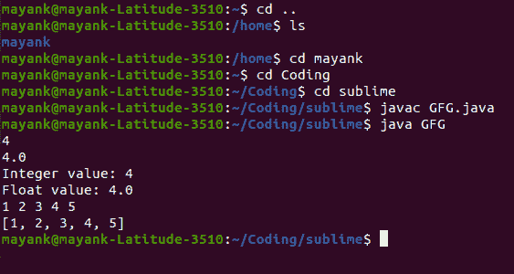

# 使用 Java 8 高效读取竞争性编程的输入

> 原文:[https://www . geesforgeks . org/efficient-reading-input-for-competitive-programming-use-Java-8/](https://www.geeksforgeeks.org/efficiently-reading-input-for-competitive-programming-using-java-8/)

众所周知，在解决任何 CP 问题时，第一步是收集输入或读取输入。我们都会犯的一个常见错误是在编写代码和编译时花费太多时间。在 Java 中，建议使用 BufferedReader 而不是 Scanner 来接受用户的输入。为什么呢？这在我们之前的一篇文章[中讨论过。](https://www.geeksforgeeks.org/difference-between-scanner-and-bufferreader-class-in-java/)(此外，与 java.util.Scanner 相关的问题也是可用的)为了更好地理解，我们将在本文中介绍这两种实现。

**读取输入的方式**

*   使用扫描仪类
*   使用 BufferedReader 类
*   借助流使用缓冲存储类(更优化)

现在让我们讨论通过提供干净的 java 程序和感知定制输入产生的输出来深入阅读的方法。

**方式一:简易扫描仪输入读数**

java.util.Scanner 类提供了从控制台读取原始数据和文本行的内置方法。在下面的代码片段中，让我们了解它是如何实现的。

**例**

## Java 语言(一种计算机语言，尤用于创建网站)

```
// Java Program Illustrating Reading Input
// Using Scanner class

// Importing Arrays and Scanner class
// from java.util package
import java.util.Arrays;
import java.util.Scanner;

// Main class
class GFG {

    // Main driver method
    public static void main(String[] args)
    {
        // Creating object of Scanner class
        Scanner scan = new Scanner(System.in);

        // Basic Input Reading
        int a = scan.nextInt();
        float b = scan.nextFloat();

        System.out.println("Integer value: " + a);
        System.out.println("Float value: " + b);

        // Space Separated Input Reading
        int[] arr = new int[5];

        for (int i = 0; i < arr.length; i++) {
            arr[i] = scan.nextInt();
        }

        System.out.println(Arrays.toString(arr));
    }
}
```

**输出:**



从上面的 Linux shell 输出我们可以得出结论，输入给出如下:

```
4
5.6
1 2 3 4 5
```

生成的输出如下:

```
Integer value: 4
Float value: 5.6
[1, 2, 3, 4, 5]
```

上面的例子说明了大多数程序员在解决竞争性编程问题时最常用的方法。但是，如果我们可以稍微增强我们的代码，使其更快、更可靠呢？

**方法 2:简单的 BufferedReader 输入读数**

java.io.BufferedReader class does 类不提供任何读取原语数据输入的方法。Java.io.BufferedReader class reads 类从字符输入流中读取文本，缓冲字符，以便提供对字符序列的有效读取。尽管它抛出了一个名为 IOException 的检查异常。让我们看看如何处理这个异常并读取用户的输入。考虑如下自定义输入:

**输入:**

```
4
5.6
1 2 3 4 5
```

**例**

## Java 语言(一种计算机语言，尤用于创建网站)

```
// Java Program Illustrating Reading Input
// Using

// Importing required classes
import java.io.BufferedReader;
import java.io.IOException;
import java.io.InputStreamReader;
import java.util.Arrays;

// Main class
class GFG {

    // Main driver method
    public static void main(String[] args)
        throws IOException
    {

        // Reading input via BufferedReader class
        BufferedReader br = new BufferedReader(
            new InputStreamReader(System.in));

        // Basic Input Reading
        int a = Integer.parseInt(br.readLine());
        float b = Float.parseFloat(br.readLine());

        // Print above input values in console
        System.out.println("Integer value: " + a);
        System.out.println("Float value: " + b);

        // Space Separated Input Reading
        int[] arr = new int[5];
        String[] strArr = br.readLine().split(" ");

        for (int i = 0; i < arr.length; i++) {
            arr[i] = Integer.parseInt(strArr[i]);
        }

        // Printing the elements in array
        // using toString() method
        System.out.println(Arrays.toString(arr));
    }
}
```

**输出:**

```
Integer value: 4
Float value: 5.6
[1, 2, 3, 4, 5]
```

上面的例子说明了在解决竞争性编程问题时读取数据的另一种常见方法。这就够了吗？如果我们能更进一步呢？是的。有可能。敬请关注。

**方法 3:通过流使用 BufferedReader 读取分离数据的增强方式**

在前面的示例中，我们已经看到，在读取以空格分隔的数据时，我们首先将其存储在 String 数组中，然后遍历元素，然后使用 java typecasting 将其转换为所需的数据类型。一行代码让这成为可能怎么样？是的。Java 8 的流库提供了多种功能，使其变得简单和优化。考虑如下自定义输入:

**输入:**

```
34 55 78 43 78 43 22
94 67 96 32 79 6 33
```

**例**

## Java 语言(一种计算机语言，尤用于创建网站)

```
// Java Program to Read Separated Data
// Using BufferedReader class voa enhanced for loopd

// Importing required classes
import java.io.BufferedReader;
import java.io.IOException;
import java.io.InputStreamReader;
import java.util.Arrays;
import java.util.List;
import java.util.stream.Collectors;
import java.util.stream.Stream;

// Main class
class GFG {

    // Main driver method
    public static void main(String[] args)
        throws IOException
    {

        // Reading input separated by space
        BufferedReader br = new BufferedReader(
            new InputStreamReader(System.in));

        // Storing in array
        int[] arr = Stream.of(br.readLine().split(" "))
                        .mapToInt(Integer::parseInt)
                        .toArray();
        System.out.println(Arrays.toString(arr));

        // Using streams concepts to parse map to integer
        // later on collecting via Collectors via toList()
        // method and storing it an integer list
        List<Integer> arrayList
            = Stream.of(br.readLine().split(" "))
                  .mapToInt(Integer::parseInt)
                  .boxed()
                  .collect(Collectors.toList());

        // Print the above List as created
        System.out.println(arrayList);
    }
}
```

**输出:**

```
[34, 55, 78, 43, 78, 43, 22]
[94, 67, 96, 32, 79, 6, 33]
```

上面的例子说明了我们如何使用一行代码读取分离的输入并将其存储到所需的数据结构中。使用 java8，程序员可能会对列表收集感到满意。这就是它被覆盖的原因。现在，让我们一个字一个字地理解代码。

> **存入 int 数组:**
> 
> 1.创建传递的字符串数组流
> 
> 2.br.readLine()。拆分(" ")–根据分隔符值将输入字符串转换为字符串数组。(示例中为空格–“”
> 
> 3.mapToInt(Integer::parsent)–使用合适的映射函数(示例中的 Integer 的 parsent()将字符串元素转换为所需的数据类型)
> 
> 4.toArray()–将 int 元素流转换为数组

> **存储到列表集合中:**
> 
> 1.创建传递的字符串数组流
> 
> 2.br.readLine()。拆分(" ")–根据分隔符值将输入字符串转换为字符串数组。(示例中为空格–“”
> 
> 3.mapToInt(Integer::parsent)–使用合适的映射函数(示例中的 Integer 的 parsent()将字符串元素转换为所需的数据类型)
> 
> 4.box()–将流装箱为整数元素
> 
> 5.collect(collectors . tolist())–创建整数元素的集合，并将其转换为 java.util.List 集合。