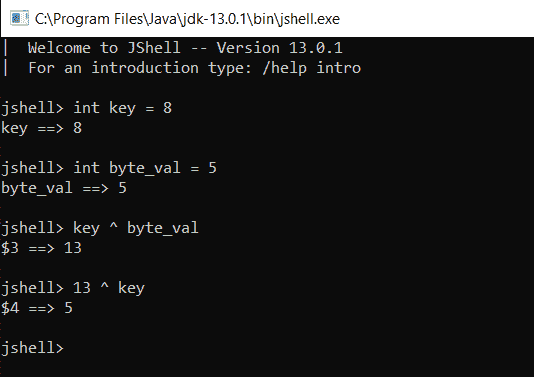
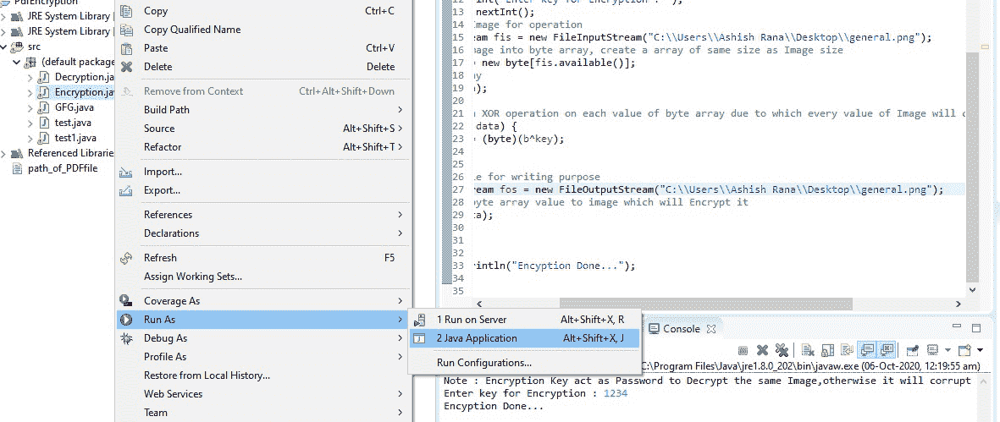

# 使用 Java 加密和解密图像

> 原文:[https://www . geesforgeks . org/encrypt-and-decrypt-image-use-Java/](https://www.geeksforgeeks.org/encrypt-and-decrypt-image-using-java/)

加密是将信息或数据转换成秘密代码的过程，特别是为了防止未经授权的访问。在这些情况下，我们也将这样做，对于加密，我们将把图像转换成一个字节数组，在转换之后，我们将对字节数组的每个值应用异或运算，并且在对字节数组的每个值执行异或运算之后，将会改变。现在执行操作后，我们将在映像中写入新数据，因此无法打开加密映像。这里的密钥将作为加密和解密图像的密码。

[**异或运算**](https://www.geeksforgeeks.org/find-xor-of-two-number-without-using-xor-operator/)

因为我们知道如何执行异或运算，现在我们将在这里看到异或运算将如何工作。让我们考虑一个样本输入和输出的例子。

**输入:**

```
int key = 8 
int byte_val = 5
```

**操作:**

```
// Performing XOR operation between key and byte_val 
key ^ byte_val         
```

**输出:**

```
// Output of XOR operation 
13              
```

**操作:**

```
// Performing XOR operation between output and key
13 ^ key                
```

**输出:**

```
//  byte_val
5                
```

**例 1:**

这里，是上面例子的截图。让我们看看。



在上面的例子中，我们已经清楚地观察到我们的 key = 8，byte_val = 5，当我们对 key 和 byte_val 执行异或运算时，它给出的输出是 13，现在如果我们再次对我们的输出“13”和 key 执行异或运算，我们再次得到我们的 byte_val。在加密和解密的情况下也执行相同的操作。

在字节数组和键的每个值之间执行异或运算，因此图像的所有数据都会发生变化，并且我们无法打开图像。现在，每当我们用相同的键值字节数组值应用解密操作时，都会得到对其原始值的更改，并且能够看到我们的原始图像。

**注意:**您可以在任何 IDE 中离线执行下面给出的代码，因为您需要一个输入图像位置，它可以从该位置加载您在加密和解密路径中指定的图像。

**在 IDE 上执行:**

*   像 eclipse IDE 一样打开 IDE。
*   创建新项目。
*   根据需要创建一个新类，如加密或解密。
*   在 IDE 中编写下面给出的加密和解密代码。
*   只需按 ***Ctrl+S*** 保存即可，也可以转到文件点击保存。
*   现在，要运行代码，只需选择您想要执行的类，如加密，然后右键单击。
*   作为 java 应用程序运行。
*   现在，您将看到输出的控制台窗口。

让我们看看上面提到的步骤的截图。



**加密可执行代码:**

## Java 语言(一种计算机语言，尤用于创建网站)

```
import java.io.FileInputStream;
import java.io.FileNotFoundException;
import java.io.FileOutputStream;
import java.io.IOException;
import java.util.Scanner;

public class Encryption {
    public static void main(String[] args)
        throws FileNotFoundException, IOException
    {
        Scanner sc = new Scanner(System.in);
        System.out.println("Note : Encryption Key act as Password to
          Decrypt the same Image,otherwise it will corrupt the Image.");

        // Here key is act as password to Encrypt and
        // Decrypt the Image
        System.out.print("Enter key for Encryption : ");
        int key = sc.nextInt();

        // Selecting a Image for operation
        FileInputStream fis = new FileInputStream(
            "C:\\Users\\lenovo\\Pictures\\logo4.png");

        // Converting Image into byte array, create a
        // array of same size as Image size

        byte data[] = new byte[fis.available()];

        // Read the array
        fis.read(data);
        int i = 0;

        // Performing an XOR operation on each value of
        // byte array due to which every value of Image
        // will change.
        for (byte b : data) {
            data[i] = (byte)(b ^ key);
            i++;
        }

        // Opening a file for writing purpose
        FileOutputStream fos = new FileOutputStream(
            "C:\\Users\\lenovo\\Pictures\\logo4.png");

        // Writing new byte array value to image which
        // will Encrypt it.

        fos.write(data);

        // Closing file
        fos.close();
        fis.close();
        System.out.println("Encryption Done...");
    }
}
```

> **注意:**加密密钥作为密码对同一个镜像进行解密，否则会破坏镜像。
> 
> 输入加密密钥:1234
> 
> 加密完成…

[**解密**](https://www.geeksforgeeks.org/difference-between-encryption-and-decryption/) 就是将加密数据转换成原来的形式，无非就是解密。在图像解密的情况下，我们也把加密的图像转换成它的原始形式。这里我们也将使用异或运算来执行解密。正如我们在上面的异或例子中观察到的，我们是如何通过对输出和键值执行异或运算来获得字节数组的原始值的。我们将在这里使用相同的逻辑。

## Java 语言(一种计算机语言，尤用于创建网站)

```
import java.io.FileInputStream;
import java.io.FileNotFoundException;
import java.io.FileOutputStream;
import java.io.IOException;
import java.util.Scanner;

public class Decryption {

    public static void main(String[] args)
        throws FileNotFoundException, IOException
    {
        Scanner sc = new Scanner(System.in);
        System.out.println(
            "Note : Encryption Key act as Password to Decrypt the same Image,
             otherwise it will corrupt the Image.");

        System.out.print("Enter a key for Decryption : ");
        int key = sc.nextInt();

        // Selecting a Image for Decryption.

        FileInputStream fis = new FileInputStream(
        "C:\\Users\\lenovo\\Pictures\\logo4.png");

        // Converting image into byte array,it will
        // Create a array of same size as image.
        byte data[] = new byte[fis.available()];

        // Read the array

        fis.read(data);
        int i = 0;

        // Performing an XOR operation
        // on each value of
        // byte array to Decrypt it.
        for (byte b : data) {
            data[i] = (byte)(b ^ key);
            i++;
        }

        // Opening file for writting purpose
        FileOutputStream fos = new FileOutputStream(
            "C:\\Users\\lenovo\\Pictures\\logo4.png");

        // Writting Decrypted data on Image
        fos.write(data);
        fos.close();
        fis.close();
        System.out.println("Decryption Done...");
    }
}
```

> **注意:**加密密钥作为密码对同一个镜像进行解密，否则会破坏镜像。
> 
> 输入解密密钥:1234
> 
> 解密完成…

通过使用相同的图像加密和解密逻辑，我们也可以创建一个小的图形用户界面项目。让我们看看。

<video class="wp-video-shortcode" id="video-495328-1" width="640" height="360" preload="metadata" controls=""><source type="video/mp4" src="https://media.geeksforgeeks.org/wp-content/uploads/20200917223130/Video_20200917_200259.mp4?_=1">[https://media.geeksforgeeks.org/wp-content/uploads/20200917223130/Video_20200917_200259.mp4](https://media.geeksforgeeks.org/wp-content/uploads/20200917223130/Video_20200917_200259.mp4)</video>