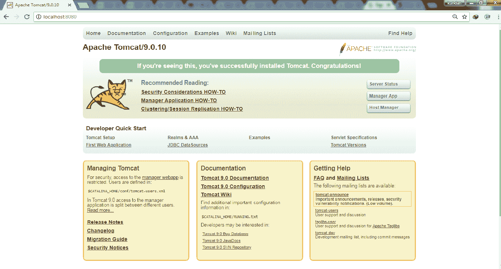

# JSP 的环境设置

> 原文:[https://www.geeksforgeeks.org/environment-setup-for-jsp/](https://www.geeksforgeeks.org/environment-setup-for-jsp/)

JSP 的环境设置主要包括 3 个步骤:

1.  建立 JDK。
2.  设置网络服务器(Tomcat)。
3.  正在启动 tomcat 服务器。

下面详细讨论了所有步骤:

1.  **Setting up Java Development Kit :**
    **Step 1:** This step involves downloading JDK from [Download JDK.](http://www.oracle.com/technetwork/java/javase/downloads/index.html)
    **Step 2:** Setting up the PATH environment variable appropriately. For windows:

    ```java
    right-click on My Computer->
    select Properties->
    Click on Advanced System setting ->
    Click on Environment Variables ->
    Then, update the PATH value5 and press the OK button.

    ```

    在 LINUX 系统上，如果 SDK 安装在/usr/local/jdk-9.0.4 中，并且您使用了 C shell，那么您将在您的。cshrc 文件。

    ```java
    setenv PATH /usr/local/jdk-9.0.4/bin:$PATH
    setenv JAVA_HOME /usr/local/jdk-9.0.4

    ```

2.  **设置 Web 服务器:Tomcat**
    Apache Tomcat 是 JavaServer Pages 和 Servlet 技术的开源软件实现，可以作为测试 JSP 的服务器，可以与 Apache Web 服务器集成。
    以下是在机器上设置 Tomcat 的步骤。
    **第一步:**从[这里](https://tomcat.apache.org/)下载最新版本的 Tomcat。
    **第二步:**下载后，将二进制发行版解包到合适的位置。
    **步骤 3:** 解包后创建 CATALINA_HOME 环境变量，指向相同的位置。

3.  **Start tomcat Server :**
    Starting on **Windows Machine** by using following command :

    ```java
    %CATALINA_HOME%\bin\startup.bat

    ```

    使用以下命令在 **Linux 机器**上启动:

    ```java
    $CATALINA_HOME/bin/startup.sh

    ```

    成功安装并为服务器成功设置路径后。我们可以在你的浏览器上使用 http://localhost:8080/看到 tomcat web 服务器的主页。

    

这是您将在浏览器中看到的最后一页。如果您没有得到所需的结果，那么从 tomcat 安装过程重新开始。