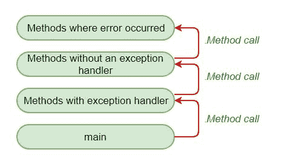

# Java 中的异常传播

> 原文:[https://www.geeksforgeeks.org/exception-propagation-java/](https://www.geeksforgeeks.org/exception-propagation-java/)

**先决条件:**[Java 中的异常](https://www.geeksforgeeks.org/exceptions-in-java/)[选中与未选中的异常](https://www.geeksforgeeks.org/checked-vs-unchecked-exceptions-in-java/)

**异常传播:**首先从栈顶抛出一个异常，如果没有被捕获，它会沿着调用栈下降到上一个方法。
在一个方法抛出异常后，运行时系统试图找到一些东西来处理它。处理异常的一组可能的“东西”是方法的有序列表，这些方法被调用来获取发生错误的方法。方法列表称为**调用栈**，搜索方法为**异常传播。**


**未检查异常中的异常传播**

当异常发生时，传播是一个过程，在这个过程中，异常被从堆栈的顶部放到底部。如果没有捕获到一次，异常将再次下降到上一个方法，以此类推，直到它被捕获或者到达调用堆栈的最底部。这被称为异常传播，这发生在未检查异常的情况下。

在下面的示例中，异常发生在 m()方法中，在那里它没有被处理，因此它被传播到先前的 n()方法中，在那里它没有被处理，同样，它被传播到 p()方法中，在那里它被处理。
异常可以在调用堆栈中的任何方法中处理，无论是 main()方法、p()方法、n()方法还是 m()方法。

**注意:**默认情况下，未检查的异常在调用链中被转发(传播)。

```java
// Java program to illustrate
// unchecked exception propagation
// without using throws keyword
class Simple {
    void m()
    {
        int data = 50 / 0; // unchecked exception occurred
        // exception propagated to n()
    }

    void n()
    {
        m();
        // exception propagated to p()
    }

    void p()
    {
        try {
            n(); // exception handled
        }
        catch (Exception e) {
            System.out.println("Exception handled");
        }
    }

    public static void main(String args[])
    {
        Simple obj = new Simple();
        obj.p();
        System.out.println("Normal flow...");
    }
}
```

**<u>输出:</u>**

```java
Exception handled 
Normal flow...

```

**已检查异常中的异常传播**

与未检查异常不同的是，在检查异常的情况下，异常**的传播不会发生**，这里强制使用[抛出关键字](https://www.geeksforgeeks.org/throw-throws-java/)。仅传播未检查的异常。**勾选异常抛出编译错误。**

在下面的例子中，如果我们省略 m()和 n()函数中的 throws 关键字，编译器将生成编译时错误。因为与未检查异常的情况不同，如果不使用 throws 关键字，检查的异常就无法传播。

**注意:**默认情况下，勾选的异常是**而不是**在调用链中转发(传播)。

```java
// Java program to illustrate exception propagation
// in checked exceptions  and it can be propagated
// by throws keyword ONLY
import java.io.IOException;
class Simple {

    // exception propagated to n()
    void m() throws IOException
    {
        // checked exception occurred
        throw new IOException("device error");
    }

    // exception propagated to p()
    void n() throws IOException
    {
        m();
    }
    void p()
    {
        try {

            // exception handled
            n();
        }
        catch (Exception e) {
            System.out.println("exception handled");
        }
    }

    public static void main(String args[])
    {
        Simple obj = new Simple();
        obj.p();
        System.out.println("normal flow...");
    }
}
```

**<u>输出:</u>**

```java
exception handled 
normal flow...

```