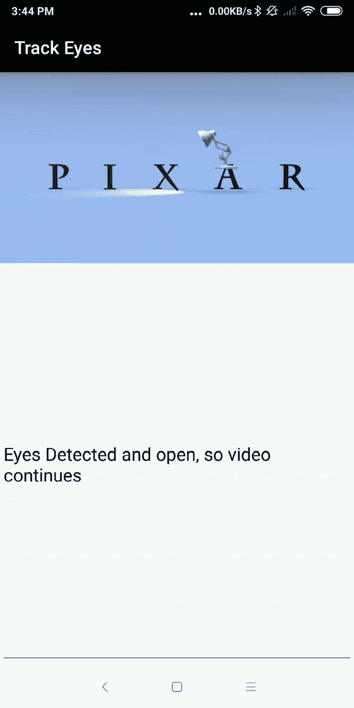
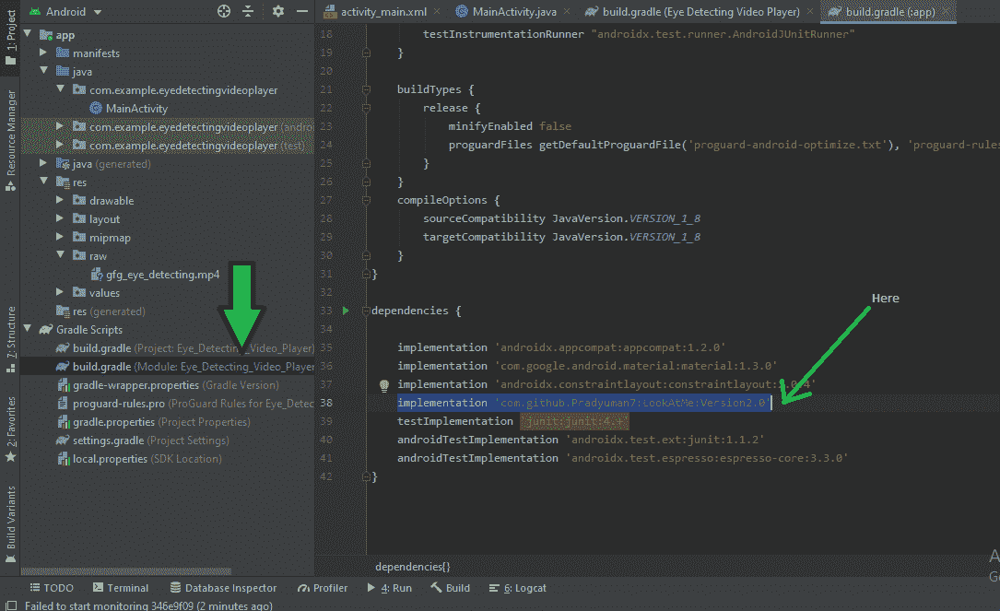
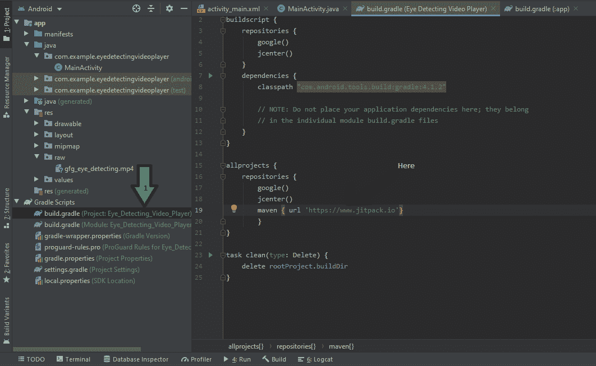
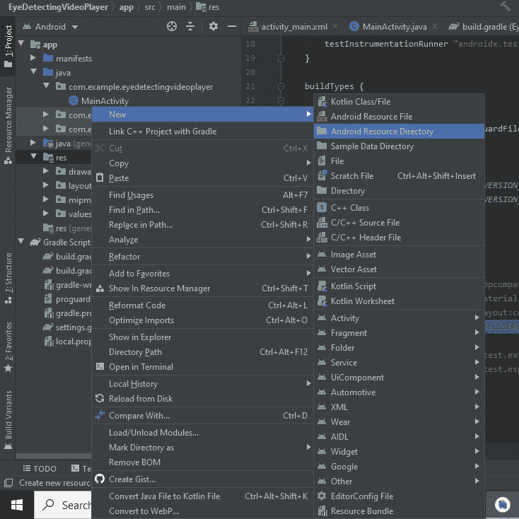
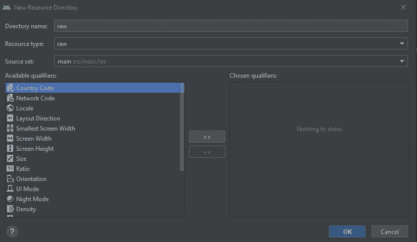

# 安卓中的眼睛检测视频播放器

> 原文:[https://www . geesforgeks . org/eye-detective-video-player in-Android/](https://www.geeksforgeeks.org/eye-detecting-video-player-in-android/)

在本文中，我们将学习如何制作眼睛检测视频播放器，并在我们的 android 应用程序中使用第三方库。如果你是安卓开发的初学者，那么通过制作这个应用程序，你将增强你的信心，并学习一些有趣和新的东西。

### **本文我们要构建什么？**

在这个应用程序中，我们将使用一个名为“ **LookAtMe** 的库，然后在我们的应用程序中放一个视频。如果用户的眼睛在摄像机的范围内，则视频将继续播放，但是如果眼睛不在摄像机的范围内，则视频将立即停止。如果用户的眼睛再次进入摄像机的范围，那么视频将从暂停的地方继续。下面给出一个 GIF 示例，了解一下我们在本文中要做什么。注意，我们将使用 **Java** 语言来实现这个项目。



因此，让我们看看这个应用程序的逐步实现。

### **分步实施**

**第一步:创建新项目**

要在安卓工作室创建新项目，请参考[如何在安卓工作室创建/启动新项目](https://www.geeksforgeeks.org/android-how-to-create-start-a-new-project-in-android-studio/)。注意选择 **Java** 作为编程语言。

**第二步:添加依赖和 JitPack 存储库**

导航到**渐变脚本>构建.渐变(模块:应用)**，并在依赖项部分添加以下依赖项。

> 实现' com . github . pradyuman 7:LookAtMe:2.0 版'



将 JitPack 存储库添加到构建文件中。将其添加到 allprojects{ }部分内存储库末尾的 root build.gradle 中。

> *所有项目{*
> 
> *存储库{*
> 
> *……*
> 
> *maven { URL " https://jitpack . io " }*
> 
> *}*
> 
> *}*



添加这个依赖项后，同步您的项目，现在我们将开始实现它。

**第三步:**转到“ **res** ，创建一个新的安卓资源目录，并将其命名为 raw。这个文件是用来粘贴我们要在应用程序中播放的离线视频的(对于在线视频，不需要创建它，我们可以用 java 代码提供视频的链接，我们将在后面看到)。

 

> **参考文章:**安卓工作室中的[资源 Raw 文件夹](https://www.geeksforgeeks.org/resource-raw-folder-in-android-studio/)

**第 4 步:使用 activity_main.xml 文件**

导航到**应用程序> res >布局> activity_main.xml** 并将下面的代码添加到该文件中。

```java
<com.pd.lookatme.LookAtMe
    android:id="@+id/lookme"
    android:layout_width="match_parent"
    android:layout_height="250dp" />
```

下面是 **activity_main.xml** 文件的代码。

## 可扩展标记语言

```java
<?xml version="1.0" encoding="utf-8"?>
<androidx.constraintlayout.widget.ConstraintLayout 
    xmlns:android="http://schemas.android.com/apk/res/android"
    xmlns:app="http://schemas.android.com/apk/res-auto"
    xmlns:tools="http://schemas.android.com/tools"
    android:layout_width="match_parent"
    android:layout_height="match_parent"
    tools:context=".MainActivity">

    <com.pd.lookatme.LookAtMe
        android:id="@+id/lookme"
        android:layout_width="443dp"
        android:layout_height="400dp"
        app:layout_constraintBottom_toBottomOf="parent"
        app:layout_constraintEnd_toEndOf="parent"
        app:layout_constraintStart_toStartOf="parent"
        app:layout_constraintTop_toTopOf="parent"
        app:layout_constraintVertical_bias="0.577" />

    <TextView
        android:id="@+id/textView"
        android:layout_width="wrap_content"
        android:layout_height="wrap_content"
        android:text="Eye Detecting Video Player"
        android:textColor="#0B0000"
        android:textSize="30sp"
        app:layout_constraintBottom_toTopOf="@+id/lookme"
        app:layout_constraintEnd_toEndOf="parent"
        app:layout_constraintHorizontal_bias="0.703"
        app:layout_constraintStart_toStartOf="parent"
        app:layout_constraintTop_toTopOf="parent"
        app:layout_constraintVertical_bias="1.0" />

    <ImageView
        android:id="@+id/imageView"
        android:layout_width="154dp"
        android:layout_height="118dp"
        app:layout_constraintBottom_toTopOf="@+id/textView"
        app:layout_constraintEnd_toEndOf="parent"
        app:layout_constraintHorizontal_bias="0.498"
        app:layout_constraintStart_toStartOf="parent"
        app:layout_constraintTop_toTopOf="parent"
        app:layout_constraintVertical_bias="1.0"
        app:srcCompat="@drawable/gfgimage" />

</androidx.constraintlayout.widget.ConstraintLayout>
```

**第五步:使用****MainActivity.java 文件**

转到**MainActivity.java**文件，参考以下代码。我们必须在 java 文件中使用下面这段代码。

```java
private LookAtMe lookAtMe;
lookAtMe = findViewById(R.id.lookme);
lookAtMe.init(this);
lookAtMe.setVideoURI(Uri.parse("android.resource://" + getPackageName() + "/" + R.raw.videoplayback));

// to use video from a url
lookAtMe.setVideoPath("http://website.com/video/mp4/62000/62792m.mp4"); 

lookAtMe.start();
lookAtMe.setLookMe();
```

下面是**文件的代码。代码中添加了注释，以更详细地理解代码。**

## **Java 语言(一种计算机语言，尤用于创建网站)**

```java
import android.os.Bundle;

import androidx.appcompat.app.AppCompatActivity;

import com.pd.lookatme.LookAtMe;

public class MainActivity extends AppCompatActivity {

    private LookAtMe lookAtMe;

    @Override
    protected void onCreate(Bundle savedInstanceState) {
        super.onCreate(savedInstanceState);
        setContentView(R.layout.activity_main);

        getSupportActionBar().hide();
        lookAtMe = findViewById(R.id.lookme);
        lookAtMe.init(this);

        // This line of code is used for offline videos which we pasted in our raw file.
        // lookAtMe.setVideoURI(Uri.parse("android.resource://" + getPackageName() + "/" + R.raw.gfg_eye_detecting));

        // This code is used for online videos along with their url
        // to use video from a url
        lookAtMe.setVideoPath("https://media.geeksforgeeks.org/wp-content/uploads/20210420234728/whatsnew.mp4?_=1"); 

        lookAtMe.start();
        lookAtMe.setLookMe();

    }
}
```

> ****注意:**你可以在这个应用里同时播放线上和线下的视频。为了播放离线视频，你必须把它粘贴在原始文件夹中，然后用代码给出它的名字，就像这里提到的“gfg_eye_detectig”，但是如果你想播放在线视频，你必须用上面提到的代码给出视频的 Url。**

****第 6 步:使用 AndroidManifest.xml 文件****

**最后一件事。如果您在应用程序中使用在线视频，请不要忘记在您的清单文件中授予[互联网权限。](https://www.geeksforgeeks.org/android-how-to-request-permissions-in-android-application/)**

****输出:****

**所以，我们都完成了代码和其他步骤，现在是时候看到输出了。在下面的视频中，您会看到，当我看向手机时，视频正在运行，但当我停止观看时，视频会自动暂停，只有在相机能够检测到眼睛时才会恢复。**

**<video class="wp-video-shortcode" id="video-606681-1" width="640" height="360" preload="metadata" controls=""><source type="video/mp4" src="https://media.geeksforgeeks.org/wp-content/uploads/20210516132353/WhatsApp-Video-2021-05-16-at-13.21.38.mp4?_=1">[https://media.geeksforgeeks.org/wp-content/uploads/20210516132353/WhatsApp-Video-2021-05-16-at-13.21.38.mp4](https://media.geeksforgeeks.org/wp-content/uploads/20210516132353/WhatsApp-Video-2021-05-16-at-13.21.38.mp4)</video>**

**因此，我们使用“LookAtMe”库制作了一个眼睛检测视频播放器应用程序，并对如何使用这个库有了一个基本的感觉。你可以利用这些基础知识来创建自己的应用程序，并越来越多地探索安卓开发。**