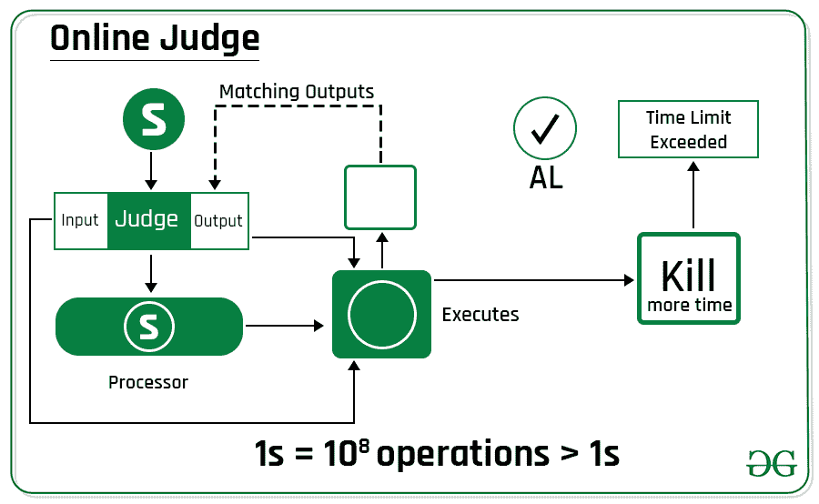

# Java 快速输出

> 原文:[https://www.geeksforgeeks.org/fast-output-in-java/](https://www.geeksforgeeks.org/fast-output-in-java/)

当在不同的编码平台上做一些问题时，我们最终会得到(TLE)。在那个时候，即使我们使用快速输入，有时(TLE)仍然在 Java 中。那时，如果我们使用快速输出和快速输入，可以减少时间。当我们必须打印许多项目时，通常使用快速输出，这将在后面作为方法 2 显示和讨论



**方法:**

1.  不使用快速输出(幼稚)
2.  使用快速输出(最佳)

**方法 1:** 不使用快速输出(标准方法)

[***system . out . println()***](https://www.geeksforgeeks.org/system-out-println-in-java/)用于打印传递给它的参数。它可以分为三个部分

*   **系统:**是 *java.lang 包*中定义的最终类。
*   **out:** 是 System 类的静态成员字段，类型为 PrintStream
*   **println():** 是 PrintStream 类的一个方法。 *println* 打印传递给标准控制台的参数和一个换行符。

**实现:**程序，我们在其中打印从 0 到 10^5 的值

**例**

## Java 语言(一种计算机语言，尤用于创建网站)

```java
// Java Program to Print VeryLarge Bunch of Numbers
// without using fast output concept

// Importin all input output classes
import java.io.*;

// Main class
class GFG {

    // Main driver method
    public static void main(String[] args)
    {

        // Iterating over very large value
        for (int i = 0; i < 100000; i++)

            // Print all the elements of an array
            // till the condition violates
            System.out.println(i);
    }
}
```

**输出:**打印从 0 到 9999 的 10000 个数字，该程序执行需要 0.88 秒

 

**方法二:**使用[快速输出](https://www.geeksforgeeks.org/fast-io-for-competitive-programming/)(最佳)

[PrintWriter 类](https://www.geeksforgeeks.org/java-io-printwriter-class-java-set-2/)是 [Writer 类](https://www.geeksforgeeks.org/java-io-writer-class-java/)的实现。当我们必须打印很多项目时，使用 PrintWriter 比使用 System.out.println 更好，因为 PrintWriter 比其他打印机更快地将数据打印到控制台。

System.out 变量引用了一个包装缓冲区输出流的打印流类型的对象。当您在 PrintStream 上调用其中一个 [*write()*](https://www.geeksforgeeks.org/printstream-writeint-method-in-java-with-examples/) 方法时，它会在内部刷新底层 BufferedOutputStream 的缓冲区。PrintWriter 不会发生这种情况。我们必须自己做。

**实施:**

**例**

## Java 语言(一种计算机语言，尤用于创建网站)

```java
// Java Program to Print VeryLarge Bunch of Numbers

// Importing input output classes
import java.io.*;

// Main class
class GFG {

    // Main driver method
    public static void main(String[] args)
    {
        // Again iterating over very Big value
        for (int i = 0; i < 100000; i++)

            // Print all the elements from the output stream
            out.print(i + "\n");

        // Flushing the content of the buffer to the
        // output stream using out.flush() methods
        out.flush();
    }
}
```

**输出:**

生成相同的输出，即从 0 到打印 9999 的 10000 个数字，并且该程序需要 0.14 秒来执行，相对于时间，生成的输出快 84%,比较了上述两个示例，如图所示。

 