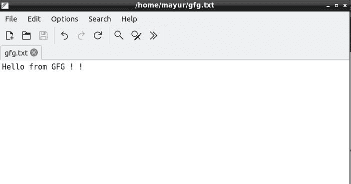

# Java 中的文件类 readString()方法，带示例

> 原文:[https://www . geesforgeks . org/files-class-read string-in-Java-method-with-examples/](https://www.geeksforgeeks.org/files-class-readstring-method-in-java-with-examples/)

Java 中[文件](https://www.geeksforgeeks.org/file-class-in-java/)类的 **readString()** 方法用于将内容读取到指定的文件中。

**语法:**

```
Files.readString(filePath)
```

**参数:**

```
path - File path with data type as Path
```

**返回值:**该方法以字符串格式返回文件内容。

下面是 readString()方法的两种重载形式。

```
public static String readString​(Path path) throws IOException 
public static String readString​(Path path, Charset cs) throws IOException
```

*   在第一种方法中使用 UTF-8 字符集将文件中的所有内容读入一个字符串，从字节解码为字符。
*   第二种方法使用指定的字符集进行相同的操作。

**输入文件:**



输入文件

下面是问题陈述的实现:

## Java 语言(一种计算机语言，尤用于创建网站)

```
// Implementation fo readString() method in Java
import java.io.IOException;
import java.nio.file.Files;
import java.nio.file.Path;
import java.nio.file.Paths;

public class GFG {
    public static void main(String[] args)
    {
        // creating path
        Path filePath
            = Paths.get("/home/mayur/", "temp", "gfg.txt");
        try

        {
            // reading file from given path
            String content = Files.readString(filePath);
            // printing the content
            System.out.println(content);
        }
        catch (IOException e) {
            e.printStackTrace();
        }
    }
}
```

**输出:**

```
Hello from GFG!
```