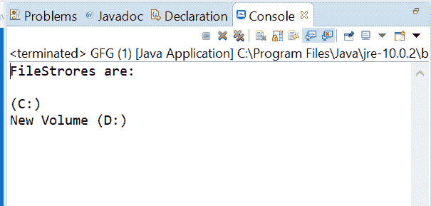
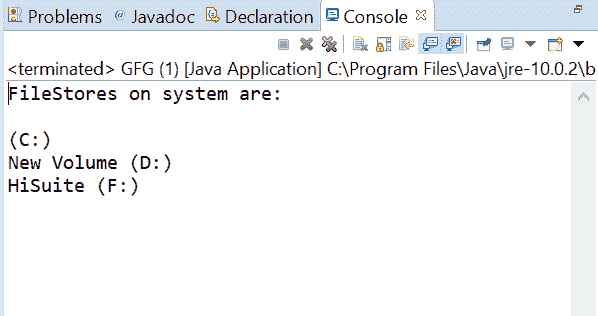

# 文件系统获取文件存储()方法，带示例

> 原文:[https://www . geesforgeks . org/file system-getfilestores-method-in-Java-with-examples/](https://www.geeksforgeeks.org/filesystem-getfilestores-method-in-java-with-examples/)

**Java . nio . file . file**的**getfilestore()**方法用于返回一个可迭代的 FileStore 对象来迭代底层文件存储。返回的迭代器包含的元素是这个文件系统的文件存储。当由于无法访问文件存储而发生输入输出错误时，迭代器不会返回该错误。

**语法:**

```java
public abstract Iterable<FileStore> getFileStores()

```

**参数:**此方法不接受任何东西。

**返回值:**这个方法返回一个对象来遍历后备文件存储。

下面的程序说明了 getFileStores()方法:
**程序 1:**

```java
// Java program to demonstrate
// java.nio.file.FileSystem.getFileStores() method

import java.nio.file.*;
import java.util.Iterator;

public class GFG {
    public static void main(String[] args)
    {

        // create object of Path
        Path path = Paths.get("C:\\Users\\"
                              + "asingh.one\\Documents");

        // get FileSystem object
        FileSystem fs = path.getFileSystem();

        // apply getFileStores() methods
        Iterable<FileStore> it = fs.getFileStores();

        // print all FileStore contains by this system
        Iterator<FileStore> iterator = it.iterator();
        System.out.println("FileStrores are:\n");
        while (iterator.hasNext()) {
            System.out.println(iterator.next());
        }
    }
}
```

**输出:**


**程序 2:**

```java
// Java program to demonstrate
// java.nio.file.FileSystem.getFileStores() method

import java.nio.file.*;
import java.util.Iterator;

public class GFG {
    public static void main(String[] args)
    {

        // create object of Path
        Path path = Paths.get("D:\\eclipse");

        // get FileSystem object
        FileSystem fs = path.getFileSystem();

        // apply getFileStores() methods
        Iterable<FileStore> it = fs.getFileStores();

        // print all FileStore contains by this system
        Iterator<FileStore> iterator = it.iterator();
        System.out.println("FileStores on system are:\n");
        while (iterator.hasNext()) {
            System.out.println(iterator.next());
        }
    }
}
```

**输出:**


**参考文献:**[https://docs . Oracle . com/javase/10/docs/API/Java/nio/file/file . html # getFileStores()](https://docs.oracle.com/javase/10/docs/api/java/nio/file/FileSystem.html#getFileStores())