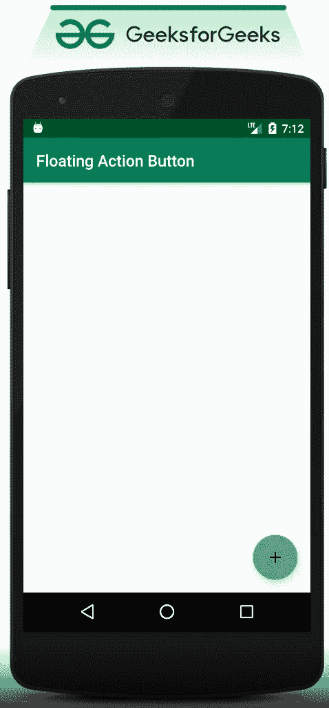
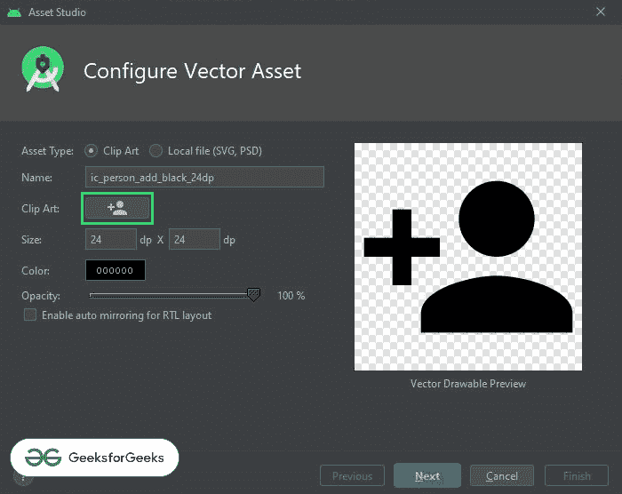
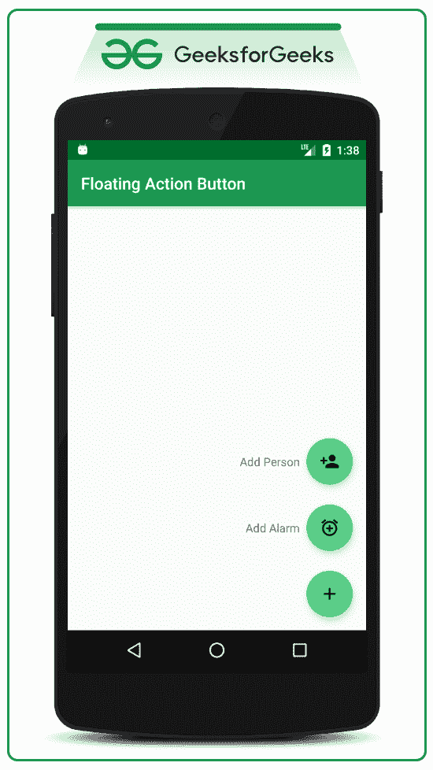
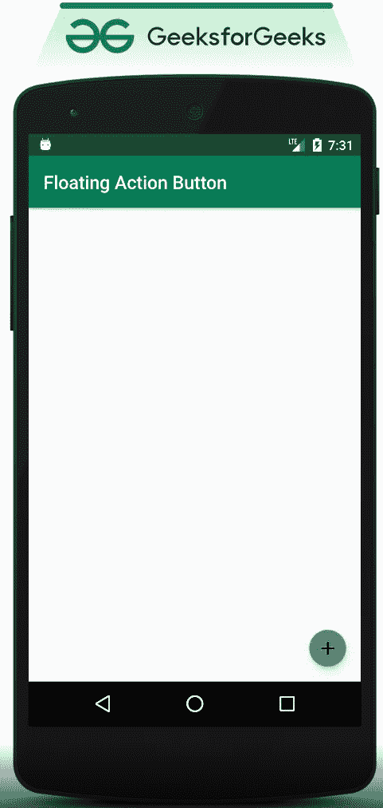

# 安卓浮动动作按钮(FAB)示例

> 原文:[https://www . geesforgeks . org/floating-action-button-fab-in-Android-with-example/](https://www.geeksforgeeks.org/floating-action-button-fab-in-android-with-example/)

浮动动作按钮与普通按钮有点不同。浮动操作按钮在应用程序的用户界面中实现，用于用户的主要操作(提升的操作)，浮动操作按钮下的操作由开发人员确定优先级。例如，在现有列表中添加一个项目。因此，在本文中，已经展示了如何实现浮动动作按钮(FAB)，并且 FAB 下的按钮也用简单的 [Toast](https://www.geeksforgeeks.org/android-what-is-toast-and-how-to-use-it-with-examples/) 消息来处理。请注意，我们将使用 Java 语言实现这个项目。

### **浮动动作按钮的类型**

安卓上主要有**四种**类型的浮动动作按钮。

*   正常/常规浮动操作按钮
*   迷你浮动动作按钮
*   扩展浮动操作按钮
*   主题化浮动操作按钮

在本文中，我们通过安卓系统中的一个示例来讨论**普通/常规浮动操作按钮**和**迷你浮动操作按钮**。

### 正常/常规浮动操作按钮

常规晶圆厂是指未扩展且大小正常的晶圆厂。以下示例显示了带有加号图标的常规 FAB。



### 创建普通/常规工厂的步骤

**第一步:创建新项目**

要在安卓工作室创建新项目，请参考[如何在安卓工作室创建/启动新项目](https://www.geeksforgeeks.org/android-how-to-create-start-a-new-project-in-android-studio/)。请注意，选择 Java 作为编程语言。

**第二步:添加对应用级 Gradle 文件的依赖。**

*   这里我们使用的是由谷歌材质设计团队设计开发的浮动动作按钮。
*   将 [build.gradle(app)](https://www.geeksforgeeks.org/android-build-gradle/) 文件中的依赖项添加为:

> 实现' com . Google . Android . material:material:1 . 3 . 0-alpha 02 '

*   确保将依赖项添加到应用程序级别的 Gradle 文件中。添加依赖项后，您需要点击出现在[安卓工作室 IDE](https://www.geeksforgeeks.org/guide-to-install-and-set-up-android-studio/) 右上角的“**立即同步**”按钮。
*   当用户单击“立即同步”按钮时，请确保您已连接到网络，以便它可以下载所需的文件。
*   如果您无法获得上述步骤，请参考下图:


**第三步:将 FAB 图标添加到可绘制文件**

*   出于演示目的，将在可绘制文件夹中导入 3 个图标，用户可以导入他/她选择的图标。可以通过**右键单击可绘制文件夹- >新建- >矢量资源**来实现。参考下图导入矢量图标。


*   现在选择您的矢量图标:



*   现在打开 **activity_main.xml** ，添加浮动动作按钮。

**第 4 步:使用 activity_main.xml 文件**

*   在 **activity_main.xml** 文件中，添加浮动操作按钮，并调用以下代码。现在调用正常的晶圆厂按钮。半径为 56dp。
*   我们已经将子 FAB 按钮链接到父 FAB 按钮，以便它们在一个键行中。代码中添加了注释，以更详细地理解代码。

## 可扩展标记语言

```java
<?xml version="1.0" encoding="utf-8"?>
<androidx.constraintlayout.widget.ConstraintLayout 
    xmlns:android="http://schemas.android.com/apk/res/android"
    xmlns:app="http://schemas.android.com/apk/res-auto"
    xmlns:tools="http://schemas.android.com/tools"
    android:layout_width="match_parent"
    android:layout_height="match_parent"
    tools:context=".MainActivity"
    tools:ignore="HardcodedText">

    <!--This will be the parent Floating Action Button-->
    <!--After the implementation the Floating Action Button
         at the bottom right corner-->
    <!--After clicking the above button the following two buttons 
        will pop up. So this button is considered as parent FAB-->
    <com.google.android.material.floatingactionbutton.FloatingActionButton
        android:id="@+id/add_fab"
        android:layout_width="wrap_content"
        android:layout_height="wrap_content"
        android:layout_gravity="end"
        android:layout_marginEnd="16dp"
        android:layout_marginBottom="16dp"
        android:src="@drawable/ic_add_black_24dp"
        app:fabSize="normal"
        app:layout_constraintBottom_toBottomOf="parent"
        app:layout_constraintEnd_toEndOf="parent" />

    <!--Floating action button for add alarm-->
    <!--Make sure that you are constraining this 
        button to the parent button-->
    <com.google.android.material.floatingactionbutton.FloatingActionButton
        android:id="@+id/add_alarm_fab"
        android:layout_width="wrap_content"
        android:layout_height="wrap_content"
        android:layout_marginBottom="24dp"
        app:fabSize="normal"
        app:layout_constraintBottom_toTopOf="@+id/add_fab"
        app:layout_constraintEnd_toEndOf="@+id/add_fab"
        app:layout_constraintStart_toStartOf="@+id/add_fab"
        app:srcCompat="@drawable/ic_add_alarm_black_24dp" />

    <!--Action name text for the add alarm button-->
    <!--Make sure that you are constraining this Text to 
        the add Alarm FAB button-->
    <TextView
        android:id="@+id/add_alarm_action_text"
        android:layout_width="wrap_content"
        android:layout_height="wrap_content"
        android:layout_marginEnd="8dp"
        android:text="Add Alarm"
        app:layout_constraintBottom_toBottomOf="@+id/add_alarm_fab"
        app:layout_constraintEnd_toStartOf="@+id/add_alarm_fab"
        app:layout_constraintTop_toTopOf="@+id/add_alarm_fab" />

    <!--Floating action button for add person-->
    <!--Make sure that you are constraining this 
        button to the add Alarm FAB button-->
    <com.google.android.material.floatingactionbutton.FloatingActionButton
        android:id="@+id/add_person_fab"
        android:layout_width="wrap_content"
        android:layout_height="wrap_content"
        android:layout_marginBottom="24dp"
        app:fabSize="normal"
        app:layout_constraintBottom_toTopOf="@+id/add_alarm_fab"
        app:layout_constraintEnd_toEndOf="@+id/add_alarm_fab"
        app:layout_constraintStart_toStartOf="@+id/add_alarm_fab"
        app:srcCompat="@drawable/ic_person_add_black_24dp" />

    <!--Action name text for the add person button-->
    <!--Make sure that you are constraining this Text 
        to the add Person FAB button-->
    <TextView
        android:id="@+id/add_person_action_text"
        android:layout_width="wrap_content"
        android:layout_height="wrap_content"
        android:layout_marginEnd="8dp"
        android:text="Add Person"
        app:layout_constraintBottom_toBottomOf="@+id/add_person_fab"
        app:layout_constraintEnd_toStartOf="@+id/add_person_fab"
        app:layout_constraintTop_toTopOf="@+id/add_person_fab" />

</androidx.constraintlayout.widget.ConstraintLayout>
```

**输出界面生成为:**



**步骤 5:使用 MainActivity.java 文件**

*   现在使用 **setOnClickListener()** 方法处理所有这些 FAB 按钮，您可以参考[在按钮|安卓中处理点击事件。](https://www.geeksforgeeks.org/handling-click-events-button-android/)
*   现在在**MainActivity.java**调用下面的代码来处理它们。阅读代码下的注释，以便更好地理解。在这段代码中，已经显示了当子晶圆厂用 onClickListener 可见时。代码中添加了注释，以更详细地理解代码。

## Java 语言(一种计算机语言，尤用于创建网站)

```java
import android.os.Bundle;
import android.view.View;
import android.widget.TextView;
import android.widget.Toast;
import androidx.appcompat.app.AppCompatActivity;
import com.google.android.material.floatingactionbutton.FloatingActionButton;

public class MainActivity extends AppCompatActivity {

    // Make sure to use the FloatingActionButton
    // for all the FABs
    FloatingActionButton mAddFab, mAddAlarmFab, mAddPersonFab;

    // These are taken to make visible and invisible along
    // with FABs
    TextView addAlarmActionText, addPersonActionText;

    // to check whether sub FAB buttons are visible or not.
    Boolean isAllFabsVisible;

    @Override
    protected void onCreate(Bundle savedInstanceState) {
        super.onCreate(savedInstanceState);
        setContentView(R.layout.activity_main);

        // Register all the FABs with their IDs
        // This FAB button is the Parent
        mAddFab = findViewById(R.id.add_fab);
        // FAB button
        mAddAlarmFab = findViewById(R.id.add_alarm_fab);
        mAddPersonFab = findViewById(R.id.add_person_fab);

        // Also register the action name text, of all the FABs.
        addAlarmActionText = findViewById(R.id.add_alarm_action_text);
        addPersonActionText = findViewById(R.id.add_person_action_text);

        // Now set all the FABs and all the action name
        // texts as GONE
        mAddAlarmFab.setVisibility(View.GONE);
        mAddPersonFab.setVisibility(View.GONE);
        addAlarmActionText.setVisibility(View.GONE);
        addPersonActionText.setVisibility(View.GONE);

        // make the boolean variable as false, as all the
        // action name texts and all the sub FABs are invisible
        isAllFabsVisible = false;

        // We will make all the FABs and action name texts
        // visible only when Parent FAB button is clicked So
        // we have to handle the Parent FAB button first, by
        // using setOnClickListener you can see below
        mAddFab.setOnClickListener(
                new View.OnClickListener() {
                    @Override
                    public void onClick(View view) {
                        if (!isAllFabsVisible) {

                            // when isAllFabsVisible becomes
                            // true make all the action name
                            // texts and FABs VISIBLE.
                            mAddAlarmFab.show();
                            mAddPersonFab.show();
                            addAlarmActionText.setVisibility(View.VISIBLE);
                            addPersonActionText.setVisibility(View.VISIBLE);

                            // make the boolean variable true as
                            // we have set the sub FABs
                            // visibility to GONE
                            isAllFabsVisible = true;
                        } else {

                            // when isAllFabsVisible becomes
                            // true make all the action name
                            // texts and FABs GONE.
                            mAddAlarmFab.hide();
                            mAddPersonFab.hide();
                            addAlarmActionText.setVisibility(View.GONE);
                            addPersonActionText.setVisibility(View.GONE);

                            // make the boolean variable false
                            // as we have set the sub FABs
                            // visibility to GONE
                            isAllFabsVisible = false;
                        }
                    }
                });

        // below is the sample action to handle add person
        // FAB. Here it shows simple Toast msg. The Toast
        // will be shown only when they are visible and only
        // when user clicks on them
        mAddPersonFab.setOnClickListener(
                new View.OnClickListener() {
                    @Override
                    public void onClick(View view) {
                        Toast.makeText(MainActivity.this, "Person Added", Toast.LENGTH_SHORT).show();
                    }
                });

        // below is the sample action to handle add alarm
        // FAB. Here it shows simple Toast msg The Toast
        // will be shown only when they are visible and only
        // when user clicks on them
        mAddAlarmFab.setOnClickListener(
                new View.OnClickListener() {
                    @Override
                    public void onClick(View view) {
                        Toast.makeText(MainActivity.this, "Alarm Added", Toast.LENGTH_SHORT).show();
                    }
                });
    }
}
```

### 输出:在模拟器上运行

<video class="wp-video-shortcode" id="video-490355-1" width="640" height="360" preload="metadata" controls=""><source type="video/mp4" src="https://media.geeksforgeeks.org/wp-content/uploads/20200921191630/GFG_frame_nexus_5.mp4?_=1">[https://media.geeksforgeeks.org/wp-content/uploads/20200921191630/GFG_frame_nexus_5.mp4](https://media.geeksforgeeks.org/wp-content/uploads/20200921191630/GFG_frame_nexus_5.mp4)</video>

### 迷你浮动动作按钮

小型晶圆厂用于较小的屏幕。迷你晶圆厂也可以用来创造与其他屏幕元素的视觉连续性。以下示例显示了带有加号图标的迷你 FAB。



### 打造迷你晶圆厂

现在调用迷你 FAB 按钮。半径为 40dp。所有其他的东西都改名一样。只需要更改一个属性，即:

> *应用程序:fabSize="mini"*

**完成更改后，输出用户界面看起来像:**

<video class="wp-video-shortcode" id="video-490355-2" width="640" height="360" preload="metadata" controls=""><source type="video/mp4" src="https://media.geeksforgeeks.org/wp-content/uploads/20200921193510/GFG_frame_nexus_5.mp4?_=2">[https://media.geeksforgeeks.org/wp-content/uploads/20200921193510/GFG_frame_nexus_5.mp4](https://media.geeksforgeeks.org/wp-content/uploads/20200921193510/GFG_frame_nexus_5.mp4)</video>

> **注意:**FAB 按钮也可以通过将 **fabSize** 属性更改为 **auto 来自动调整大小。**这将使 FAB 尺寸根据窗口尺寸自动迷你和正常。
> 
> ***app:fab size = " auto "***