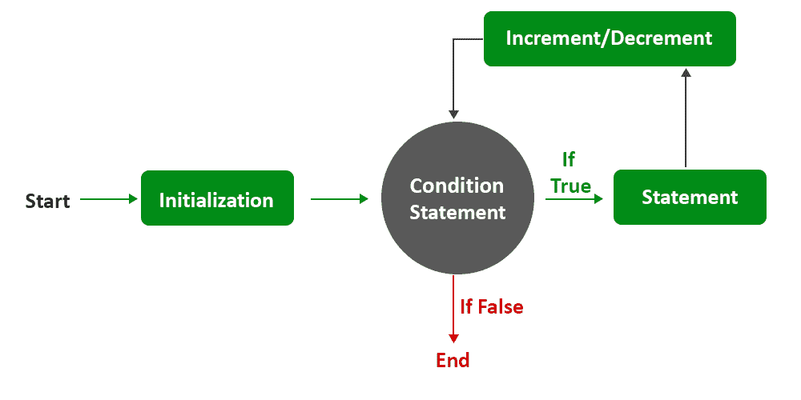

# Java 中的循环|要点

> 原文:[https://www . geesforgeks . org/for-loop-Java-重要点/](https://www.geeksforgeeks.org/for-loop-java-important-points/)

[编程语言中的循环](https://www.geeksforgeeks.org/loops-in-java/)是一种功能，当某个条件评估为真时，它有助于重复执行一组指令/功能。在 Java 中，任何编程语言都不可能提供四种执行循环的方式，即 while 循环、for 循环、for-每个循环、do-while 循环，或者我们基本上可以称之为**三种类型的循环**在一些书籍中，for-每个循环都被视为增强 for 循环。让我们详细讨论循环。

一般来说，我们倾向于使用 while 循环，因为如果我们进入学习循环，我们会得到更好的理解，但是在饱和之后，我们作为程序员倾向于 for 循环，因为它更干净，基础是直接进行的，为此我们必须仔细掌握语法如下:



**语法:**由三部分组成，如下所示:

*   变量初始化
*   需要迭代这些定义变量的特定条件
*   一个终止部分，我们通常使用变量来达到终止条件状态。

```java
for(initialization; boolean expression; update statement) { 
// Body of for loop 
} 
```

这通常是 for 循环的基本朝圣结构。

让我们看一些使用 for 循环的基本例子，以及使用 for 循环的常见陷阱，这使我们能够更好地了解内部工作，就像我们玩代码一样。

**用例 1:** **在 for 循环中提供表达式是必须的**

For 循环必须由循环语句中的有效表达式组成，否则会导致无限循环。声明

```java
for ( ; ; ) 
is similar to
while(true)
```

> **注:**以上所说的是高级编程的症结所在，因为它是编程中逻辑构建的起源。

**例**

## Java 语言(一种计算机语言，尤用于创建网站)

```java
// Java program to illustrate Infinite For loop

// Main class
public class GFG {

    // Main driver method
    public static void main(String[] args)
    {
        // For loop
        for (;;) {

            // Print statement everytime condition holds
            // true making body to execute
            System.out.println("This is an infinite loop");
        }
    }
}
```

**输出:**重复打印语句“这是一个无限循环”。

```java
This is an infinite loop
This is an infinite loop
This is an infinite loop
This is an infinite loop
...
...
This is an infinite loop
```

**用例 2:** **初始化多个变量**

在 Java 中，无论是否在循环中使用，都可以在 for 循环的初始化块中初始化多个变量。

**示例:**

## Java 语言(一种计算机语言，尤用于创建网站)

```java
// Java Program to Illustrate Initializing Multiple
// Variables in Initialization Block

// Main class
public class GFG {

    // Main driver method
    public static void main(String[] args)
    {
        // Declaring an integer variable
        int x = 2;

        // For loop to iterate
        for (long y = 0, z = 4; x < 10 && y < 10;
             x++, y++) {
            // Printing value/s stored in variable named y
            // defined inside body of for loop
            System.out.println(y + " ");
        }

        // Printing value/s stored in variable named x
        // defined outside body of for loop
        System.out.println(x);
    }
}
```

**Output**

```java
0 
1 
2 
3 
4 
5 
6 
7 
10
```

在上面的代码中，for 循环有简单的变化。在初始化块中声明并初始化了两个变量。变量“z”未被使用。另外，另外两个组件包含额外的变量。因此，可以看出，这些块可能包含额外的变量，这些变量可能不会被彼此引用。

**用例 3:初始化块中变量的重新声明**

假设初始化变量已经声明为整数。这里我们不能用另一种数据类型在 for 循环中重新声明它，如下所示:

**例 1:**

## Java 语言(一种计算机语言，尤用于创建网站)

```java
// Java Program to Illustrate Redeclaring a Variable
// in Initialization Block

// Main class
public class GFG {

    // Main driver method
    public static void main(String[] args)
    {
        // Declaring an integer variable
        int x = 0;

        // Redeclaring above variable
        // as long will not work
        for (long y = 0, x = 1; x < 5; x++) {

            // Printing the value inside the variable
            System.out.print(x + " ");
        }
    }
}
```

**输出:**

```java
Example3.java:12: error: variable x is already defined in method main(String[])
        for(long y = 0, x = 1; x < 5; x++)
```

这里，x 已经被初始化为零整数，并在循环中用 long 数据类型重新声明。但是这个问题可以通过稍微修改代码来解决。这里，变量 x 和 y 以不同的方式声明。

**例 2:**

## Java 语言(一种计算机语言，尤用于创建网站)

```java
// Java Program to Illustrate Redeclaring a Variable
// in Initialization Block

// Main class
public class GFG {

    // main driver method
    public static void main(String[] args)
    {
        // Declaring and initializing variables
        int x = 0;
        long y = 10;

        // For loop to iterate over till
        // custom specified check
        for (y = 0, x = 1; x < 5; x++) {

            // Printing value contained in memory block
            // of the variable
            System.out.print(x + " ");
        }
    }
}
```

**输出:**

```java
1 2 3 4
```

**用例 4:初始化块中声明的变量必须是同一类型**

当我们声明如下所示的变量时，这只是常识:

```java
 int x, y;
```

这里两个变量是同一类型的。循环初始化块也是如此。

**示例:**

## Java 语言(一种计算机语言，尤用于创建网站)

```java
// Java program to Illustrate Declaring a Variable
// in Initialization Block

// Main class
public class GFG {

    // Main driver method
    public static void main(String[] args)
    {
        // Declaring integer variable
        // int x;

        // Note:  This will cause error;

        // Redeclaring x as long will not work
        for (long y = 0, x = 1; x < 5; x++) {

            // Printing the value stored
            System.out.print(x + " ");
        }
    }
}
```

**Output**

```java
1 2 3 4 
```

**用例 5:循环中的变量只能在**内访问

根据变量范围的[概念，初始化块中声明的变量只能在循环中访问。](https://www.geeksforgeeks.org/variable-scope-in-java/)

**示例:**

## Java 语言(一种计算机语言，尤用于创建网站)

```java
// Java Program to Illustrate Scope of Initializing
// Variables Within the oop

// Main class
public class GFG {

    // Main driver method
    public static void main(String[] args)
    {
        // x and y scope is declared only
        // within for loop
        for (int x = 0, y = 0; x < 3 && y < 3; x++, y++) {
            // Printing value stored in variable named y
            System.out.println(y + " ");
        }

        // Printing value stored in variable named x
        // after inner loop is over
        System.out.println(x);
    }
}
```

**错误:**

```java
Example5.java:13: error: cannot find symbol
        System.out.println(x);
```

> 在上面的例子中，变量 x 在循环外是不可访问的。被注释的语句给出了一个编译器错误。

本文由 **Preeti Pardeshi** 供稿。如果你喜欢 GeeksforGeeks 并想投稿，你也可以使用[write.geeksforgeeks.org](http://www.write.geeksforgeeks.org)写一篇文章或者把你的文章邮寄到 review-team@geeksforgeeks.org。看到你的文章出现在极客博客主页上，帮助其他极客。如果你发现任何不正确的地方，或者你想分享更多关于上面讨论的话题的信息，请写评论。