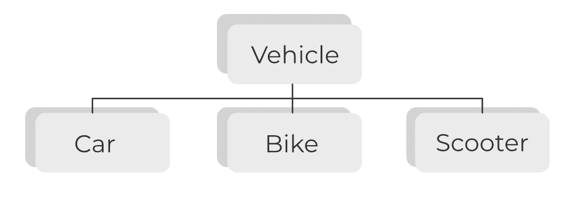

# Java 的四个主要面向对象编程概念

> 原文:[https://www . geesforgeks . org/four-main-object-oriented-programming-of-Java/](https://www.geeksforgeeks.org/four-main-object-oriented-programming-concepts-of-java/)

面向对象编程通常被称为 OOPS，它是 java 的支柱，因为 java 是一种完全面向对象的语言。Java 围绕各种对象和定义良好的接口组织程序。下面列出了 OOPS 中的四个支柱。这些**概念**旨在程序中实现真实世界的实体。

*   抽象
*   包装
*   遗产
*   多态性

抽象是隐藏实现细节的过程，并且只向用户公开功能。在抽象中，我们处理的是想法而不是事件。这意味着用户将只知道“它做了什么”，而不知道“它是如何做的”。

**在 Java 中实现抽象有两种方式**

1.  抽象类(0 到 100%)
2.  接口(100%)

> **现实生活示例:**驾驶员将专注于汽车功能(启动/停止- >加速/制动)，他/她不关心加速/制动机构内部如何工作。这就是抽象的工作原理。

关于 OOPS 这一支柱，应记住以下关键点:

*   如果一个类有一个或多个抽象方法，那么这个类应该是抽象的
*   抽象类可以有构造函数、具体方法、静态方法和最终方法
*   抽象类不能直接用 ***新的*** 运算符实例化。如下图所示:

```
A b = new B();
```

*   子类应该覆盖父类的所有抽象方法，否则子类应该用抽象关键字声明



**示例:**

## Java 语言(一种计算机语言，尤用于创建网站)

```
// Abstract class
public abstract class Car {
    public abstract void stop();
}

// Concrete class
public class Honda extends Car {
    // Hiding implementation details
    @Override public void stop()
    {
        System.out.println("Honda::Stop");
        System.out.println(
            "Mechanism to stop the car using break");
    }
}

public class Main {
    public static void main(String args[])
    {
        Car obj
            = new Honda(); // Car object =>contents of Honda
        obj.stop(); // call the method
    }
}
```

**支柱 2:封装**

**封装**是将代码和数据一起封装成单个单元的过程。

> **真实例子:**
> 
> 由几种药物混合而成的胶囊。药品对最终用户来说是隐藏的数据。

为了在 java 中实现封装，请遵循以下建议的特定步骤:

*   将变量声明为私有
*   声明[设置器和获取器](https://www.geeksforgeeks.org/advantages-of-getter-and-setter-over-public-fields-in-java-with-examples/)来设置和获取变量值

> **注意:**Java 中封装的缺点很少，如下所示:
> 
> 1.  **对数据的控制:**我们可以在 setter 方法中写入逻辑，不存储整数的负值。所以通过这种方式我们可以控制数据。
> 2.  **数据隐藏:**数据成员是私有的，所以其他类不能访问数据成员。
> 3.  **易于测试:**单元测试对于封装类很容易

**示例:**

## Java 语言(一种计算机语言，尤用于创建网站)

```
// A Java class which is a fully encapsulated class.
public class Car
{

        // private variable  
        private String name;

        // getter method for name  
        public String getName()
    {
           return name;

    }

        // setter method for name  
        public void setName(String name)
    {
           this.name = name  
    }

}

// Java class to test the encapsulated class.  
public class Test
{
       public static void main(String[] args)
    {

            // creating instance of the encapsulated class  
            Car car
            = new Car();

            // setting value in the name member  
            car.setName("Honda");

            // getting value of the name member  
            System.out.println(car.getName());

    }

}
```

**支柱 3:** 继承

**继承**是 Java 中一个类从另一个类继承属性和方法的过程。当我们的对象之间有**是-一种**关系时，就使用了继承。Java 中的继承是使用**扩展**关键字实现的。

> **真实例子:**
> 
> 地球和火星这两颗行星继承了超一流的太阳系，太阳系继承了银河系。所以银河系是太阳系、地球和火星的顶级超级星系。

在提出代码之前，让我们用一个普通的例子来讨论继承在 java 应用程序中的用法。因此，考虑一个扩展[异常类](https://www.geeksforgeeks.org/exceptions-in-java/)的例子，以创建一个包含更多信息(如错误代码)的特定于应用程序的异常类。例如[空指针异常](https://www.geeksforgeeks.org/null-pointer-exception-in-java/)。

java 中有以下 5 种不同类型的继承:

1.  **单一继承:**B 类使用 extends 关键字继承 B 类
2.  **多级继承:**C 类继承 B and B 类使用 extends 关键字继承 A 类
3.  **层次继承:**B 类和 C 类使用 extends 关键字按照层次顺序继承 A 类
4.  **多重继承:**C 类继承 A 类和 B 类，这里 A 和 B 都是超类，C 只是一个子类。Java 不支持多重继承，但是我们可以使用接口来实现。
5.  **混合继承:**D 类继承 B 类和 C 类，B 类和 C 类继承 a，这里还是一样，D 类继承两个超类，所以 Java 也不支持混合继承。

**示例:**

## Java 语言(一种计算机语言，尤用于创建网站)

```
// super class
class Car {
    // the Car class have one field
    public String wheelStatus;
    public int noOfWheels;

    // the Car class has one constructor
    public Car(String wheelStatus, int noOfWheels)
    {
        this.wheelStatus = wheelStatus;
        this.noOfWheels = noOfWheels;
    }

    // the Car class has three methods
    public void applyBrake()
    {
        wheelStatus = "Stop" System.out.println(
            "Stop the car using break");
    }

    // toString() method to print info of Car
    public String toString()
    {
        return ("No of wheels in car " + noOfWheels + "\n"
                + "status of the wheels " + wheelStatus);
    }
}

// sub class
class Honda extends Car {

    // the Honda subclass adds one more field
    public Boolean alloyWheel;

    // the Honda subclass has one constructor
    public Honda(String wheelStatus, int noOfWheels,
                 Boolean alloyWheel)
    {
        // invoking super-class(Car) constructor
        super(wheelStatus, noOfWheels);
        alloyWheel = alloyWheel;
    }

    // the Honda subclass adds one more method
    public void setAlloyWheel(Boolean alloyWheel)
    {
        alloyWheel = alloyWheel;
    }

    // overriding toString() method of Car to print more
    // info
    @Override public String toString()
    {
        return (super.toString() + "\nCar alloy wheel "
                + alloyWheel);
    }
}

// driver class
public class Main {
    public static void main(String args[])
    {

        Honda honda = new Honda(3, 100, 25);
        System.out.println(honda.toString());
    }
}
```

**支柱 4:**Java 中的多态性

多态性是以多种方式完成许多事情的能力。多态性这个词来自两个不同的希腊语单词——poly 和 morphs。“聚”意味着很多，“形”意味着形式。所以多态性意味着多种形式。多态性也可以出现在继承的情况下。这些函数根据实际实现的不同而有所不同。

> **真实例子:**
> 
> 送货人向用户递送物品。如果是邮递员，他会送信。如果是送餐员，他会把食物送给用户。像这样的多态性为传递函数实现了不同的方式。

多态性有两种类型，如下所示:

1.  静态或编译时多态性
2.  动态或运行时多态性

静态或编译时多态性当编译器能够确定实际函数时，称为**编译时**多态性。编译时多态性可以通过 java 中的**方法重载**来实现。当一个类中的不同函数具有相同的名称但不同的签名时，这被称为方法重载。方法签名包含名称和方法参数。因此，重载方法有不同的参数。参数可能在数量或类型上有所不同。

**例 1:** 静态多态性

## Java 语言(一种计算机语言，尤用于创建网站)

```
public class Car{

    public void speed() {
    }

    public void speed(String accelerator) {
    }

    public int speed(String accelerator, int speedUp) {
        return carSpeed;
    }
}
```

**动态或运行时多态性发生在**当编译器不能确定它是超类方法还是子类方法时，它被称为**运行时**多态性。运行时多态性通过**方法覆盖**来实现。当超类方法在子类中被重写时，它被称为方法重写。

**例 2:** 动态多态性

## Java 语言(一种计算机语言，尤用于创建网站)

```
import java.util.Random;

class DeliveryBoy {

    public void deliver() {
        System.out.println("Delivering Item");
    }

    public static void main(String[] args) {
        DeliveryBoy deliveryBoy = getDeliveryBoy();
        deliveryBoy.deliver();
    }

    private static DeliveryBoy getDeliveryBoy() {
        Random random = new Random();
        int number = random.nextInt(5);
        return number % 2 == 0 ? new Postman() : new FoodDeliveryBoy();
    }
}

class Postman extends DeliveryBoy {
    @Override
    public void deliver() {
        System.out.println("Delivering Letters");
    }
}

class FoodDeliveryBoy extends DeliveryBoy {
    @Override
    public void deliver() {
        System.out.println("Delivering Food");
    }
}
```

**Output**

```
Delivering Letters

```