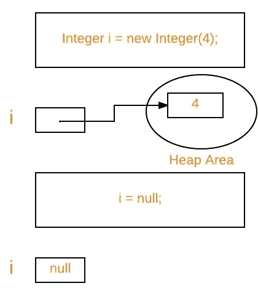

# Java 中的垃圾收集

> 原文:[https://www.geeksforgeeks.org/garbage-collection-java/](https://www.geeksforgeeks.org/garbage-collection-java/)

Java 中的垃圾收集是 Java 程序执行自动内存管理的过程。Java 程序编译成字节码，可以在 Java 虚拟机(简称 JVM)上运行。当 Java 程序在 JVM 上运行时，对象是在堆上创建的，堆是程序专用的一部分内存。最终，一些对象将不再需要。垃圾收集器会找到这些未使用的对象并删除它们以释放内存。

#### 什么是垃圾收集？

在 C/C++中，程序员负责对象的创建和销毁。通常，程序员会忽略无用对象的销毁。由于这个疏忽，在某一点上，可能没有足够的内存来创建新的对象，整个程序会异常终止，导致 **OutOfMemoryErrors** 。

但是在 Java 中，程序员不需要关心那些不再使用的对象。垃圾收集器会销毁这些对象。垃圾收集器的主要目标是通过销毁**不可到达的对象**来释放堆内存。垃圾收集器是[守护线程](https://www.geeksforgeeks.org/daemon-thread-java/)的最好例子，因为它总是在后台运行。

#### Java 中的垃圾收集是如何工作的？

Java 垃圾收集是一个自动过程。自动垃圾收集是查看堆内存、识别哪些对象在使用中，哪些没有使用，以及删除未使用对象的过程。正在使用的对象或被引用的对象意味着程序的某些部分仍然保持指向该对象的指针。未使用或未引用的对象不再被程序的任何部分引用。因此未引用对象使用的内存可以被回收。程序员不需要显式标记要删除的对象。垃圾收集实现存在于 JVM 中。

### Java 垃圾收集中的活动类型

Java 中通常会发生两种类型的垃圾收集活动。这些是:

1.  **次要或增量垃圾收集:**据说是在年轻一代堆内存中不可到达的对象被移除时发生的。
2.  **主要或完全垃圾收集:**据说是在次要垃圾收集幸存下来并复制到老一代或永久一代堆内存中的对象被移除时发生的。与年轻一代相比，老一代的垃圾收集频率较低。

### Java 中与垃圾收集相关的重要概念

**1。不可达对象:**如果一个对象不包含任何对它的引用，那么这个对象就是不可达的。此外，请注意，作为隔离岛一部分的对象也是不可访问的。

```
Integer i = new Integer(4);
// the new Integer object is reachable  via the reference in 'i' 
i = null;
// the Integer object is no longer reachable. 
```



**2。垃圾收集的资格:**如果一个对象不可访问，则称其有资格进行垃圾收集。在 *i = null* 之后，堆区的整数对象 4 适合上图中的垃圾收集。

#### 使对象适合垃圾收集器的方法

*   即使程序员不负责销毁无用的对象，但如果不再需要某个对象，强烈建议将其设为不可访问(因此符合 GC 条件)。
*   通常有四种方法可以使对象适合垃圾收集。
    1.  取消引用变量
    2.  重新分配参考变量
    3.  在方法内部创建的对象
    4.  孤岛

#### 请求 [JVM](https://www.geeksforgeeks.org/jvm-works-jvm-architecture/) 运行垃圾收集器的方式

*   一旦我们使一个对象符合垃圾收集的条件，它可能不会被垃圾收集器立即销毁。每当 JVM 运行垃圾收集器程序时，只有对象会被销毁。但是当 JVM 运行垃圾收集器时，我们不能期待。
*   我们也可以请求 JVM 运行垃圾收集器。有两种方法可以做到:
    1.  **使用*****System . GC()*****方法:**系统类包含静态方法 *gc()* 用于请求 JVM 运行垃圾收集器。
    2.  **使用** ***Runtime.getRuntime()。gc()*** **方法:** [Runtime 类](https://www.geeksforgeeks.org/java-lang-runtime-class-in-java/)允许应用程序与运行该应用程序的 JVM 接口。因此，通过使用它的 gc()方法，我们可以请求 JVM 运行垃圾收集器。
    3.  不能保证上述两种方法中的任何一种都能运行垃圾收集器。
    4.  调用 *System.gc()* 实际上相当于调用: *Runtime.getRuntime()。gc()*

#### 定稿

*   就在销毁对象之前，垃圾收集器调用对象上的 *finalize()* 方法来执行清理活动。一旦 *finalize()* 方法完成，垃圾收集器就会销毁该对象。
*   *finalize()* 方法存在于[对象类](https://www.geeksforgeeks.org/object-class-in-java/)中，其原型如下。

```
protected void finalize() throws Throwable
```

基于我们的需求，我们可以覆盖 *finalize()* 方法来执行我们的清理活动，比如关闭数据库的连接。

1.  *finalize()* 方法由垃圾收集器调用，而不是 JVM。然而，垃圾收集器是 JVM 的模块之一。
2.  对象类 *finalize()* 方法有一个空实现。因此，建议覆盖 *finalize()* 方法来处置系统资源或执行其他清理。
3.  对于任何对象， *finalize()* 方法都不会被调用一次以上。
4.  如果 *finalize()* 方法引发了一个未捕获的异常，该异常将被忽略，并且该对象的 finalize 将终止。

#### Java 中垃圾收集的优势

Java 中垃圾收集的优点是:

*   这使得 java 内存高效，因为垃圾收集器从堆内存中移除了未引用的对象。
*   它是由垃圾收集器(JVM 的一部分)自动完成的，所以我们不需要额外的努力。

#### 真实世界的例子

让我们举一个真实的例子，我们使用垃圾收集器的概念。

**问题:**假设你去 GeeksForGeeks 实习，被告知要写一个程序来统计在公司工作的员工人数(不包括实习生)。要制作这个程序，你必须使用垃圾收集器的概念。

***这是公司给你的实际任务:***

编写一个程序来创建一个名为 Employee 的类，该类包含以下数据成员。

1.用于存储分配给每个员工的唯一标识的标识。
2。员工姓名。
3。员工的年龄。

另外，提供以下方法:

1.  初始化名称和年龄的参数化构造函数。标识应该在这个构造函数中初始化。
2.  show()方法显示身份证、姓名和年龄。
3.  一个方法 showNextId()来显示下一个员工的 Id。

现在，任何不了解 Java 中垃圾收集器的初学者都会这样编写代码:

## Java 语言(一种计算机语言，尤用于创建网站)

```
// Java Program to count number
// of employees working
// in a company

class Employee {

    private int ID;
    private String name;
    private int age;
    private static int nextId = 1;
    // it is made static because it
    // is keep common among all and
    // shared by all objects

    public Employee(String name, int age)
    {
        this.name = name;
        this.age = age;
        this.ID = nextId++;
    }
    public void show()
    {
        System.out.println("Id=" + ID + "\nName=" + name
                           + "\nAge=" + age);
    }
    public void showNextId()
    {
        System.out.println("Next employee id will be="
                           + nextId);
    }
}

class UseEmployee {
    public static void main(String[] args)
    {
        Employee E = new Employee("GFG1", 56);
        Employee F = new Employee("GFG2", 45);
        Employee G = new Employee("GFG3", 25);
        E.show();
        F.show();
        G.show();
        E.showNextId();
        F.showNextId();
        G.showNextId();

        { // It is sub block to keep
            // all those interns.
            Employee X = new Employee("GFG4", 23);
            Employee Y = new Employee("GFG5", 21);
            X.show();
            Y.show();
            X.showNextId();
            Y.showNextId();
        }
        // After countering this brace, X and Y
        // will be removed.Therefore,
        // now it should show nextId as 4.

          // Output of this line
        E.showNextId();
        // should be 4 but it will give 6 as output.
    }
}
```

**Output**

```
Id=1
Name=GFG1
Age=56
Id=2
Name=GFG2
Age=45
Id=3
Name=GFG3
Age=25
Next employee id will be=4
Next employee id will be=4
Next employee id will be=4
Id=4
Name=GFG4
Age=23
Id=5
Name=GFG5
Age=21
Next employee id will be=6
Next employee id will be=6
Next employee id will be=6
```

**现在获取正确的输出:**

现在垃圾收集器(gc)将看到两个对象空闲。现在为了减少 nextId，gc(垃圾收集器)将只在我们程序员在我们的类中重写它时调用方法 finalize()。如前所述，我们必须请求 gc(垃圾收集器)，为此，我们必须在关闭子块的大括号之前编写以下 3 个步骤。

1.  将引用设置为空(即 X = Y =空；)
2.  Call，system . GC()；
3.  调用，system . run finalization()；

现在计算员工人数的正确代码(不包括实习生)

## Java 语言(一种计算机语言，尤用于创建网站)

```
// Correct code to count number
// of employees excluding interns.

class Employee {

    private int ID;
    private String name;
    private int age;
    private static int nextId = 1;

    // it is made static because it
    // is keep common among all and
    // shared by all objects
    public Employee(String name, int age)
    {
        this.name = name;
        this.age = age;
        this.ID = nextId++;
    }
    public void show()
    {
        System.out.println("Id=" + ID + "\nName=" + name
                           + "\nAge=" + age);
    }
    public void showNextId()
    {
        System.out.println("Next employee id will be="
                           + nextId);
    }
    protected void finalize()
    {
        --nextId;
        // In this case,
        // gc will call finalize()
        // for 2 times for 2 objects.
    }
}

public class UseEmployee {
    public static void main(String[] args)
    {
        Employee E = new Employee("GFG1", 56);
        Employee F = new Employee("GFG2", 45);
        Employee G = new Employee("GFG3", 25);
        E.show();
        F.show();
        G.show();
        E.showNextId();
        F.showNextId();
        G.showNextId();

        {
            // It is sub block to keep
            // all those interns.
            Employee X = new Employee("GFG4", 23);
            Employee Y = new Employee("GFG5", 21);
            X.show();
            Y.show();
            X.showNextId();
            Y.showNextId();
            X = Y = null;
            System.gc();
            System.runFinalization();
        }
        E.showNextId();
    }
}
```

**输出**

```
Id=1
Name=GFG1
Age=56
Id=2
Name=GFG2
Age=45
Id=3
Name=GFG3
Age=25
Next employee id will be=4
Next employee id will be=4
Next employee id will be=4
Id=4
Name=GFG4
Age=23
Id=5
Name=GFG5
Age=21
Next employee id will be=6
Next employee id will be=6
Next employee id will be=4
```

**相关文章:**

*   [如何在 Java 中让对象符合垃圾收集的条件？](https://www.geeksforgeeks.org/how-to-make-object-eligible-for-garbage-collection/)
*   [爪哇岛隔离岛](https://www.geeksforgeeks.org/island-of-isolation-in-java/)
*   [Java 程序输出|第 10 集(垃圾收集)](https://www.geeksforgeeks.org/output-of-java-programs-set-10-garbage-collection/)
*   [如何在 Java 中找到最大内存、自由内存](https://www.geeksforgeeks.org/find-max-memory-free-memory-total-memory-java/)、[和总内存？](https://www.geeksforgeeks.org/find-max-memory-free-memory-total-memory-java/)
*   [JVM 如何工作——JVM 架构？](https://www.geeksforgeeks.org/jvm-works-jvm-architecture/)

本文由 **Chirag Agarwal 和 Gaurav migrani**供稿。如果你发现任何不正确的地方，或者你想分享更多关于上面讨论的话题的信息，请写评论。