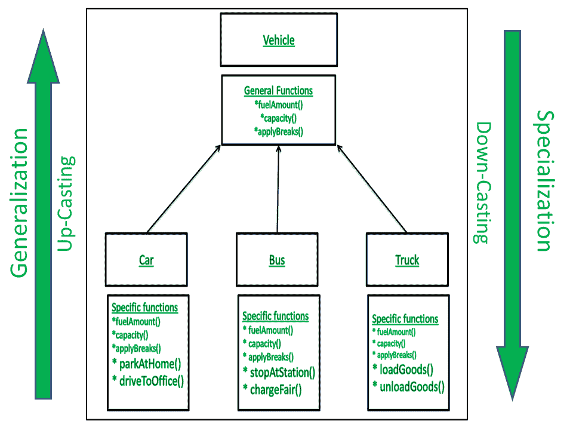

# Java 中的泛化和专门化

> 原文:[https://www . geesforgeks . org/generation-and-specification-in-Java/](https://www.geeksforgeeks.org/generalization-and-specialization-in-java/)

### <u>普通班？</u>

粗略地说，这是一门只讲主要特征而不讲具体细节的课程。位于继承层次结构顶部的类可以说是通用的。

### <u>具体类别？</u>

一个非常特别并陈述了具体细节的类。位于继承层次结构底部的类可以说是特定的。
**例 1:**

```
Relatively General Class: Money
Relatively Specific Class: Dollar, Euro, Rupees
```

**例 2:**

```
Lemon, Orange are more Specific than Citrus
Banana, Apple are more Specific than Non-Citrus
Citrus, Non-Citrus are more Specific than Fruit
Fruit is most general class
```

### <u>一个类类型到另一个类类型的转换？</u>

我们可以在 Java 中将对一个类类型的引用转换成另一个类类型。但是为了转换的发生，类应该通过[继承的方式相互关联。](https://www.geeksforgeeks.org/inheritance-in-java/)



因此，

*   车辆和总线参考**可以相互类型化。**
*   **车辆和汽车的参考**可以相互进行类型铸造。****
*   ****车辆和卡车的参考**可以相互进行类型铸造。******
*   ******公共汽车、轿车和卡车的参考文献**不能相互进行类型铸造。********

### ****<u>概括</u>****

****将子类类型转换为超类类型称为“**泛化**”，因为我们正在使子类变得更加通用，其范围也在不断扩大。这也被称为**加宽或向上铸造**。加宽是安全的，因为类将变得更加通用。
比如我们说汽车是交通工具，就不会有异议。因此，Java 编译器一般不会要求强制转换运算符。
**例:****** 

## ****Java 语言(一种计算机语言，尤用于创建网站)****

```
**class Father {
    public void work()
    {
        System.out.println("Earning Father");
    }
}

class Son extends Father {
    public void play()
    {
        System.out.println("Enjoying son");
    }
}

class Main {
    public static void main(String[] args)
    {
        // father is a superclass reference
        Father father;

        // new operator returns a subclass reference
        father = (Father) new Son();

        // which is widened using casting
        // and stored in father variable
        // Though casting is done but it is not needed
        father.work();

        // Uncomment next line to see the error
        // father.play();
    }
}**
```

******Output:** 

```
Earning Father
```**** 

****因此，在扩展或泛化中，**我们可以访问所有超类方法，但不能访问子类方法**。
**示例:**现在假设我们覆盖子类
中的超类方法****

## ****Java 语言(一种计算机语言，尤用于创建网站)****

```
**class Father {
    public void work()
    {
        System.out.println("Earning Father");
    }
}

class Son extends Father {
    @Override
    public void work()
    {
        System.out.println("Earning Son");
    }
}

class Main {
    public static void main(String[] args)
    {

        // father is the super class reference
        Father father;

        // new operator returns a subclass reference
        father = (Father) new Son();

        // which is widened using casting
        // and stored in father variable
        // Though casting is done but it is not needed

        // subclass method is invoked
        father.work();
    }
}**
```

******Output:** 

```
Earning Son
```**** 

### ****<u>专精</u>****

****将超类类型转换为子类类型称为“**特殊化**”。在这里，我们从更一般的形式下降到特定的形式，因此范围缩小了。因此，这被称为**缩小**或**缩小**。
收窄是**不安全**因为类会越来越具体从而引起越来越多的质疑。例如，如果我们说车辆是一辆汽车，我们需要一个证据。因此，在这种情况下，Java 编译器特别要求强制转换。这叫做**显式铸造**。
**示例:**显示何时不允许变窄**** 

## ****Java 语言(一种计算机语言，尤用于创建网站)****

```
**class Father {
    public void work()
    {
        System.out.println("Earning Father");
    }
}

class Son extends Father {
    public void play()
    {
        System.out.println("Enjoying son");
    }
}

class Main {
    public static void main(String[] args)
    {

        try {
            // son is a sub class reference
            Son son;

            // new operator returns a superclass reference
            // which is narrowed using casting
            // and stored in son variable

            // This will throw exception
            son = (Son) new Father();

            // Through a narrowed reference of the superclass
            // we can neither access superclass method
            // and nor the subclass methods

            // Below lines will show
            // an error when uncommented
            // son.work();
            // son.play();
        }
        catch (Exception e) {
            System.out.println(e);
        }
    }
}**
```

******Output:** 

```
java.lang.ClassCastException: Father cannot be cast to Son
```**** 

******例:****** 

## ****Java 语言(一种计算机语言，尤用于创建网站)****

```
**class Father {
    public void work()
    {
        System.out.println("Earning Father");
    }
}

class Son extends Father {
    public void play()
    {
        System.out.println("Enjoying son");
    }
}

class Main {
    public static void main(String[] args)
    {
        // son is a subclass reference
        Father father;

        // new operator returns a subclass reference
        // which is stored in the father variable
        // father stores a Father class reference
        // because of implicit casting
        father = new Son();

        // father is narrowed
        Son son = (Son)father;

        son.work(); // works well
        son.play(); // works well
    }
}**
```

******Output:** 

```
Earning Father
Enjoying son
```**** 

### ****<u>结论:</u>****

1.  ****当超类引用(引用超类对象)变窄时，使用该引用，我们既不能访问子类的方法，也不能访问超类的方法。****
2.  ****当一个子类引用(引用子类对象)被扩大，然后再缩小，那么使用这个引用，我们可以访问子类和超类的所有方法。这与简单的基类引用是一样的，它引用继承了超类方法的基类对象。****