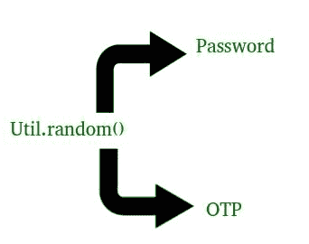

# 在 Java 中生成密码和 OTP

> 原文:[https://www.geeksforgeeks.org/generating-password-otp-java/](https://www.geeksforgeeks.org/generating-password-otp-java/)

为了更好地理解，您可以在此之前阅读[生成一次性密码或唯一标识网址](https://www.geeksforgeeks.org/generate-one-time-password-unique-identification-url/)一文。


很多时候，我们忘记了密码，我们选择了忘记密码选项，很快我们就会在注册的电子邮件 ID 或电话号码上获得一个新密码来登录我们的帐户。每次我们得到不同的密码。
有时我们在网上商店购物时或通过许多其他方式访问我们的银行账户，为了验证我们从银行账户的过渡，他们会在短时间内通过我们的注册电话号码或电子邮件标识向我们发送一次性密码。

下面的代码解释了如何在短时间内生成这样的密码和动态口令，以及如果需要，我们可以使用什么代码。

**方法 1:**

**解释密码生成的 Java 程序**

```java
// Java code to explain how to generate random
// password

// Here we are using random() method of util
// class in Java
import java.util.*;

public class NewClass
{
    public static void main(String[] args)
    {
        // Length of your password as I have choose
        // here to be 8
        int length = 10;
        System.out.println(geek_Password(length));
    }

    // This our Password generating method
    // We have use static here, so that we not to
    // make any object for it
    static char[] geek_Password(int len)
    {
        System.out.println("Generating password using random() : ");
        System.out.print("Your new password is : ");

        // A strong password has Cap_chars, Lower_chars,
        // numeric value and symbols. So we are using all of
        // them to generate our password
        String Capital_chars = "ABCDEFGHIJKLMNOPQRSTUVWXYZ";
        String Small_chars = "abcdefghijklmnopqrstuvwxyz";
        String numbers = "0123456789";
                String symbols = "!@#$%^&*_=+-/.?<>)";

        String values = Capital_chars + Small_chars +
                        numbers + symbols;

        // Using random method
        Random rndm_method = new Random();

        char[] password = new char[len];

        for (int i = 0; i < len; i++)
        {
            // Use of charAt() method : to get character value
            // Use of nextInt() as it is scanning the value as int
            password[i] =
              values.charAt(rndm_method.nextInt(values.length()));

        }
        return password;
    }
}
```

**注意:**我们正在生成的密码每次都会发生变化。因为我们已经使用了 random()方法来生成密码。
T3】输出:

```java
Generating password using random() : 
Your new password is : KHeCZBTM;-
```

**解释 OTP(一次性密码)生成的 Java 程序**

```java
// Java code to explain how to generate OTP

// Here we are using random() method of util
// class in Java
import java.util.*;

public class NewClass
{
    static char[] OTP(int len)
    {
        System.out.println("Generating OTP using random() : ");
        System.out.print("You OTP is : ");

        // Using numeric values
        String numbers = "0123456789";

        // Using random method
        Random rndm_method = new Random();

        char[] otp = new char[len];

        for (int i = 0; i < len; i++)
        {
            // Use of charAt() method : to get character value
            // Use of nextInt() as it is scanning the value as int
            otp[i] =
             numbers.charAt(rndm_method.nextInt(numbers.length()));
        }
        return otp;
    }
    public static void main(String[] args)
    {
        int length = 4;
        System.out.println(OTP(length));
    }
}
```

**注意:**
我们正在生成的 OTP 每次都会发生变化。因为我们已经使用了随机()方法来生成动态口令。
**输出:**

```java
Generating OTP using random() : 
You OTP is : 5291
```

**方法二:**

**解释密码生成的 Java 程序**

```java
// Java code to explain how to generate random
// password
class uniquePassword
{
public static long Code() //this code returns the  unique 16 digit code 
{  //creating a 16 digit code using Math.random function
    long code   =(long)((Math.random()*9*Math.pow(10,15))+Math.pow(10,15));
    return code; //returning the code
}
    //method to generate the password
    //by converting every two digits as an ascii value of a character
public static void main(String args[]) 
{
long code=Code();//function calling
String unique_password="";
for (long i=code;i!=0;i/=100)//a loop extracting 2 digits from the code 
    {
        long digit=i%100;//extracting two digits
        if (digit<=90)
        digit=digit+32; 
        //converting those two digits(ascii value) to its character value
        char ch=(char) digit;
        // adding 32 so that our least value be a valid character 
        unique_password=ch+unique_password;//adding the character to the string
    }
    System.out.println("unique password ="+unique_password);
    }
}
// Here we are using random() method of util
// class in Java
```

**注意:**我们正在生成的密码每次都会发生变化。因为我们已经使用了 random()方法来生成密码。
T3】输出:

```java
Generating password using Math.random() and ascii code: 
Your new password is : KHe%ZBT$
```

#### ascii 码表:


**解释 OTP(一次性密码)生成的 Java 程序**

```java
// Java code to explain how to generate OTP
public class GenerateOTP {
//declaring a of return type String
//which on calling provides the otp
    public static String generateOTP() 
    {  //int randomPin declared to store the otp
        //since we using Math.random() hence we have to type cast it int
        //because Math.random() returns decimal value
        int randomPin   =(int) (Math.random()*9000)+1000;
        String otp  = String.valueOf(randomPin);
        return otp; //returning value of otp
    }
            public static void main(String args[])//method to call and print otp
    {
        String otpSting  =generateOTP();//function calling
        System.out.println("OTP : "+otpSting);
    }
}// Here we are using Math.random() function.
// class in Java
```

**注意:**
我们正在生成的 OTP 每次都会发生变化。因为我们已经使用了 Math.random()函数来生成动态口令。
**输出:**

```java
Generating OTP using random() : 
You OTP is : 5291
```

本文由 <font color="green">**莫希特·古普塔供稿🙂**</font> 。如果你喜欢 GeeksforGeeks 并想投稿，你也可以使用[contribute.geeksforgeeks.org](http://www.contribute.geeksforgeeks.org)写一篇文章或者把你的文章邮寄到 contribute@geeksforgeeks.org。看到你的文章出现在极客博客主页上，帮助其他极客。

如果你发现任何不正确的地方，或者你想分享更多关于上面讨论的话题的信息，请写评论。