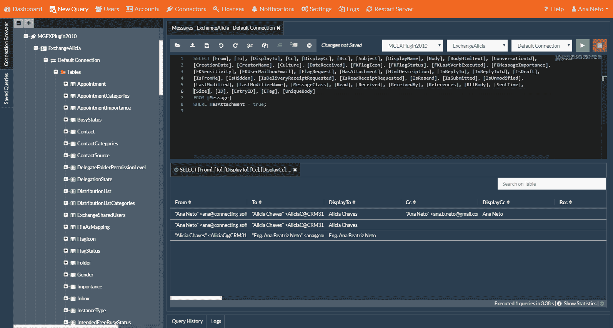

# 用 Java 从微软交换服务器获取数据

> 原文:[https://www . geesforgeks . org/get-data-from-Microsoft-exchange-server-in-Java/](https://www.geeksforgeeks.org/getting-data-from-microsoft-exchange-server-in-java/)

在软件行业，许多程序需要您需要从某种以前存在的商业软件中获取的信息。换句话说，您可能会遇到与来自微软、Salesforce、SAP 和其他软件巨头的软件集成的需求。尽管这看起来很吓人，但你可以做到！让我示范给你看。

### 需要与微软交换服务器集成

与所有类型的软件集成的最常见方式是使用它们的应用编程接口。大型软件公司提供它们正是为了使集成成为可能。
我们以微软交易所为例。您可以使用交换的应用编程接口在 Java 中执行的不同操作有:

1.  阅读电子邮件。
2.  发送电子邮件。
3.  从日历上的约会获取信息。
4.  插入新约会。
5.  编辑现有约会。
6.  从任务列表中获取信息。
7.  插入新任务。
8.  编辑现有任务。
9.  从公用文件夹读取。
10.  写入公共文件夹。

### 如何与微软交换服务器集成？

从 Java 集成到 Exchange 最传统的方式曾经是 **Exchange 网络服务(EWS)** 。

1.  EWS 软件开发工具包是一个基于 SOAP 的应用编程接口。
2.  它是作为微软交换 2007 的一部分推出的。
3.  这并不容易使用，但真正的问题是，早在 2018 年 7 月，微软就宣布他们将不再进行任何功能更新。

**微软图表**

此外，从 2020 年 10 月 13 日起，微软预计每个使用 Exchange 网络服务进行 Office 365 集成的人都将转向微软 Graph。此外，2020 年 10 月 13 日，将停止支持 Exchange 网络服务(EWS)中的基本身份验证。

[微软](https://docs.microsoft.com/en-us/legal/microsoft-apis/terms-of-use?context=/graph/context)希望一切都转移到 **OAuth** 和**微软 Graph** 。[微软 Graph](https://graph.microsoft.com/) 早在 2015 年就推出了 Office 365。它通过单个端点将呼叫委托给多个 Office 365 云服务。在微软图表中，您有两个选项:

1.  微软图表数据连接。
2.  微软图形应用编程接口。

微软对你能用他们的 API 做什么和不能做什么是精确的，所以最好事先检查一下。如果(且仅当)您想要处理大数据或需要精细的同意，您应该查看微软图表数据连接。如果不是这样，您需要常规的 API，这是最常见的选项。

目前有两个版本的**微软 Graph REST API**–**1.0 版本和测试版**。你可以查看[测试版](https://docs.microsoft.com/en-us/graph/api/overview?view=graph-rest-beta)，但是对于任何严肃的开发，你自然应该保持生产版本 1.0。对于该版本，请务必阅读[文档](https://docs.microsoft.com/en-us/graph/api/overview?view=graph-rest-1.0)并学习 [Java SDK](https://github.com/microsoftgraph/msgraph-sdk-java) 。

### 连接到应用编程接口的方法

我们可以通过两种方式连接到应用编程接口:

1.  微软图形应用编程接口。
2.  集成平台。

**微软 API**

当您进入实际使用 API 的部分时，您应该从获取以下内容开始:

1.  **微软账户:**可以是公司账户，也可以是学校账户。获取应用程序标识。
2.  **注册您的申请:**使用以下方式注册您的申请:
    *   微软应用程序注册门户。
    *   Azure 活动目录管理门户。
3.  **应用程序 ID:** 注册后，将为您的应用程序创建一个应用程序 ID，并显示在新应用程序的属性页面上。

您应该将 Azure 活动目录管理门户用于企业级应用程序。
**注:**微软 Graph 一直在变。查看变更日志，了解已经发生的变更(自 2015 年 12 月以来)。如果您想使用它，请确保检查哪一个是 API 的当前生产版本。

**集成平台**

1.  您可以将集成平台视为您和应用编程接口之间的一个薄层。
2.  您为集成平台编写代码，这要简单得多。
3.  然后是平台工作的集成，用 API 进行翻译和“说话”。与 API 不同，使用集成平台需要付费，但通常可以从免费试用开始。
4.  **示例:**连接桥台

[**【通桥】**](https://www.connecting-software.com/connect-bridge/) **平台:**这个具体集成平台的好处是保证了前向和后向兼容。这意味着您可以用连接桥构建您的 Java 代码，然后管理员可以升级到新的交换版本，微软可以启动新版本的应用编程接口。你不用担心这些。

**集成平台如何工作**

1.  连接桥将 SQL 语句转换成应用编程接口调用。
2.  您在代码中放入的是标准的 SQL。您可以编写普通的 SELECT、UPDATE、INSERT 和 DELETE 语句。
3.  它的工作原理就像使用 JDBC 从关系数据库中获取数据一样。
4.  您甚至可以使用存储过程。

**注:**都只是一层抽象。事实上，您访问的是应用编程接口，而不是微软交换的数据库。

**集成平台存在的问题**

一些集成平台的问题是它们只在特定的环境中工作，但是在连接桥的特定情况下，这不是问题，因为您可以在以下平台上运行:

*   天蓝色建造的 SaaS 平台。
*   内部/自托管(在您自己的虚拟机或云服务器上)。

### 履行

在本节中，我们将看到如何使用**连接桥管理工作室**将我们的应用程序集成到应用编程接口中。

**接近**

假设 Exchange 和 SharePoint 实例已经存在，您需要遵循以下准备步骤:

**1。**手边有您的目标系统登录信息(在本例中是 Exchange 和 SharePoint)。

**2。**安装连接桥。

**3。**运行连接桥管理工作室。

*   为 SharePoint 添加帐户(帐户–添加帐户)。要添加帐户，您应该选择连接器 CBSharePointConnector 并使用来自点 1 的凭据。
*   为 Exchange 添加帐户(帐户–添加帐户)。要添加帐户，您应该选择连接器 MGEXPlugin2010，并使用来自点 1 的凭据。
*   对于每个帐户，请确保您测试了连接，以便您知道您使用的凭据和参数一切正常。

**4。**打开新建查询选项，然后打开连接浏览器。找到交换连接器并展开它，直到看到默认连接。右键单击默认连接，然后选择获取连接字符串选项。你需要它来传递给脚本，所以复制 [JDBC](https://www.google.com/url?client=internal-element-cse&cx=009682134359037907028:tj6eafkv_be&q=https://www.geeksforgeeks.org/introduction-to-jdbc/&sa=U&ved=2ahUKEwi1w9338YbtAhXvwzgGHX88BH4QFjADegQIBxAC&usg=AOvVaw0YSj8JPHRDPKT2hucqIJ9s) 连接字符串。

**5。**打开新建查询选项，然后打开连接浏览器。找到 SharePoint 连接器并展开它，直到看到默认连接。右键单击默认连接，然后选择获取连接字符串选项。您将需要它来将其传递给脚本，因此复制 JDBC 连接字符串。



**示例:**在下面的示例中，我们讨论了一个用于集成 Microsoft Exchange 和 SharePoint 的 java 代码。

## Java 语言(一种计算机语言，尤用于创建网站)

```java
// Java Program to demonstrate
// integration of Exchange and
// SharePoint

import java.sql.Connection;
import java.sql.DriverManager;
import java.sql.Statement;
import java.sql.PreparedStatement;
import java.sql.ResultSet;
import java.sql.SQLException;

class Program {

    public static void main(String[] args)
        throws SQLException, ClassNotFoundException
    {

        Class.forName("com.cnsconnect.mgw.jdbc.MgDriver");

        // STEP 1:Create a JDBC connection
        // for each target server you get
        // the data for the connection string
        // from Connect Bridge
        String exchangeConnectionString
            = "jdbc:MgDriver:IMPL=CORBA;ENC=UTF8;"
              + "HOST=123.456.789.000;PORT=8087;"
              + "UID=demouser;PWD='password';"
              + "ACC=accountExchange;";
        String sharepointConnectionString
            = "jdbc:MgDriver : IMPL = CORBA; ENC = UTF8;"
              + "HOST = 123.456.789.000; PORT = 8087;"
              + "UID=demouser; PWD = 'password';"
              + "ACC = accountSharePoint;";
        Connection exchangeConn
            = DriverManager.getConnection(
                exchangeConnectionString);
        Connection sharepointConn
            = DriverManager.getConnection(
                sharepointConnectionString);
        Statement exchangeSt
            = exchangeConn.createStatement();
        System.out.println("Connecting to Exchange...");

        // STEP 2: Provide an appropriate
        // object  like a ResultSet +
        // STEP 3: Fill the object with data
        // from the source server
        ResultSet exchangeRs = exchangeSt.executeQuery(
            "SELECT * FROM [Appointment]");

        // Create a new statement for
        // inserting PreparedStatement
        // using JDBC
        sharepointSt = sharepointConn.prepareStatement(
            "INSERT INTO [Calendar] "
            + "([Title],[Description], [Location],"
            + "[StartTime], [EndTime]) "
            + "VALUES ( ?, ?, ?, ?, ?)");

        // STEP 4: Manipulate the data or
        // apply a workflow rule (or both)
        // in this sample: check if the
        // appointment is private,
        // if not, insert it into SharePoint
        while (exchangeRs.next()) {
            Boolean isPrivate
                = exchangeRs.getBoolean("IsPrivate");
            if (isPrivate != null & amp; & isPrivate) {
                System.out.println(
                    "Skipping '"
                    + exchangeRs.getString("Subject")
                    + "'");
                continue;
            }

            // Fill these parameters with values
            // for the SharePoint account
            sharepointSt.setString(
                1, exchangeRs.getString("Subject"));
            sharepointSt.setString(
                2, exchangeRs.getString("Body"));
            sharepointSt.setString(
                3, exchangeRs.getString("Location"));
            sharepointSt.setTimestamp(
                4, exchangeRs.getTimestamp("StartDate"));
            sharepointSt.setTimestamp(
                5, exchangeRs.getTimestamp("EndDate"));

            System.out.println(
                "Inserting '"
                + exchangeRs.getString("Subject") + "'");

            // STEP 5: Insert data into
            // the target server
            sharepointSt.execute();
        }

        // STEP 6: Clean up and
        // lose the connections
        exchangeRs.close();
        exchangeSt.close();
        sharepointSt.close();
        exchangeConn.close();
        sharepointConn.close();
    }
}
```

**输出:**

<video class="wp-video-shortcode" id="video-439261-1" width="640" height="360" preload="metadata" controls=""><source type="video/mp4" src="https://media.geeksforgeeks.org/wp-content/uploads/20201030190045/Connect-Bridge-and-Java.mp4?_=1">[https://media.geeksforgeeks.org/wp-content/uploads/20201030190045/Connect-Bridge-and-Java.mp4](https://media.geeksforgeeks.org/wp-content/uploads/20201030190045/Connect-Bridge-and-Java.mp4)</video>