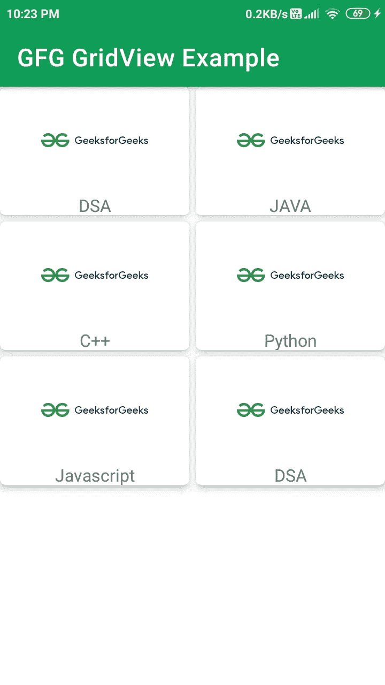

# 安卓 GridView 带示例

> 原文:[https://www . geeksforgeeks . org/GridView-in-Android-with-example/](https://www.geeksforgeeks.org/gridview-in-android-with-example/)

GridView 是一种在二维滚动网格中显示项目的 AdapterView。项目从数据库或数组插入到网格布局中。适配器用于显示该数据， **setAdapter()** 方法用于将适配器与 GridView 连接。GridView 中适配器的主要功能是从数据库或数组中获取数据，并将每条数据插入将在 GridView 中显示的适当项目中。这就是 GridView 结构的样子。注意，我们将使用 **Java** 语言来实现这个项目。


### 网格视图的可扩展标记语言属性

*   **安卓:numColumns**:GridView 的这个属性会用来决定要在 Grid 中显示的列数。
*   **Android:horizontal spacing**:该属性用于定义 GridView 两列之间的间距。
*   **Android:vertical space**:此属性用于指定 GridView 两行之间的间距。

### 例子

现在让我们看一个例子，我们将在安卓应用程序中实现一个简单的 GridView。在 GridView 中，我们现在显示了 GeeksforGeeks 上可用的课程列表。

**步骤 1:创建新项目**

要在安卓工作室创建新项目，请参考[如何在安卓工作室创建/启动新项目](https://www.geeksforgeeks.org/android-how-to-create-start-a-new-project-in-android-studio/)。注意选择 **Java** 作为编程语言。

**第二步:在应用项目的 build.gradle 文件中添加 google repository。**

> buildscript {
> 
> 存储库{
> 
> 谷歌()
> 
> mavenuentral _)
> 
> }

所有的 Jetpack 组件都可以在 Google Maven 存储库中找到，包括在 build.gradle 文件中

> 所有项目{
> 
> 存储库{
> 
> 谷歌()
> 
> mavenuentral _)
> 
> }
> 
> }

**第三步:修改 activity_main.xml 文件**

将 GridView 添加到 **activity_main.xml** 文件。下面是 **activity_main.xml** 文件的代码。

## 可扩展标记语言

```
<?xml version="1.0" encoding="utf-8"?>
<androidx.constraintlayout.widget.ConstraintLayout
    xmlns:android="http://schemas.android.com/apk/res/android"
    xmlns:tools="http://schemas.android.com/tools"
    android:layout_width="match_parent"
    android:layout_height="match_parent"
    tools:context=".MainActivity">

    <!-- android:numColumns=2 is the number of columns for Grid View
         android:horizontalSpacing is the space between horizontal
         grid items.-->
    <GridView
        android:id="@+id/idGVcourses"
        android:layout_width="match_parent"
        android:layout_height="match_parent"
        android:horizontalSpacing="6dp"
        android:numColumns="2"
        android:verticalSpacing="6dp" />

</androidx.constraintlayout.widget.ConstraintLayout>
```

**第 4 步:为 GridView 的每个项目创建一个 XML 布局文件**

为要在 GridView 中显示的每个网格项创建一个 XML 文件。点击 **app > res >布局>右键>布局资源文件**，然后将文件命名为**卡片 _ 项目**。下面是 **card_item.xml** 文件的代码。

## 可扩展标记语言

```
<?xml version="1.0" encoding="utf-8"?>
<!--XML implementation of Card Layout-->
<androidx.cardview.widget.CardView
    xmlns:android="http://schemas.android.com/apk/res/android"
    xmlns:app="http://schemas.android.com/apk/res-auto"
    android:layout_width="match_parent"
    android:layout_height="120dp"
    android:layout_gravity="center"
    android:layout_margin="5dp"
    app:cardCornerRadius="5dp"
    app:cardElevation="5dp">

    <LinearLayout
        android:layout_width="match_parent"
        android:layout_height="wrap_content"
        android:orientation="vertical">

        <ImageView
            android:id="@+id/idIVcourse"
            android:layout_width="100dp"
            android:layout_height="100dp"
            android:layout_gravity="center"
            android:src="@mipmap/ic_launcher" />

        <TextView
            android:id="@+id/idTVCourse"
            android:layout_width="match_parent"
            android:layout_height="wrap_content"
            android:text="@string/app_name"
            android:textAlignment="center" />

    </LinearLayout>

</androidx.cardview.widget.CardView>
```

**步骤 5:创建一个** **模态类来存储数据**

模态类是处理要添加到 GridView 的每个 GridView 项中的数据的 JAVA 类。用于创建模态类。

*   现在点击**应用> java >应用包名称>右键**在上面。
*   然后点击**新建> Java 类**。
*   将你的 Java 类文件命名为**。下面是T5【课程模式】T6T8 的代码。java 文件。**

## **Java 语言(一种计算机语言，尤用于创建网站)**

```
public class CourseModel {

    // string course_name for storing course_name
    // and imgid for storing image id.
    private String course_name;
    private int imgid;

    public CourseModel(String course_name, int imgid) {
        this.course_name = course_name;
        this.imgid = imgid;
    }

    public String getCourse_name() {
        return course_name;
    }

    public void setCourse_name(String course_name) {
        this.course_name = course_name;
    }

    public int getImgid() {
        return imgid;
    }

    public void setImgid(int imgid) {
        this.imgid = imgid;
    }
}
```

****步骤 6:创建适配器类****

**适配器类将模式类中的数据添加到要在屏幕上显示的每个 GridView 项中。用于创建适配器类。**

*   **现在点击**应用> java >应用包名称>右键**在上面。**
*   **然后点击**新建> Java 类**。**
*   **将你的 Java 类文件命名为 **CourseGVAdapter** 。下面是**CourseGVAdapter****的代码。java** 文件。**

## **Java 语言(一种计算机语言，尤用于创建网站)**

```
import android.content.Context;
import android.view.LayoutInflater;
import android.view.View;
import android.view.ViewGroup;
import android.widget.ArrayAdapter;
import android.widget.ImageView;
import android.widget.TextView;
import androidx.annotation.NonNull;
import androidx.annotation.Nullable;
import java.util.ArrayList;

public class CourseGVAdapter extends ArrayAdapter<CourseModel> {
    public CourseGVAdapter(@NonNull Context context, ArrayList<CourseModel> courseModelArrayList) {
        super(context, 0, courseModelArrayList);
    }

    @NonNull
    @Override
    public View getView(int position, @Nullable View convertView, @NonNull ViewGroup parent) {
        View listitemView = convertView;
        if (listitemView == null) {
            // Layout Inflater inflates each item to be displayed in GridView.
            listitemView = LayoutInflater.from(getContext()).inflate(R.layout.card_item, parent, false);
        }
        CourseModel courseModel = getItem(position);
        TextView courseTV = listitemView.findViewById(R.id.idTVCourse);
        ImageView courseIV = listitemView.findViewById(R.id.idIVcourse);
        courseTV.setText(courseModel.getCourse_name());
        courseIV.setImageResource(courseModel.getImgid());
        return listitemView;
    }
}
```

****第七步:修改****MainActivity.java 文件****

**现在在这个文件中，我们将执行所有将数据添加到 GridView 的后端操作。以下是**MainActivity.java**文件的代码。**

## **Java 语言(一种计算机语言，尤用于创建网站)**

```
import android.os.Bundle;
import android.widget.GridView;
import androidx.appcompat.app.AppCompatActivity;
import java.util.ArrayList;

public class MainActivity extends AppCompatActivity {

    GridView coursesGV;

    @Override
    protected void onCreate(Bundle savedInstanceState) {
        super.onCreate(savedInstanceState);
        setContentView(R.layout.activity_main);

        coursesGV = findViewById(R.id.idGVcourses);

        ArrayList<CourseModel> courseModelArrayList = new ArrayList<CourseModel>();
        courseModelArrayList.add(new CourseModel("DSA", R.drawable.ic_gfglogo));
        courseModelArrayList.add(new CourseModel("JAVA", R.drawable.ic_gfglogo));
        courseModelArrayList.add(new CourseModel("C++", R.drawable.ic_gfglogo));
        courseModelArrayList.add(new CourseModel("Python", R.drawable.ic_gfglogo));
        courseModelArrayList.add(new CourseModel("Javascript", R.drawable.ic_gfglogo));
        courseModelArrayList.add(new CourseModel("DSA", R.drawable.ic_gfglogo));

        CourseGVAdapter adapter = new CourseGVAdapter(this, courseModelArrayList);
        coursesGV.setAdapter(adapter);
    }
}
```

****输出:****

****