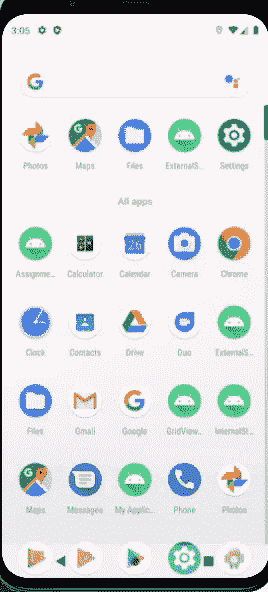
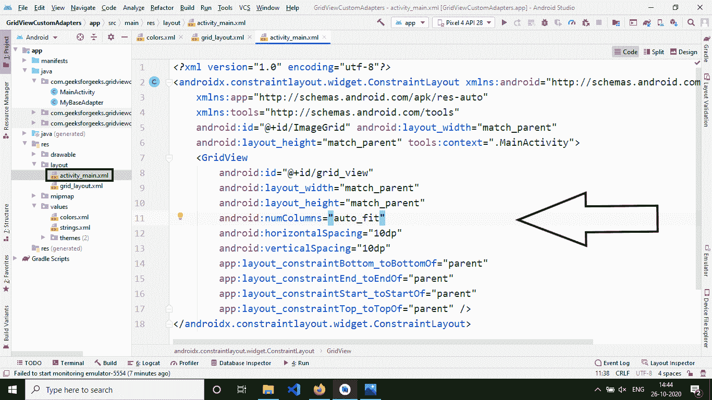
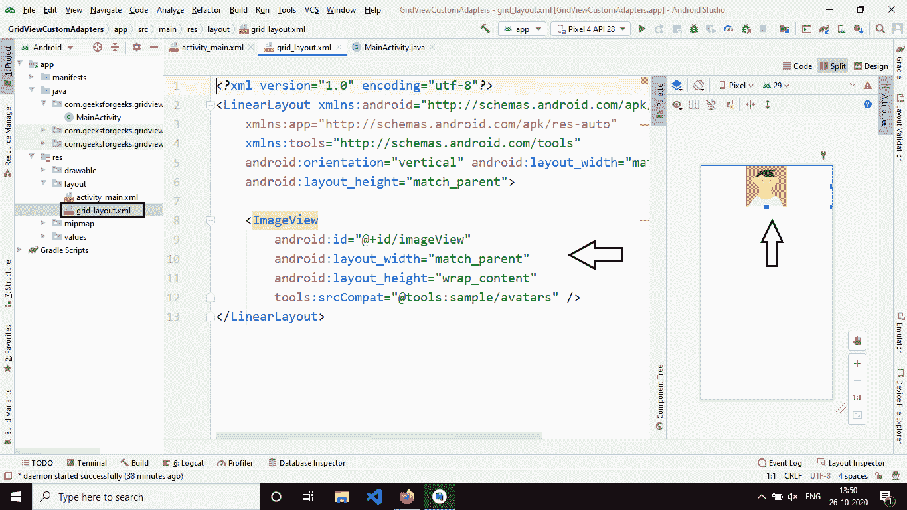

# 在安卓系统中使用 BaseAdapter 的 GridView 示例

> 原文:[https://www . geeksforgeeks . org/GridView-using-based adapter-in-Android-with-example/](https://www.geeksforgeeks.org/gridview-using-baseadapter-in-android-with-example/)

这里，我们正在设计一个安卓应用程序来演示 **GridView** 布局的使用。GridView 布局是一个视图组，它是由行和列组成的二维滚动网格中的视图组。网格视图中的项目是使用列表适配器插入的。默认情况下，布局是可滚动的，我们不需要使用[滚动视图](https://www.geeksforgeeks.org/scrollview-in-android/)。GridView 的一个例子是您的默认图库。

### **网格视图的属性**

<figure class="table">

| 

属性

 | 

描述

 |
| --- | --- |
| 身份证明（identification） | 像所有其他视图一样，android 使用 id 元素来唯一标识一个元素。 |
| numColumns | 要显示的列数。它可以是整数或自动拟合

将显示尽可能多的列来填充设备屏幕。如果他们没有指定这个属性，那么网格视图将表现得像一个列表视图。 |
| 水平间距 | 水平间距属性用于定义默认水平列间距。这可以是像素(px)、密度像素(dp)或者比例无关像素(sp)。 |
| 垂直空间 | 用于定义默认垂直间距的垂直间距属性行间。这应该是在 px，dp 或 sp。 |

</figure>

### **在安卓系统中使用不同适配器的 GridView 示例**

适配器是用户界面组件(如[文本视图](https://www.geeksforgeeks.org/textview-widget-in-android-using-java-with-examples/)、[图像视图](https://www.geeksforgeeks.org/imageview-in-kotlin/))和数据源之间的连接。适配器有助于用适当的数据填充用户界面元素。在 android 中，在 GridView 中填充数据的常用适配器有:

1.  阵列适配器
2.  基础适配器
3.  自定义数组适配器

本教程将使用基本适配器，下面是扩展基本适配器的类的结构。

## Java 语言(一种计算机语言，尤用于创建网站)

```java
public class MyAdapter extends BaseAdapter 
{
    @Override public int getCount() 
    {
      return 0; 
    }

    @Override public Object getItem(int i)
    {
      return null;
    }

    @Override public long getItemId(int i) 
    {
      return 0; 
    }

    @Override
    public View getView(int i, View view, ViewGroup viewGroup)
    {
      return null;
    }
}
```

**方法描述:**

*   **getCount():** 这个方法返回要显示的元素总数的计数。
*   **getItem(int i):** 这个方法接受一个索引并返回一个对象。
*   **getItemId(int i):** 这个方法接受一个索引，并返回在 GrIdView 中显示的项目的 id。
*   **getView(int I，View view，ViewGroup 组):**这是返回网格视图中显示的视图的最重要的方法。int i 是索引，视图可以是(ImageView 或 TextView)，视图组是承载视图的容器，例如[线形布局](https://www.geeksforgeeks.org/linearlayout-and-its-important-attributes-with-examples-in-android/)、[相对布局](https://www.geeksforgeeks.org/android-relativelayout-in-kotlin/)等。

### **例**

下面给出了一个 GIF 示例，来了解一下在这篇文章中要做什么。注意，我们将使用 **Java** 语言来实现这个项目。



### **分步实施**

**第一步:创建新项目**

要在安卓工作室创建新项目，请参考[如何在安卓工作室创建/启动新项目](https://www.geeksforgeeks.org/android-how-to-create-start-a-new-project-in-android-studio/)。注意选择 **Java** 作为编程语言。

**步骤 2:使用 activity_main.xml 文件**

打开**activity _ main . XML**文件，并在其中插入一个 GridView 组件。布局最初看起来是空白的，但在运行时会被自定义适配器类填充。



下面是**activity _ main . XML**文件的代码。

## 可扩展标记语言

```java
<?xml version="1.0" encoding="utf-8"?>
<androidx.constraintlayout.widget.ConstraintLayout 
    xmlns:android="http://schemas.android.com/apk/res/android"
    xmlns:app="http://schemas.android.com/apk/res-auto"
    xmlns:tools="http://schemas.android.com/tools"
    android:id="@+id/ImageGrid"
    android:layout_width="match_parent"
    android:layout_height="match_parent"
    tools:context=".MainActivity">

    <GridView
        android:id="@+id/grid_view"
        android:layout_width="match_parent"
        android:layout_height="match_parent"
        android:numColumns="auto_fit"
        android:horizontalSpacing="10dp"
        android:verticalSpacing="10dp"
        app:layout_constraintBottom_toBottomOf="parent"
        app:layout_constraintEnd_toEndOf="parent"
        app:layout_constraintStart_toStartOf="parent"
        app:layout_constraintTop_toTopOf="parent" />

</androidx.constraintlayout.widget.ConstraintLayout>
```

**步骤 3:创建新的布局 XML 文件**

在与 **activity_main.xml** 文件相同的文件夹中创建一个名为 **grid_layout.xml** 的新文件。该自定义视图将包含一个**图像视图。**使用自定义适配器的主要原因是在 GridView 或 [ListView](https://www.geeksforgeeks.org/android-listview-in-java-with-example/) 中显示复杂的视图，而不是一些简单的文本。自定义视图被命名为 **grid_layout.xml** ，其根是 LinearLayout 和一个简单的 ImageView。



下面是T2 文件的代码。

## 可扩展标记语言

```java
<?xml version="1.0" encoding="utf-8"?>
<LinearLayout 
    xmlns:android="http://schemas.android.com/apk/res/android"
    xmlns:tools="http://schemas.android.com/tools"
    android:layout_width="match_parent"
    android:layout_height="match_parent"
    android:orientation="vertical">

    <ImageView
        android:id="@+id/imageView"
        android:layout_width="match_parent"
        android:layout_height="wrap_content"
        android:scaleType="center"
        tools:srcCompat="@tools:sample/avatars" />

</LinearLayout>
```

**步骤 4:创建自定义适配器类**

将这个类命名为 MyBaseAdapter，它将扩展 BaseAdapter 类并继承上面显示的方法。我们需要遍历的主要方法是 getView 方法。

## Java 语言(一种计算机语言，尤用于创建网站)

```java
@Override
public View getView(int i, View view, ViewGroup viewGroup)
{
    if (view == null) 
    {
      LayoutInflater inflater = (LayoutInflater)c.getSystemService(Context.LAYOUT_INFLATER_SERVICE);
      view = inflater.inflate(R.layout.grid_layout, viewGroup);
    }

    ImageView imageView = view.findViewById(R.id.imageView);
    imageView.setImageResource(items[i]);
    return view;
}
```