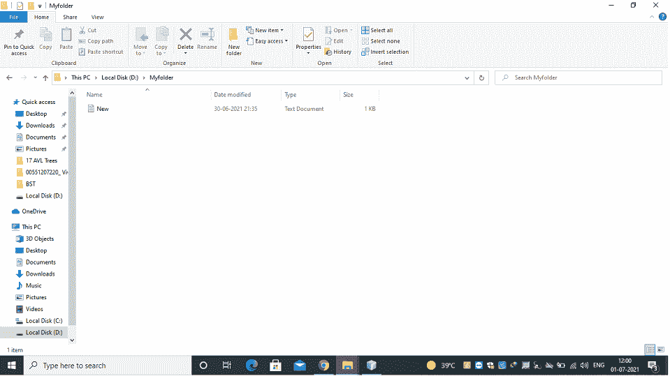
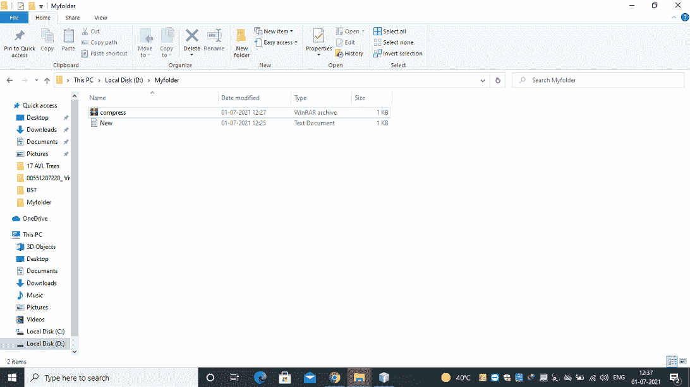

# Java 中的 GZIPOutputStream 类

> 原文:[https://www . geeksforgeeks . org/gzipoututstream-class-in-Java/](https://www.geeksforgeeks.org/gzipoutputstream-class-in-java/)

[***java.util.zip** 包*](https://www.geeksforgeeks.org/tag/java-util-zip-package/) 提供压缩和解压缩文件内容的类。Java 中提供了 FileInputStream、FileOutputStream 和 GZIPOutputStream 类来压缩和解压缩文件。GZIPOutputStream 类对于以 **GZIP** 文件格式写入压缩数据非常有用。但是，GZIP 不是一个压缩工具，它只用来把一个文件压缩成一个”。gz”格式，而不是将几个文件压缩成一个单独的档案。

构造函数和执行的相应操作如下:

*   **GZIPOutputStream(OutputStream out):**使用默认缓冲区大小创建新的输出流
*   **GZIPOutputStream(OutputStream out，boolean syncFlush):** 使用默认缓冲区大小和指定的刷新模式创建新的输出流。
*   **GZIPOutputStream(OutputStream out，int size):** 用指定的缓冲区大小创建新的输出流
*   **GZIPOutputStream(OutputStream out，int size，boolean syncFlush):** 使用指定的缓冲区大小和刷新模式创建新的输出流

让我们讨论涉及的重要方法，如下所示:

*   void write(byte[] buf，int off，int len): 将字节数组写入压缩的输出流。

**参数:**取 3 个参数，即:

*   buf:要写入的数据
*   关闭:数据的开始偏移量
*   len:数据的长度

**异常:** IOException:如果出现输入/输出错误

> **注意:** finish()方法在不关闭底层流的情况下完成将压缩数据写入输出流。

**实现:**我们在 D:/Myfolder/New.txt 中有一个文本文件，这个文本文件中写着“Hello World”。我们正在压缩这个文本文件，并在同一个文件夹中生成 GZip 文件。下面也用图片描述如下:



**例**

## Java 语言(一种计算机语言，尤用于创建网站)

```java
// Java Program to Illustrate GZIPOutputStream class

// Importing required classes
import java.io.*;
import java.io.FileInputStream;
import java.io.FileOutputStream;
import java.io.IOException;
import java.util.zip.GZIPInputStream;
import java.util.zip.GZIPOutputStream;

// Main class
class GFG {

    // Main driver method
    public static void main(String[] args) throws Exception
    {
        // Existing file path
        String file = "D:/Myfolder/New.txt";

        // Path where we want the compression of the file
        String gzipFile = "D:/Myfolder/compress.gz";

        // Reading the text file
        FileInputStream fis = new FileInputStream(file);

        // Creating the compressed file
        FileOutputStream fos
            = new FileOutputStream(gzipFile);

        // Object of Fileoutstream passed
        GZIPOutputStream gzipOS = new GZIPOutputStream(fos);

        byte[] buffer = new byte[1024];

        int len;

        // Writing the data to file until -1 reached(End of
        // file)
        while ((len = fis.read(buffer)) != -1) {

            gzipOS.write(buffer, 0, len);
        }

        // Closing the resources
        // using standard close() method
        gzipOS.close();
        fos.close();
        fis.close();

        // Display message on the console in order to
        // illustrate successful execution of the program
        System.out.println("File successfully compressed");
    }
}
```

**输出:**

```java
File successfully compressed
```

运行上述程序后，它将通过与上面的采样快照进行比较来压缩生成的可以从下面的快照描述的文件。

