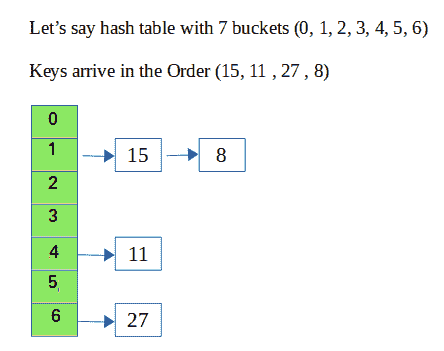

# Java 中的哈希

> 原文:[https://www.geeksforgeeks.org/hashing-in-java/](https://www.geeksforgeeks.org/hashing-in-java/)

在[散列](https://www.geeksforgeeks.org/hashing-data-structure/)中，有一个散列函数将键映射到一些值。但是这些散列函数可能会导致冲突，即两个或多个键被映射到相同的值。**链式哈希**避免碰撞。其思想是使哈希表的每个单元格指向具有相同散列函数值的记录的链表。
让我们创建一个哈希函数，这样我们的哈希表就有‘N’个桶。
要在哈希表中插入一个节点，我们需要找到给定键的哈希索引。它可以用散列函数来计算。
**示例:hashIndex = key % noobuckets**
**Insert**:移动到与上面计算的 hash 索引对应的桶，在列表末尾插入新节点。
**删除**:从哈希表中删除一个节点，计算该键的哈希索引，移动到与计算出的哈希索引对应的桶中，在当前桶的列表中搜索，找到并删除给定键的节点(如果找到)。



详情请参考 [**哈希|集合 2(单独链接)**](https://www.geeksforgeeks.org/hashing-set-2-separate-chaining/) 。

### 用 Java 实现哈希的方法

*   **借助** [**哈希表**](https://www.geeksforgeeks.org/java-util-hashtable-class-java/) **(哈希的同步实现)**

## Java 语言(一种计算机语言，尤用于创建网站)

```
// Java program to demonstrate working of HashTable
import java.util.*;

class GFG {
    public static void main(String args[])
    {

        // Create a HashTable to store
        // String values corresponding to integer keys
        Hashtable<Integer, String>
            hm = new Hashtable<Integer, String>();

        // Input the values
        hm.put(1, "Geeks");
        hm.put(12, "forGeeks");
        hm.put(15, "A computer");
        hm.put(3, "Portal");

        // Printing the Hashtable
        System.out.println(hm);
    }
}
```

**Output:** 

```
{15=A computer, 3=Portal, 12=forGeeks, 1=Geeks}
```

*   **借助** [**HashMap**](https://www.geeksforgeeks.org/hashmap-treemap-java/) **(一个非同步更快实现的 hashing)**

## Java 语言(一种计算机语言，尤用于创建网站)

```
// Java program to create HashMap from an array
// by taking the elements as Keys and
// the frequencies as the Values

import java.util.*;

class GFG {

    // Function to create HashMap from array
    static void createHashMap(int arr[])
    {
        // Creates an empty HashMap
        HashMap<Integer, Integer> hmap = new HashMap<Integer, Integer>();

        // Traverse through the given array
        for (int i = 0; i < arr.length; i++) {

            // Get if the element is present
            Integer c = hmap.get(arr[i]);

            // If this is first occurrence of element
            // Insert the element
            if (hmap.get(arr[i]) == null) {
                hmap.put(arr[i], 1);
            }

            // If elements already exists in hash map
            // Increment the count of element by 1
            else {
                hmap.put(arr[i], ++c);
            }
        }

        // Print HashMap
        System.out.println(hmap);
    }

    // Driver method to test above method
    public static void main(String[] args)
    {
        int arr[] = { 10, 34, 5, 10, 3, 5, 10 };
        createHashMap(arr);
    }
}
```

**Output:** 

```
{34=1, 3=1, 5=2, 10=3}
```

*   **借助** [**链接 HashMap**](https://www.geeksforgeeks.org/hashmap-treemap-java/) **(类似 HashMap，但保持元素顺序)**

## Java 语言(一种计算机语言，尤用于创建网站)

```
// Java program to demonstrate working of LinkedHashMap
import java.util.*;

public class BasicLinkedHashMap
{
    public static void main(String a[])
    {
        LinkedHashMap<String, String> lhm =
                       new LinkedHashMap<String, String>();
        lhm.put("one", "practice.geeksforgeeks.org");
        lhm.put("two", "code.geeksforgeeks.org");
        lhm.put("four", "quiz.geeksforgeeks.org");

        // It prints the elements in same order 
        // as they were inserted    
        System.out.println(lhm);

        System.out.println("Getting value for key 'one': "
                                       + lhm.get("one"));
        System.out.println("Size of the map: " + lhm.size());
        System.out.println("Is map empty? " + lhm.isEmpty());
        System.out.println("Contains key 'two'? "+ 
                                  lhm.containsKey("two"));
        System.out.println("Contains value 'practice.geeks"
        +"forgeeks.org'? "+ lhm.containsValue("practice"+
        ".geeksforgeeks.org"));
        System.out.println("delete element 'one': " + 
                           lhm.remove("one"));
        System.out.println(lhm);
    }
}
```

**Output:** 

```
{one=practice.geeksforgeeks.org, two=code.geeksforgeeks.org, four=quiz.geeksforgeeks.org}
Getting value for key 'one': practice.geeksforgeeks.org
Size of the map: 3
Is map empty? false
Contains key 'two'? true
Contains value 'practice.geeksforgeeks.org'? true
delete element 'one': practice.geeksforgeeks.org
{two=code.geeksforgeeks.org, four=quiz.geeksforgeeks.org}
```

*   **借助**[**concurrenthashmap**](https://www.geeksforgeeks.org/concurrenthashmap-in-java/)**(类似于 Hashtable，Synchronized，但使用多个锁更快)**

## Java 语言(一种计算机语言，尤用于创建网站)

```
// Java program to demonstrate working of ConcurrentHashMap

import java.util.concurrent.*;
class ConcurrentHashMapDemo {
    public static void main(String[] args)
    {
        ConcurrentHashMap<Integer, String> m =
                   new ConcurrentHashMap<Integer, String>();
        m.put(100, "Hello");
        m.put(101, "Geeks");
        m.put(102, "Geeks");

        // Printing the ConcurrentHashMap
        System.out.println("ConcurentHashMap: " + m);

        // Adding Hello at 101 key
        // This is already present in ConcurrentHashMap object
        // Therefore its better to use putIfAbsent for such cases
        m.putIfAbsent(101, "Hello");

        // Printing the ConcurrentHashMap
        System.out.println("\nConcurentHashMap: " + m);

        // Trying to remove entry for 101 key
        // since it is present
        m.remove(101, "Geeks");

        // Printing the ConcurrentHashMap
        System.out.println("\nConcurentHashMap: " + m);

        // replacing the value for key 101
        // from "Hello" to "For"
        m.replace(100, "Hello", "For");

        // Printing the ConcurrentHashMap
        System.out.println("\nConcurentHashMap: " + m);
    }
}
```

**Output:** 

```
ConcurentHashMap: {100=Hello, 101=Geeks, 102=Geeks}

ConcurentHashMap: {100=Hello, 101=Geeks, 102=Geeks}

ConcurentHashMap: {100=Hello, 102=Geeks}

ConcurentHashMap: {100=For, 102=Geeks}
```

*   **借助** [**HashSet**](https://www.geeksforgeeks.org/hashset-in-java/) **(类似 HashMap，但只维护按键，不维护配对)**

## Java 语言(一种计算机语言，尤用于创建网站)

```
// Java program to demonstrate working of HashSet
import java.util.*;

class Test {
    public static void main(String[] args)
    {
        HashSet<String> h = new HashSet<String>();

        // Adding elements into HashSet using add()
        h.add("India");
        h.add("Australia");
        h.add("South Africa");
        h.add("India"); // adding duplicate elements

        // Displaying the HashSet
        System.out.println(h);

        // Checking if India is present or not
        System.out.println("\nHashSet contains India or not:"
                           + h.contains("India"));

        // Removing items from HashSet using remove()
        h.remove("Australia");

        // Printing the HashSet
        System.out.println("\nList after removing Australia:" + h);

        // Iterating over hash set items
        System.out.println("\nIterating over list:");
        Iterator<String> i = h.iterator();
        while (i.hasNext())
            System.out.println(i.next());
    }
}
```

**Output:** 

```
[South Africa, Australia, India]

HashSet contains India or not:true

List after removing Australia:[South Africa, India]

Iterating over list:
South Africa
India
```

**借助**[**LinkedHashSet**](https://www.geeksforgeeks.org/linkedhashset-class-in-java-with-examples/)**(类似 LinkedHashMap，但只维护按键，不维护配对)**

## Java 语言(一种计算机语言，尤用于创建网站)

```
// Java program to demonstrate working of LinkedHashSet

import java.util.LinkedHashSet;  
public class Demo 
{  
    public static void main(String[] args) 
    {  
        LinkedHashSet<String> linkedset = 
                           new LinkedHashSet<String>();  

        // Adding element to LinkedHashSet  
        linkedset.add("A");  
        linkedset.add("B");  
        linkedset.add("C");  
        linkedset.add("D"); 

        // This will not add new element as A already exists 
        linkedset.add("A"); 
        linkedset.add("E");  

        System.out.println("Size of LinkedHashSet = " +
                                    linkedset.size());  
        System.out.println("Original LinkedHashSet:" + linkedset);  
        System.out.println("Removing D from LinkedHashSet: " +
                            linkedset.remove("D"));  
        System.out.println("Trying to Remove Z which is not "+
                            "present: " + linkedset.remove("Z"));  
        System.out.println("Checking if A is present=" + 
                            linkedset.contains("A"));
        System.out.println("Updated LinkedHashSet: " + linkedset);  
    }  
}  
```

**Output:** 

```
Size of LinkedHashSet = 5
Original LinkedHashSet:[A, B, C, D, E]
Removing D from LinkedHashSet: true
Trying to Remove Z which is not present: false
Checking if A is present=true
Updated LinkedHashSet: [A, B, C, E]
```

*   **借助** [**树集**](https://www.geeksforgeeks.org/treeset-in-java-with-examples/) **(实现排序集界面，对象按排序升序存储)。**

## Java 语言(一种计算机语言，尤用于创建网站)

```
// Java program to demonstrate working of TreeSet

import java.util.*;

class TreeSetDemo {
    public static void main(String[] args)
    {
        TreeSet<String> ts1 = new TreeSet<String>();

        // Elements are added using add() method
        ts1.add("A");
        ts1.add("B");
        ts1.add("C");

        // Duplicates will not get insert
        ts1.add("C");

        // Elements get stored in default natural
        // Sorting Order(Ascending)
        System.out.println("TreeSet: " + ts1);

        // Checking if A is present or not
        System.out.println("\nTreeSet contains A or not:"
                           + ts1.contains("A"));

        // Removing items from TreeSet using remove()
        ts1.remove("A");

        // Printing the TreeSet
        System.out.println("\nTreeSet after removing A:" + ts1);

        // Iterating over TreeSet items
        System.out.println("\nIterating over TreeSet:");
        Iterator<String> i = ts1.iterator();
        while (i.hasNext())
            System.out.println(i.next());
    }
}
```

**输出:**

```
TreeSet: [A, B, C]

TreeSet contains A or not:true

TreeSet after removing A:[B, C]

Iterating over TreeSet:
B
C
```