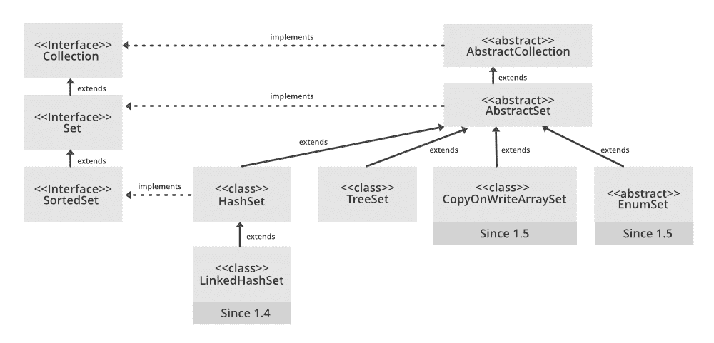

# Java 中的 hashset

> 原文:[https://www.geeksforgeeks.org/hashset-in-java/](https://www.geeksforgeeks.org/hashset-in-java/)

**HashSet** 类实现了 [Set 接口](https://www.geeksforgeeks.org/set-in-java/)，由哈希表支持，哈希表实际上是一个 [HashMap](https://www.geeksforgeeks.org/java-util-hashmap-in-java/) 实例。不保证集合的迭代顺序，这意味着类不保证元素随时间的恒定顺序。这个类允许空元素。该类还为基本操作(如添加、移除、包含和大小)提供了恒定的时间性能，假设哈希函数将元素适当地分散在桶中，我们将在本文中进一步看到这一点。

HashSet 的几个**重要特点是:**

*   **实现[设置界面](https://www.geeksforgeeks.org/set-in-java/)。**
*   **HashSet 的底层数据结构是 [Hashtable](https://www.geeksforgeeks.org/hashtable-in-java/) 。**
*   **因为它实现了设置接口，所以不允许重复值。**
*   **在哈希集中插入的对象不能保证以相同的顺序插入。根据对象的哈希代码插入对象。**
*   **哈希集中允许空元素。**
*   **HashSet 还实现了**可序列化**和**可克隆**接口。**

****哈斯塞特的等级**** 

****

**HashSet 扩展了[抽象集< E >](https://www.geeksforgeeks.org/abstractset-class-in-java-with-examples/#:~:text=The%20AbstractSet%20class%20in%20Java,implementation%20of%20the%20Set%20interface.) 类，实现了[集< E >](https://www.geeksforgeeks.org/set-in-java/) 、[可克隆](https://www.geeksforgeeks.org/marker-interface-java/#:~:text=Cloneable%20interface%20%3A%20Cloneable%20interface%20is,of%20instances%20of%20that%20class.)和[可序列化](https://www.geeksforgeeks.org/serialization-in-java/)接口，其中 E 是该集合维护的元素类型。HashSet 的直接已知子类是 [LinkedHashSet](https://www.geeksforgeeks.org/linkedhashset-in-java-with-examples/) 。**

**现在为了保持恒定的时间性能，迭代 HashSet 需要的时间与 HashSet 实例的大小(元素的数量)加上后备 HashMap 实例的“容量”(桶的数量)之和成正比。因此，如果迭代性能很重要，那么不要将初始容量设置得太高(或者将负载系数设置得太低)，这一点非常重要。**

*   ****初始容量:**初始容量是指创建 hashtable (HashSet 内部使用 hashtable 数据结构)时的桶数。如果当前大小已满，存储桶的数量将自动增加。** 
*   ****负载系数:**负载系数是在 HashSet 的容量自动增加之前，允许 HashSet 达到多满的度量。当哈希表中的条目数超过负载系数和当前容量的乘积时，哈希表将被重新刷新(即重建内部数据结构)，以便哈希表具有大约两倍的桶数。** 

```
 Number of stored elements in the table
**Load Factor** = -----------------------------------------
                        Size of the hash table 
```

****示例:**如果内部容量为 16，负载系数为 0.75，则当表中有 12 个元素时，桶的数量将自动增加。**

****对性能的影响:**负载系数和初始容量是影响 HashSet 操作性能的两个主要因素。就时间和空间复杂性而言，0.75 的负载系数提供了非常有效的性能。如果我们将加载因子的值增加得更多，那么内存开销将会减少(因为它将减少内部重建操作)，但是，它将影响哈希表中的添加和搜索操作。为了减少再洗操作，我们应该明智地选择初始容量。如果初始容量大于最大条目数除以负载系数，则永远不会发生重新散列操作。**

****注意:**HashSet 中的实现是不同步的，也就是说，如果多个线程并发访问一个 hash 集，并且至少有一个线程修改了该集，那么它必须在外部同步。这通常是通过在自然封装该集合的某个对象上进行同步来实现的。如果不存在这样的对象，应该使用 Collections.synchronizedSet 方法“包装”该集合。这最好在创建时进行，以防止意外不同步地访问集合，如下所示:** 

```
Set s = Collections.synchronizedSet(new HashSet(...)); 
```

****HashSet 申报:****

```
public class HashSet<E> extends AbstractSet<E> implements Set<E>, Cloneable, Serializable 
```

**其中 **E** 是存储在 HashSet 中的元素类型。**

### **HashSet 类的构造函数**

**为了创建一个 HashSet，我们需要创建一个 HashSet 类的对象。HashSet 类由各种构造函数组成，这些构造函数允许创建 HashSet。以下是此类中可用的构造函数。**

****1。HashSet()** :此构造函数用于构建一个空的 HashSet 对象，其中默认初始容量为 16，默认加载因子为 0.75。如果我们希望创建一个名为 hs 的空 HashSet，那么它可以创建为:**

> **HashSet <e>hs =新 hashset<e>()；</e></e>**

****2。HashSet(int initialCapacity):**此构造函数用于构建一个空的 HashSet 对象，其中 initial capacity 是在对象创建时指定的。这里，默认的加载因子保持为 0.75。**

> **HashSet <e>hs =新 HashSet <e>(int 初始容量)；</e></e>**

****3。HashSet(int initialCapacity，float loadFactor):** 此构造函数用于构建一个空的 HashSet 对象，其中 initialCapacity 和 loadFactor 是在对象创建时指定的。**

> **HashSet <e>hs =新 HashSet <e>(int 初始容量，浮点装载系数)；</e></e>**

****4。HashSet(集合):**这个构造函数用于构建一个包含给定集合中所有元素的 HashSet 对象。简而言之，当需要从任何 Collection 对象到 HashSet 对象的任何转换时，都会使用此构造函数。如果我们希望创建一个名为 hs 的 HashSet，它可以创建为:**

> **HashSet <e>hs =新 HashSet <e>(集合 c)；</e></e>**

****例:**** 

## **Java 语言(一种计算机语言，尤用于创建网站)**

```
// Java program to demonstrate working of HashSet
import java.util.*;

class HashSetDemo {

    // Main Method
    public static void main(String[] args)
    {
        HashSet<String> h = new HashSet<String>();

        // Adding elements into HashSet usind add()
        h.add("India");
        h.add("Australia");
        h.add("South Africa");
        h.add("India"); // adding duplicate elements

        // Displaying the HashSet
        System.out.println(h);
        System.out.println("List contains India or not:"
                           + h.contains("India"));

        // Removing items from HashSet using remove()
        h.remove("Australia");
        System.out.println("List after removing Australia:"
                           + h);

        // Iterating over hash set items
        System.out.println("Iterating over list:");
        Iterator<String> i = h.iterator();
        while (i.hasNext())
            System.out.println(i.next());
    }
}
```

****Output:****

```
[South Africa, Australia, India]
List contains India or not:true
List after removing Australia:[South Africa, India]
Iterating over list:
South Africa
India
```