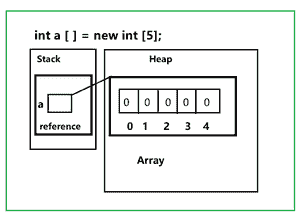
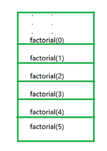
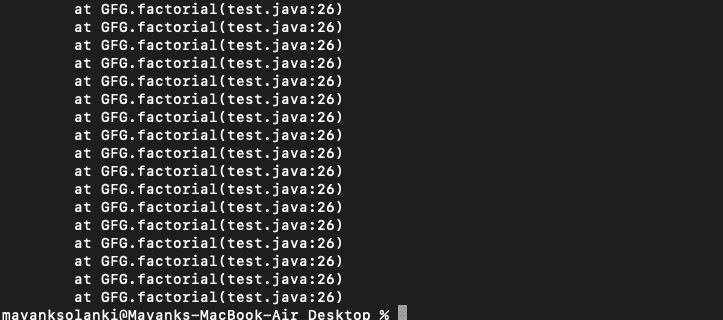

# Java 中的堆和栈内存错误

> 原文:[https://www . geesforgeks . org/heap-and-stack-memory-in-Java 错误/](https://www.geeksforgeeks.org/heap-and-stack-memory-errors-in-java/)

java 中的内存分配由 Java 中的 Java 虚拟机管理。它将内存分为堆栈和堆内存，如下图所示，如下图所示:


**Java 中的堆栈内存**

它是临时内存分配，当调用局部变量和引用变量的方法时，它们被分配内存。它包含对存储在堆中的对象的引用。方法执行后，包含这些变量的内存被清除。我们可以按照后进先出的顺序访问这个内存。分配和解除分配比堆内存快。这样更安全，因为数据只能由线程所有者访问。如果堆栈内存已满，则 JVM 会抛出[堆栈溢出异常](https://www.geeksforgeeks.org/top-5-exceptions-in-java-with-examples/)。

插图:

```
// Java Program to Illustrate Stack Memory  

// Importing required I/O classes 
import java.io.*;

// Main class 
class GFG {

    // Main driver method 
    public static void main (String[] args) {

        // Creating an integer array 
        int a [] = new int[5];  
    }
}
```



上面例子的图解说明

在上面的插图中，我们可以结论性地感知上面显示的媒体，并总结出以下几点

*   “a”是存储在堆栈中的数组类型的变量。
*   new 关键字用于分配堆中的内存。
*   5 是数组的大小。

**堆栈内存错误**

每当我们调用一个方法时，它在执行后会离开堆栈内存。如果你的方法留在栈中，那么栈将会满，如果栈满了我们不能推，如果我们推了，那么我们将会得到错误[Java . lang . stackoverflow error](https://www.geeksforgeeks.org/stackoverflowerror-in-java-with-examples/)，这将会被 JVM 抛出。当您调用一个方法并且堆栈中没有剩余空间时，它将被抛出。在大多数情况下，当我们递归调用一个方法而没有任何适当的终止条件时，就会引发这个问题。我们可以通过确保方法在正确终止的情况下执行来避免这种情况。



过了某一点，栈就会满了

让我们举一个计算一个数的阶乘的例子来说明这一点。

## Java 语言(一种计算机语言，尤用于创建网站)

```
// Java Program to Illustrate Stack Memory Error
// Factorial function without termination condition
// will cause StackOverflow error

// Importing I/O classes
import java.io.*;

// Main class
class GFG {

    // Main driver method
    public static void main (String[] args) {

        // Declaring a custom number whose factorial is to be computed
        int n = 5;

        // Print and display the factorial
        System.out.println(factorial(n));
    }

    // Method
    // To calculate factorial
    static int factorial(int n) {

        // Note: There is no termination condition

        // Calling recursively to compute factorial of a number
        return n * factorial(n - 1);
    }
}
```

**输出:**



> **注意:**如果运行这段代码会得到 java.lang.StackOverflowError，如果在 return 语句之前在阶乘函数中添加终止条件，我们可以通过添加适当的终止条件来避免。在终止条件下，按如下方式消除错误:
> 
> if(n==0)
> 
> 返回 0；

**Java 中的堆内存**

[Java 中的堆内存](https://www.geeksforgeeks.org/stack-vs-heap-memory-allocation/)用于为对象和 JRE (Java Runtime Environment)类分配内存。创建对象时，它总是在堆中创建，对该对象的引用存储在堆栈内存中。它作为一个堆栈是不安全的，因为它可以被全局访问。对该内存的访问相对比堆栈内存慢。它需要一个[垃圾收集器](https://www.geeksforgeeks.org/garbage-collection-java/)来清除未使用的物品。如果堆已满，JVM 会抛出[Java . lang . out of memory error](https://www.geeksforgeeks.org/understanding-outofmemoryerror-exception-java/)。它不像堆栈那样是线程安全的。

**例**

## Java 语言(一种计算机语言，尤用于创建网站)

```
// Java Program to Illustrate Execution in Heap Memory

// Importing input output classes
import java.io.*;

// Main class
class GFG {

    // Static class
    static class Student {

        int roll_no;

        // The reference variable of String argument name
        // which points to the actual string from string
        // pool in heap memory
        String name;

        // Constructor of this static class
        Student(int roll_no, String name)
        {

            // This keyword refers to current instance
            this.roll_no = roll_no;
            this.name = name;
        }
    }

    // Main driver method
    public static void main(String[] args)
    {

        // Primitive roll no value directly stored in stack
        // memory
        int roll_no = 1;
        // Primitive name value directly stored in stack
        // memory
        String name = "Jack";

        // Creating reference variable of Student class type
        // created in a stack memory which will point to
        // the object in heap memory
        // New object created in heap memory
        Student st = new Student(roll_no, name);

        // Print and display the student name and roll
        // number
        System.out.println("Student name -> " + st.name);
        System.out.println("Student roll no. -> "
                           + st.roll_no);
    }
}
```

**Output**

```
Student name -> Jack
Student roll no. -> 1
```

**堆内存错误**

现在也适合讨论 java 中的堆内存错误。因此，当我们在堆内存中创建大量新对象，并且没有空间留给新对象时，确实会发生这种情况，然后 JVM 会抛出***Java . lang . out of memory error***。垃圾收集器删除了没有引用的对象，但不能删除有引用的对象。可以通过移除对不需要的对象的引用来避免这种情况。

**示例:**

## Java 语言(一种计算机语言，尤用于创建网站)

```
// Java Program to Illustrate OutOfMemoryError
// in Heap Space

// Importing input output classes
import java.io.*;

// Main class
class GFG {

    // Main driver method
    public static void main(String[] args)
    {

        // Creating an array whose size is havoc
        Long a[] = new Long[100000 * 10000];
    }
}
```

**输出:**


**输出解释:**在上面的例子中，试图初始化一个非常大的 Long 数组，而 java 堆不足以分配这个数组，它在 Java 堆空间中抛出一个 java.lang.OutOfMemoryError。