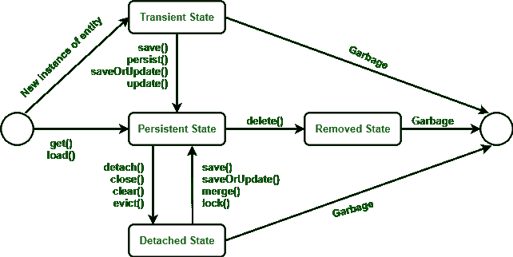
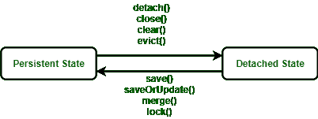

# 冬眠生命周期

> 原文:[https://www.geeksforgeeks.org/hibernate-lifecycle/](https://www.geeksforgeeks.org/hibernate-lifecycle/)

在这里，我们将了解 hibernate 生命周期，或者换句话说，我们可以说我们将了解 Hibernate 中实体/对象类的映射实例的生命周期。在 Hibernate 中，我们可以创建一个实体的新对象并将其存储到数据库中，也可以从数据库中获取实体的现有数据。这些实体与生命周期相关联，每个实体对象都经历生命周期的不同阶段。

Hibernate 生命周期主要有四种状态:

1.  过渡状态
2.  回归状态
3.  分离状态
4.  移除状态



**冬眠生命周期**

从上面的媒体中可以看出，为了在我们的脑海中更好地描绘，人们可以将它们是如何被描绘出来的联系起来。现在我们将讨论更好地解释 hibernate 生命周期的状态。具体如下:

**状态 1:** 瞬态

瞬态是实体对象的第一个状态。当我们使用新的操作符实例化一个 [POJO 类](https://www.geeksforgeeks.org/pojo-vs-java-beans/)的对象时，该对象处于瞬态。此对象未与任何休眠会话连接。因为它没有连接到任何休眠会话，所以这个状态没有连接到任何数据库表。因此，如果我们对 POJO 类的数据进行任何更改，那么数据库表就不会改变。瞬态对象独立于 Hibernate，存在于**堆内存**中。


**将新对象更改为瞬态**

有两种布局会出现瞬态，如下所示:

1.  当对象由应用程序生成但未连接到任何会话时。
2.  这些对象由关闭的会话生成。

在这里，我们为雇员类创建了一个新对象。下面是显示雇员对象初始化的代码:

```java
//Here, The object arrives in the transient state.
Employee e = new Employee();   
e.setId(21);  
e.setFirstName("Neha");  
e.setMiddleName("Shri");  
e.setLastName("Rudra");
```

**状态 2:** 持续状态

一旦对象与休眠会话连接，对象就进入持久状态。因此，有两种方法可以将瞬态转换为持久状态:

1.  使用休眠会话，将实体对象保存到数据库表中。
2.  使用休眠会话，将实体对象加载到数据库表中。

在这种状态下。每个对象代表数据库表中的一行。因此，如果我们对数据进行任何更改，那么 hibernate 将检测到这些更改，并对数据库表进行更改。


**将瞬态转换为持续状态**

以下是为持久状态提供的方法:

*   session . persist(e)；
*   session . save(e)；
*   会话。save orupdate(e)；
*   session . update(e)；
*   session . merge(e)；
*   session . lock(e)；

**示例:**

```java
// Transient State
Employee e = new Employee("Neha Shri Rudra", 21, 180103); 

//Persistent State
session.save(e);
```

**状态 3:** 分离状态

要将对象从持久状态转换为分离状态，我们要么关闭会话，要么清除其缓存。由于此处会话已关闭或缓存已清除，因此对数据所做的任何更改都不会影响数据库表。只要需要，分离的对象就可以重新连接到新的休眠会话。要将分离的对象重新连接到新的 hibernate 会话，我们将使用以下方法:

*   合并()
*   更新()
*   负载()
*   刷新()
*   保存()
*   更新()

以下是用于分离状态的方法:

*   session . detach(e)；
*   session . exclude(e)；
*   session . clear()；
*   session . close()；



**将持续状态转换为分离状态**

**例**

```java
// Transient State
Employee e = new Employee("Neha Shri Rudra", 21, 180103);

// Persistent State 
session.save(e); 

// Detached State
session.close(); 
```

**状态 4:** 移除状态

在休眠生命周期中，它是最后一种状态。在移除状态下，当实体对象从数据库中删除时，就知道实体对象处于移除状态。通过调用 ***删除()操作*** 来完成。由于实体对象处于移除状态，因此如果对数据进行任何更改，都不会影响数据库表。

> **注意:**要创建一个被移除的实体对象，我们将调用 **session.delete()** 。


**将持续状态转换为移除状态**

**例**

```java
// Java Pseudo code to Illustrate Remove State

// Transient State
Employee e = new Employee();     
Session s = sessionfactory.openSession();
e.setId(01);

// Persistent State
session.save(e)  

// Removed State                 
session.delete(e);            
```