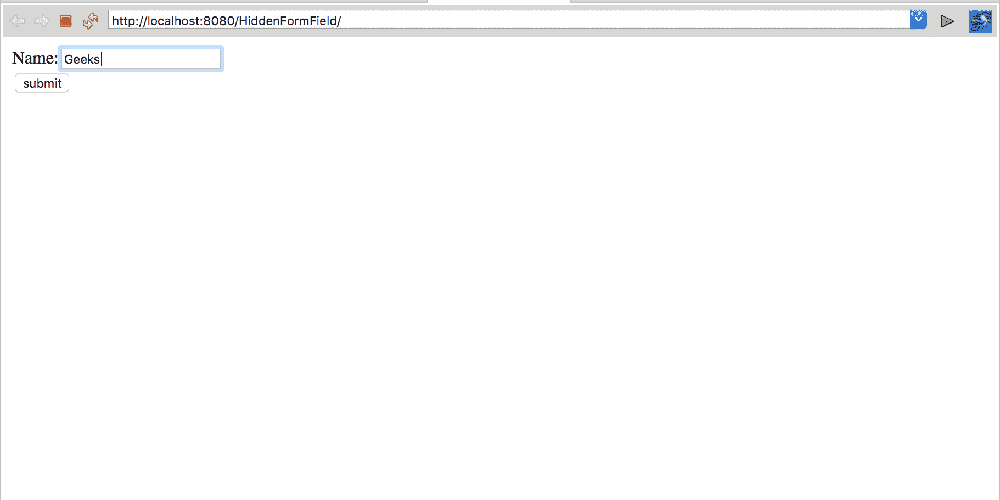
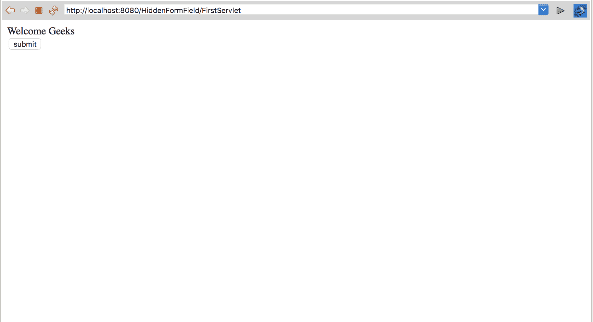
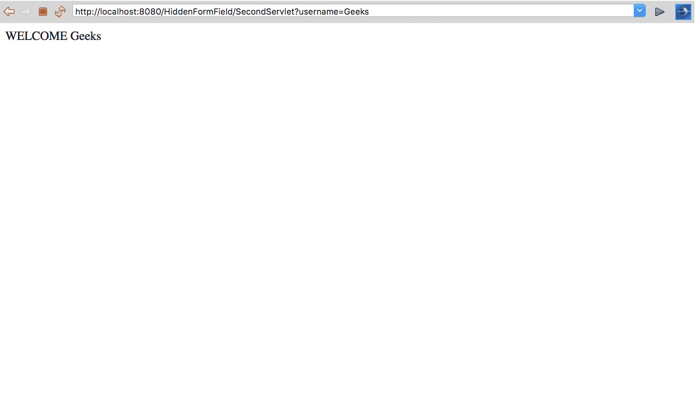

# 使用注释隐藏表单域| Java Servlet

> 原文:[https://www . geesforgeks . org/hidden-form-field-use-annotation-Java-servlet/](https://www.geeksforgeeks.org/hidden-form-field-using-annotation-java-servlet/)

隐藏表单字段用于存储客户端的会话信息。在这个方法中，我们创建一个隐藏的表单，它将控制传递给 servlet，servlet 的路径在表单操作区域给出。使用这个，用户的信息被存储并传递到我们想要发送数据的位置。
使用隐藏表单域的主要优点是不依赖浏览器。即使 cookies 被禁用或未隐藏，表单归档也能完美工作。

**例**

## Java 语言(一种计算机语言，尤用于创建网站)

```java
out.print("<form action='SecondServlet'>");
out.print("<input type='hidden' name='username'
value='" + n + "'>");
out.print("<input type='submit' value='submit'>");
out.print("</form>");
```

**隐藏表单域方法的完整示例**

在这个方法中，我们将客户机细节从第一个 Servlet 转移到第二个 Servlet

**Index.html**

## 超文本标记语言

```java
<!DOCTYPE html>
<!DOCTYPE html>
<html>
<head>
<meta charset="UTF-8">
<title>Insert title here</title>
</head>
<body>
    <form action="FirstServlet" method="Post">
        <!-- Move the control to firstServlet -->
        Name:<input type="text" name="userName" /><br />
        <input type="submit" value="submit" />
    </form>
</body>
</html>
```

**输出**



第一 Servlet.java

## Java 语言(一种计算机语言，尤用于创建网站)

```java
// Java program to demonstrate
// Hidden form field method

package GeeksforGeeks;

import java.io.*;
import javax.servlet.*;
import javax.servlet.annotation.WebServlet;
import javax.servlet.http.*;

@WebServlet("/FirstServlet")

// this annotation is used for replacing xml file
public class FirstServlet extends HttpServlet {

    // class name is FirstServlet which extends HttpServlet
    public void doPost(HttpServletRequest request, HttpServletResponse response)
    {
        try {
            response.setContentType("text/html");
            /*
             The response's character encoding is only set from the given
             content type if this method is called before getWriter is called.
             This method may be called repeatedly to change content type and
             character encoding.
             */
            PrintWriter out = response.getWriter();

            /*
             The Java PrintWriter class ( java.io.PrintWriter ) enables you to
             write formatted data to an underlying Writer . For instance,
             writing int, long and other primitive data formatted as text,
             rather than as their byte values
             */
            String username = request.getParameter("userName");

            /*
             request.getParameter takes the value from index.html file where
             name is username
             */
            out.print("Welcome " + username);

            // out.println is used to print on the client web browser

            /*
             In the below code their is a hidden form
for maintaining session of user.
             this passes control to SecondServlet
             */
            out.print("<form action='SecondServlet'>");

            out.print("<input type='hidden' name='username' value='" + username + "'>");
            out.print("<input type='submit' value='submit'>");
            out.print("</form>");
            out.close();
        }
        catch (Exception e) {
            System.out.println(e);
        }
    }
}
```

**输出**



**第二支发球**

## Java 语言(一种计算机语言，尤用于创建网站)

```java
// Java program to demonstrate
// Hidden form field method

package GeeksforGeeks;

import java.io.*;
import javax.servlet.*;
import javax.servlet.annotation.WebServlet; // Importing annotation
import javax.servlet.http.*;

// using this annotation we dont need
// xml file for dispathing servlet
@WebServlet("/SecondServlet")

public class SecondServlet extends HttpServlet {
    public void doGet(HttpServletRequest request, HttpServletResponse response)
    {
        try {
            response.setContentType("text/html");
            /*
             The response's character encoding is only set from the given
             content type if this method is called before getWriter is called.
             This method may be called repeatedly to change content type and
             character encoding.
             */
            PrintWriter out = response.getWriter();

            /*
             The Java PrintWriter class ( java.io.PrintWriter ) enables you to
             write formatted data to an underlying Writer . For instance,
             writing int, long and other primitive data formatted as text,
             rather than as their byte values
             */
            // getting value from the query string
            String username = request.getParameter("username");

            // taking the value of usename from First servlet using getparameter object
            out.print("WELCOME " + username);

            // out.println is used to print on the client web browser
            out.close();
        }
        catch (Exception e) {
            System.out.println(e);
        }
    }
}
```

**输出**



**代码的逐步处理**
当您部署项目并在服务器上运行代码时，以下过程将继续。

1.  控件转到 index.html 文件，并在网络浏览器上生成一个表单，它会询问您的用户名。
2.  在 index.html 文件表单中，操作是第一个 Servlet，因此当您点击提交按钮时，控制转到第一个 Servlet，您的会话开始。
3.  在 first servlet request . getparameter(用户名)中，从 index.html 获取输入，其中的字段是 username，并将其打印在浏览器上。
4.  在第一个 Servlet 中，有一个隐藏的表单域，它再次从浏览器获取输入，并将控件传递给第二个 servlet。
5.  这种方法适用于许多不同的 Servlet。
    注意:这是 Hidden 表单字段方法的主要缺点，为了维护一个客户端会话，你必须一次又一次地填写表单。
6.  在第二个 Servlet 中，我们再次使用 request.getParameter 从第一个 Servlet 页面获取输入。

**优势与应用**

*   它可以用于匿名会话跟踪。
*   每个浏览器都支持隐藏表单域。这种会话跟踪方法不需要任何特殊的浏览器配置。
*   所有信息都存储在客户端浏览器中，增加了安全性

**劣势:**

1.  它只适用于一系列动态生成的表单。这可以分解为静态文档、电子邮件文档、书签文档和浏览器关闭。
2.  你需要为每个请求提交一份额外的表格。
3.  比 URL 重写复杂。
4.  此方法仅使用文本信息。