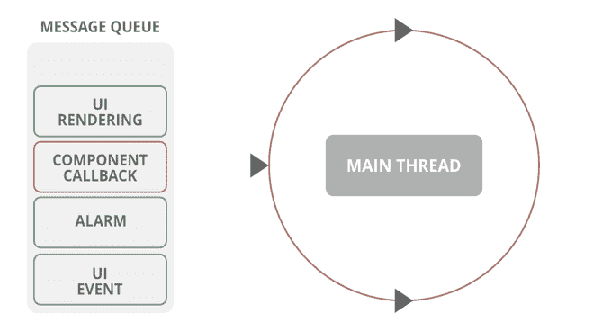

# 线程在安卓系统中是如何工作的？

> 原文:[https://www . geeksforgeeks . org/线程如何在安卓中工作/](https://www.geeksforgeeks.org/how-does-threading-work-in-android/)

当一个应用在安卓系统中启动时，它*会创建执行的主线程*，简称为“ ***主*** ”线程。大多数线程负责将事件分派到可接受的接口小部件，也负责与安卓用户界面工具包中的组件进行通信。为了保持应用程序**的响应**，避免使用最多的线程来执行任何会发现自己被阻塞的操作是至关重要的。

网络操作和数据库调用，也称为某些组件的加载，是在主线程中应该避免的常见操作示例。一旦它们在主线程中被调用，它们就会被同步调用，这表明用户界面将保持完全无响应，直到操作完成。因此，需要调用的任务通常在不同的线程中执行，这反过来避免了阻塞用户界面，并在执行任务时保持用户界面的响应。*(也就是说，他们已经从用户界面异步执行)。*

安卓提供了一些制作和管理线程的方法，并且有很多第三方库可以让线程管理变得更加愉快。然而，由于手头上有许多方法，选择合适的方法通常会很混乱。在本文中，您将研究安卓开发中线程化变得至关重要的一些**常见场景**以及一些将应用于这些场景的简单解决方案等等。

### 安卓系统中的线程

**在安卓系统中，你将所有线程组件分为两个基本类别:**

1.  **附加到活动/片段的线程**:这些线程与活动/片段的生命周期相关联，并且因为活动/片段被破坏而立即终止。
2.  **没有附加到任何活动/片段的线程**:这些线程仍然可以在产生它们的活动/片段(如果有的话)的生命周期之外运行。

### 类型#1:附加到活动/片段的线程组件

**1。ASYNCTASK**

[AsyncTask](https://www.geeksforgeeks.org/asynchronous-synchronous-callbacks-java/) 是最基本的安卓线程组件。它非常简单易用，对一些基本场景也很有用

## Java 语言(一种计算机语言，尤用于创建网站)

```java
public class GeeksActivity extends Activity {

    @Override
    protected void onCreate(Bundle savedInstanceState)
    {
        super.onCreate(savedInstanceState);
        // Adding Task to the List (Async)
        new MyTask().execute(url);
    }

    private class MyTask
        extends AsyncTask<String, Void, String> {

        @Override
        protected String doInBackground(String... params)
        {
            String url = params[0];
            return doSomeWork(url);
        }

        @Override
        protected void onPostExecute(String result)
        {
            super.onPostExecute(result);
            // do something with the result
        }
    }
}
```

**AsyncTask** 但是，如果您希望您的延迟任务在活动/片段的生命周期之外运行，则**的时间会很短。事实上，即使是最轻微的屏幕旋转也会导致活动被破坏，这简直太可怕了！所以我们来到:**

**2。装载机**

装载机是上述可怕噩梦的答案。加载器在这种情况下表现出色，当活动被破坏时，它们会自动停止，更妙的是，它们在活动被重新创建后也会重新启动。

## Java 语言(一种计算机语言，尤用于创建网站)

```java
public class GeeksActivity extends Activity{

    @Override
    protected void onCreate(Bundle savedInstanceState) {
        super.onCreate(savedInstanceState);
        // Getting instance of loader manager
        getLoaderManager().initLoader(1, null, new MyLoaderCallbacks());
    }

    private class MyGeekyLoaderCallbacks implements LoaderManager.LoaderCallbacks {
        // Overriding the method
        @Override
        public Loader onCreateLoader(int id, Bundle args) {
            return new MyLoader(GeeksforGeeks.this);
        }

        @Override
        public void onLoadFinished(Loader loader, Object data) {

        }

        @Override
        public void onLoaderReset(Loader loader) {

        }
    }

    private class MyLoader extends AsyncTaskLoader {

        public MyLoader(Context context) {
            super(context);
        }

        @Override
        public Object loadInBackground() {
            return someWorkToDo();
        }

    }
}
```

### 类型 2。不附加到活动/片段的线程组件

**1。服务**

服务可以被认为是一个组件，它对于在没有用户界面的情况下执行长时间(或潜在长时间)操作非常有用。是的，你没听错！服务没有任何用户界面！服务在其宿主进程的主线程中运行；该服务不会创建自己的线程，也不会在单独的进程中运行，除非您另外指定。

## Java 语言(一种计算机语言，尤用于创建网站)

```java
public class ExampleServiceGeeks extends Service {

    @Override
    public int onStartCommand(Intent intent, int flags, int startId) {
        doSomeLongProccesingWork();
        stopSelf();
        // Self stopping the service
          // by calling stopSelf();
        return START_NOT_STICKY;
    }

    @Nullable
    @Override
    // Binding the service to the Method calls
    public IBinder onBind(Intent intent) {
        return null;
    }
}
```

### 典型的设计错误

请看下面的代码片段:

## Java 语言(一种计算机语言，尤用于创建网站)

```java
public class GeeksforGeeks extends Activity {
  // ...
  public class MyAsyncTask extends AsyncTask<Void, Void, String>   {
    @Override protected void onPostExecute(String result) {...}
    @Override protected String doInBackground(Void... params) {...}

  }
}
```

## 我的锅

```java
class GeeksforGeeks : Activity() {
    // ...
    inner class MyAsyncTask : AsyncTask<Unit, Unit, String>() {
          override fun onPostExecute(result: String) {...}
        override fun doInBackground(vararg params: Unit): String {...}
    }
}
```

**怎么好像不对？**

这段代码中出现的错误是，代码将线程对象 MyAsyncTask 声明为某个活动的非静态内部类(或 Kotlin 中的内部类)。这个声明创建了对封闭活动实例的隐式关注。因此，在线程化工作完成之前，该事物包含关于该活动的信息，从而导致被引用活动的销毁延迟。因此，我们会得到一个延迟，这反过来会损害系统，并给内存带来沉重的负担。当前问题的一个直接解决方案是将您的重载类实例定义为静态类或在它们自己的文件中，从而删除隐式引用。

另一个解决方案是总是在适当的活动生命周期回调中取消和打包后台任务，如 onDestroy。然而，这种方法通常是乏味且容易出错的。一般来说，您不应该将复杂的非用户界面逻辑直接放在活动中。另外， **AsyncTask** 现在是*弃用，*不建议在新代码中使用。

### 线程优先级

如流程和应用程序生命周期中所述，应用程序线程接收的优先级部分取决于应用程序在应用程序生命周期中的位置。当您在应用程序中创建和管理线程时，重要的是对它们的优先级进行排序，以便正确的线程在正确的时间获得正确的优先级。

如果优先级设置得太高，那么该线程可能会中断用户界面线程，甚至在某些不利情况下阻塞它，甚至阻塞渲染线程，从而导致应用程序性能问题，如丢帧、延迟、应用程序用户界面迟缓等。

每次创建线程，都应该调用 **setThreadPriority()** 。系统的线程调度器优先选择具有高优先级的线程，平衡这些优先级和最终完成所有工作的必要性。通常，前台组中的线程从设备获得大约 95%的整个执行时间，而后台组获得大约 5%。

因此，如果你对像素做长期的工作而变得愤怒，这可能是一个更好的解决方案。当你的应用程序使用 **HandlerThread** 创建一个线程时，不要忘记根据它所做的工作来排列线程的优先级。请记住，CPU 只能并行处理少量线程。设置优先级有助于当所有其他线程都在争夺注意力时，系统知道如何安排这项工作。



解释线程进程的消息队列

关于“服务绑定和线程”的详细讨论可以在[这里](https://developer.android.com/guide/components/aidl)找到，以供参考。