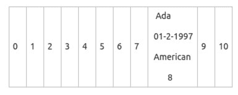

# 哈希表在 Java 内部是如何工作的？

> 原文:[https://www . geesforgeks . org/how-hashtable-work-in-internal-in-Java/](https://www.geeksforgeeks.org/how-hashtable-works-internally-in-java/)

[哈希表](https://www.geeksforgeeks.org/hashtable-in-java/)是一种哈希映射，但是是同步的。哈希映射是非同步的，允许一个空键&多个空值，非线程安全，即没有适当的同步就不能在多个线程之间共享，键/值对存储在哈希表中。哈希表不允许空值/键。使用此选项时，您可以指定一个用作键的对象&您想要与该键关联的值。它是一个索引数组。每个索引称为一个存储桶/插槽。它基于键&约束值，通过调用哈希代码()方法识别桶的位置。Java 的哈希表保存了一个具有唯一元素的类。

**哈希表**的工作

哈希表本质上包含一个存储键和值对的槽/桶。它使用密钥的哈希代码来发现集合的密钥/值应该映射到哪个桶。要在列表中找到一个项目，你需要做第一种方法，即线性搜索，这包括检查每个项目，这将需要更多的时间。假设您已经检索了一个数组的值及其索引号，那么您将非常快速地查找一个值。事实上，如果您知道索引号与数组的大小和位置无关，则花费的时间会更少。但是如何知道数组的哪个元素包含您要查找的值呢？答案是通过计算数值本身，指数多少与数据有关。

让我们扩散数组，取一个名字并找到它的 ASCII 码，例如，我们将取一个名字，比如 Mia，找到每个字母的 ASCII 码&将 ASCII 码相加，并将组合的 ASCII 码除以元素的大小，在这里它是 5，我们将记住元素是 4，我们将把 Mia 的名字放在第 4 个槽/桶中。

**示例:**

> 名字=米娅
> 
> M 77
> 
> i 105
> 
> a 97
> 
> 总和= 279
> 
> 模量= 279 % 5 = 4
> 
> 

现在我们可以向桶中添加更多的名称，如下所示:

> mia’m(77)+I(105)+a(97)= 279% 5 = 4
> 
> 团队 ⇾ T （84） + i（105） + 米（77） = 298 % 5 = 3
> 
> Leo l(76)+e(101)+n(110)= 287% 5 = 2
> 
> I ⇾ S（83） + o（111） + m（77） = 271 % 5 = 1
> 
> beb ' b(66)+e(101)+b(98)= 265% 5 0
> 
> 

> 索引号= ASCII 码的总和%数组的大小

让我们检索一个项目，比如 Ada，我们执行相同的计算，

> 查找 **Ada** = (65+100+97) = 262 的 ASCII 码
> 
>                       262 % 11 = 9
> 
> 我的数据=数组(9)


这是一个快速的数组查找。使用哈希表来存储键值对，而不是存储单个项目或数据。例如，Ada 将是想要计算相应值的 Index 和 DOB 的键，因此，键-值对的哈希表有时被称为哈希表，事实上，如果采用面向对象的方法，一个类的实例中的每个人和键将具有许多属性，通过用对象填充数组，您将有效地为每个桶存储您喜欢的许多相关数据



哈希算法也称为哈希函数。哈希函数是一个在给定一个键时生成一个表的函数。这是一个从密钥的哈希代码中获取存储桶位置的函数。它每次都会为一个对象返回一个数字。用于将密钥转换为地址的计算。

对于数字键，将该键除以可用地址数 n，然后取余数

> 地址=密钥 Mod n

对于字母数字键，将一个键中 ASCII 码的总和除以可用地址的数量，然后取余数。

*   折叠方法将键分成相等的部分，然后将这些部分加在一起
*   电话号码 018767242947 变成 01+87+67+24+29+47= 255
*   根据表的大小，可以除以某个常数，然后取余数。
*   有许多哈希函数，有些根据性质适合另一些。

**哈希表中的冲突**

到目前为止，您已经看到，有很多带有数据的哈希表非常方便地导致任何问题说这是不现实的有时，如果您在两种不同的情况下应用哈希函数，它会为两者生成相同的索引号，但是两个项目不能在同一个地方，这称为碰撞。两个相同的对象每次都有相同的数字，而两个不相等的对象可能不总是有不同的数字。将一个对象放入哈希表中，不同的对象可能会有一个相同的哈希代码，称为碰撞。哈希表使用这个列表数组来纠正。映射到数组索引/单存储桶并保存在索引中的集合&索引引用存储在数组索引中。

这次让我们用不同的数据集再次加载数组。如下所示，如果米娅占据了位置 4，利奥占据了位置 2，并且如果其他名字在位置 2 也有相同的条目，则下一个桶将自动填充该条目，以避免碰撞，如下所示。

> 查找 Rae 280 Mod 11 = 5
> 
> 我的数据=数组(5)


作为提醒，Rae 的 ASCII 码是 5，但被放在槽 8 中，因为由于冲突，两个项目被认为是在同一个槽中，但是为了避免这种情况，Rae 被转移到另一个槽，并且当另一个槽再次被占用时，它被转移到第 8 个位置。

通过将项目放在其他地方来解决冲突，那么它的计算地址被称为开放寻址，因为每个位置都对项目开放。这可以使用多种技术来决定将项目放置在何处这种特定的寻址技术称为线性探测如果计算出的地址被占用，则使用线性搜索来查找下一个可用的存储桶如果线性探测结束并且仍然找不到位置，它可能会在数组的开头循环&从那里继续搜索。散列表中的项目越多，发生冲突的可能性就越大。处理这种情况的一种方法是使哈希表变得更大，以容纳您期望的数据总量，这样可能会有 70%的表被占用。存储的项数和数组大小之间的比率称为加载因子

> 加载因子= <u>T</u> 存储的项目总数/数组大小

处理冲突的另一种方法是链，有时也称为封闭寻址。在这种情况下，一个插槽可以通过将不同的项目添加到一个桶中来形成链。

**散列函数的目标**

*   最小化冲突
*   哈希值的均匀分布
*   易于计算
*   解决任何冲突

**像 hashCode () &这样的方法等于()来寻找精确的元素匹配**

**equal():** 对象类将 [equal()](https://www.geeksforgeeks.org/equals-hashcode-methods-java/) 定义为 Java 的给定语言。其中对象指示是否很少有对象作为“等于”当前实例的参数传递。不同或两个对象只有放在相同的内存地址上才能相似。

**语法:**

```
public boolean equals  (Object obj)

// This method checks if some other Object
// passed to it as an argument is equal to 
// the Object on which it is invoked.
```

**应遵循以下原则:**

*   **反身:**对于单个对象说 **a** ，a.equal(a)返回 true。
*   **对称:**对于两个不同的对象，当且仅当 y.equal(a)返回 true 时，a.equal(y)返回 true。
*   **传递:**对于多个对象 a，b，c 如果 a.equal(b)返回真& b.equals(c)返回真那么 a.equals(c)应该返回真。
*   如果修改了对象属性，这意味着在 equal()方法实现中使用了不同的和倍数的 a.equal(b)将返回相同的结果。
*   只有当两个引用标记相似的对象时，Object class equal()才会返回 true。

**注意:** 对于任何非空引用值 a，a.equals(null)应该返回 false。

**hashCode():** 在这个对象中返回一个对象内存地址的整数描述。通过使用此方法，将返回一个随机整数，该整数对于特定实例是唯一的。这将返回整数哈希代码数据或该对象的值。

**语法**:

```
public int hashCode()

// This method returns the hash code value 
// for the object on which this method is invoked.
```

**示例:**

## Java 语言(一种计算机语言，尤用于创建网站)

```
import java.util.*;

public class HashCodeExample {
    public static void main(String[] args)
    {
        // develop integer object
        Integer i = new Integer("144");

        // Returned hash code value
        int hashValue = i.hashCode();

        System.out.println("Value of Hashcode : "
                           + hashValue);
    }
}
```

**输出**

```
144
```

**步骤**

*   基类具有用户定义的对象属性。
*   通过使用@override，可以预定义 override hashCode()函数。
*   以类似的方式，可以预定义 override equal()函数。
*   声明基类的一个对象，并使用哈希代码和 equals 函数，以便在主函数中对象是相等的。

**哈希码()和等号()的约定**

*   在应用程序执行期间，如果在同一个对象上多次调用 [hashCode()](https://www.geeksforgeeks.org/equals-hashcode-methods-java/) ，那么它必须一致地返回同一个整数值，前提是在对象上的 **equals(对象)**比较中没有使用的信息被修改。从应用程序的一次执行到同一应用程序的另一次执行，该整数值不必保持相同。
*   如果两个对象相等，根据**等于(对象)**方法，那么 hashCode()方法必须在两个对象的每一个上产生相同的整数。
*   如果两个对象不相等，根据**等于(对象)**的方法，hashCode()方法在两个对象上产生的整数值没有必要是不同的。它可以是相同的，但是在两个对象中的每一个上产生不同的整数对于提高基于散列的集合的性能更好，例如[散列映射](https://www.geeksforgeeks.org/java-util-hashmap-in-java-with-examples/)、散列表等。

**注意:**相等的对象只要相等就必须产生相同的哈希码，然而不相等的对象不需要产生不同的哈希码。

### 使用

它是一种执行关联数组超越数据类型的数据结构，这种结构可以将键映射到值。这里，我们使用哈希算法来确定一个名为哈希代码的列表，该列表包含一个插槽数组，从中可以获得所需的值。哈希表用于实现内存中的表，在 python、PHP 等编程语言中。，在错误检查。关联数组、数据库索引、缓存、集合、对象表示、唯一数据表示、换位表等。

**例 1:**

## Java 语言(一种计算机语言，尤用于创建网站)

```
import java.util.*;

public class HashtableExample {
    public static void main(String[] args)
    {
        // Create Hashtable
        Hashtable<Integer, String> hashtable
            = new Hashtable<>();

        // Add mappings to hashtable
        hashtable.put(1, "X");
        hashtable.put(2, "Y");
        hashtable.put(3, "Z");
        System.out.println(hashtable);

        // Get a mapping by key
        String value = hashtable.get(1);

        System.out.println(value);

        //  Remove a mapping
        hashtable.remove(3);

        // Iterate overmapping
        Iterator<Integer> itr
            = hashtable.keySet().iterator();

        while(itr.hasNext())
        {
            Integer key = itr.next();
            String mapped_value = hashtable.get(key);
            System.out.println(
                "key: " + key + " value : " + mapped_value);
        }
    }
}
```

**Output**

```
{3=Z, 2=Y, 1=X}
X
key: 2 value : Y
key: 1 value : X
```

**例 2:**

## Java 语言(一种计算机语言，尤用于创建网站)

```
import java.util.Hashtable;
import java.util.Enumeration;
public class HashtableExample {

    public static void main(String[] args)
    {

        Enumeration names;
        String key;

        // Developing a Hashtable
        Hashtable<String, String> hashtable
            = new Hashtable<String, String>();

        // Attaching Key and Value sets to Hashtable
        hashtable.put("Key1", "Madhu");
        hashtable.put("Key2", "Girja");
        hashtable.put("Key3", "Durgesh");
        hashtable.put("Key4", "Richa");
        hashtable.put("Key5", "Manisha");

        names = hashtable.keys();
        while (names.hasMoreElements()) {
            key = (String)names.nextElement();
            System.out.println("Key: " + key + " & Value: "
                               + hashtable.get(key));
        }
    }
}
```

**Output**

```
Key: Key4 & Value: Richa
Key: Key3 & Value: Durgesh
Key: Key2 & Value: Girja
Key: Key1 & Value: Madhu
Key: Key5 & Value: Manisha
```

**结论**

*   用于索引大量数据
*   使用密钥本身计算的每个密钥的地址
*   通过开放或封闭寻址解决冲突
*   哈希广泛用于数据库索引、编译器、缓存、密码验证等等
*   插入、删除和检索在恒定时间内发生。