# 如何在安卓中从 recycle view 访问 recycle view 之外的任何组件？

> 原文:[https://www . geeksforgeeks . org/如何访问任何组件-外部-回收-从回收-在安卓中查看/](https://www.geeksforgeeks.org/how-to-access-any-component-outside-recyclerview-from-recyclerview-in-android/)

标题可能有点混乱，但我们想说的是，假设在一个安卓应用程序中，有一个[recycle view](https://www.geeksforgeeks.org/android-recyclerview/)，在此之外还有一个 [TextView](https://www.geeksforgeeks.org/textview-widget-in-android-using-java-with-examples/) 。在回收视图中有一个可点击组件的列表，表示[按钮](https://www.geeksforgeeks.org/button-in-kotlin/)。现在我想要的是，对于不同的按钮点击，文本视图中的文本会有所不同。这基本上是从回收视图中控制回收视图之外的组件。


根据图片，有一个回收视图，有四个按钮(1 个隐藏在左侧)和一个文本视图。对于不同的按钮点击，文本视图中会显示不同的文本。在本文中，同样的概念将通过一点真实世界的接触来实现。**所以最终的应用程序将显示极客为极客提供的教程列表和子列表**。以下是最终应用的演示 GIF:

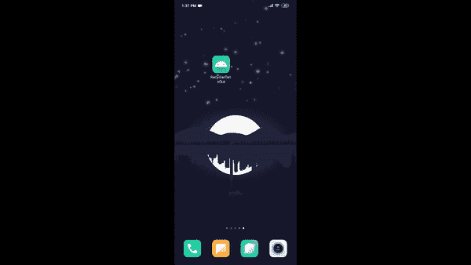

**先决条件:**

*   [如何安装安卓工作室](https://www.geeksforgeeks.org/guide-to-install-and-set-up-android-studio/)
*   [在安卓工作室建立新项目](https://www.geeksforgeeks.org/android-how-to-create-start-a-new-project-in-android-studio/)
*   [什么是回收视图](https://www.geeksforgeeks.org/android-recyclerview/)

**步骤 1:使用 activity_main.xml 文件**

*   转到 **res - >布局- > activity_main.xml** 文件。
*   下面是该 XML 文件的代码:

## 可扩展标记语言

```
<?xml version="1.0" encoding="utf-8"?>
<androidx.constraintlayout.widget.ConstraintLayout
    xmlns:android="http://schemas.android.com/apk/res/android"
    xmlns:app="http://schemas.android.com/apk/res-auto"
    xmlns:tools="http://schemas.android.com/tools"
    android:layout_width="match_parent"
    android:layout_height="match_parent"
    tools:context=".MainActivity">

    <LinearLayout
        android:layout_width="match_parent"
        android:layout_height="match_parent"
        android:layout_marginTop="10dp"
        android:orientation="vertical"
        android:padding="10dp"
        app:layout_constraintEnd_toEndOf="parent"
        app:layout_constraintStart_toStartOf="parent"
        app:layout_constraintTop_toTopOf="parent">

        <LinearLayout
            android:layout_width="match_parent"
            android:layout_height="wrap_content"
            android:gravity="center">

            <TextView
                style="@style/MaterialAlertDialog.MaterialComponents.Title.Icon"
                android:layout_width="wrap_content"
                android:layout_height="match_parent"
                android:text="GEEKS FOR GEEKS TUTORIALS"
                android:textAlignment="center"
                android:textSize="25sp"
                android:textStyle="bold" />

        </LinearLayout>

        <!-- The horizontal recyclerView where the 
             Main-List items will be showed -->
        <androidx.recyclerview.widget.RecyclerView
            android:id="@+id/recyclerViewOne"
            android:layout_width="match_parent"
            android:layout_height="150dp"
            android:layout_marginTop="20dp"
            android:clipToPadding="false"
            android:foregroundGravity="center"
            android:orientation="horizontal" />

        <LinearLayout
            android:id="@+id/linearLayout"
            android:layout_width="match_parent"
            android:layout_height="50dp"
            android:layout_marginTop="20dp"
            android:gravity="center">

            <!-- The TextView where the Main-List item 
                 title text will be showed -->
            <TextView
                android:id="@+id/algorithmTitleText"
                style="@style/ShapeAppearance.MaterialComponents.MediumComponent"
                android:layout_width="wrap_content"
                android:layout_height="wrap_content"
                android:textColor="@android:color/black"
                android:textSize="22sp" />

        </LinearLayout>

        <!-- The vertical recyclerView where the Sub-List 
             items will be showed -->
        <androidx.recyclerview.widget.RecyclerView
            android:id="@+id/recyclerViewTwo"
            android:layout_width="match_parent"
            android:layout_height="match_parent"
            android:layout_marginTop="20dp"
            android:clipToPadding="false"
            android:foregroundGravity="center" />

    </LinearLayout>

</androidx.constraintlayout.widget.ConstraintLayout>
```

*   这里使用了**两个 recycle view**，一个水平(**recycle viewine**)一个垂直(**recycle viewine two**)。第一个显示主列表，第二个显示主列表项的子列表。
*   一个**文本视图**也用于显示主列表项文本。

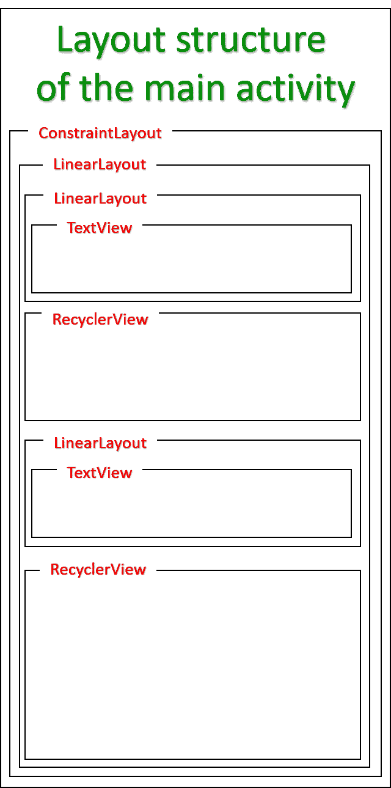

**第二步:主列表项**增加 single_card_layout.xml

*   转到 **res - >布局**
*   右键单击布局文件夹
*   转到**新建- >布局资源文件**
*   键入文件名( *single_card_layout.xml* 为我)
*   将根元素更改为 RelativeLayout
*   点击**确定**

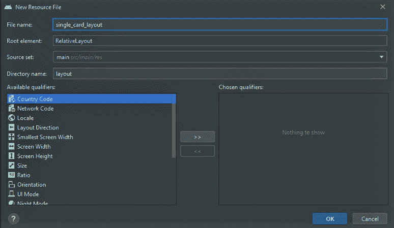

*   下面是这个 XML 文件的代码:

## 可扩展标记语言

```
<?xml version="1.0" encoding="utf-8"?>
<RelativeLayout
    xmlns:android="http://schemas.android.com/apk/res/android"
    xmlns:app="http://schemas.android.com/apk/res-auto"
    android:gravity="center"
    android:layout_width="wrap_content"
    android:layout_height="wrap_content">

    <androidx.cardview.widget.CardView
        android:id="@+id/singleItemCardView"
        android:layout_width="145dp"
        android:layout_height="match_parent"
        android:layout_margin="10dp"
        android:elevation="10dp"
        app:cardCornerRadius="30dp"
        android:clickable="true"
        android:focusable="true"
        android:foreground="?android:attr/selectableItemBackground">

        <RelativeLayout
            android:layout_width="match_parent"
            android:layout_height="match_parent"
            android:gravity="center"
            android:layout_gravity="center">

            <TextView
                android:id="@+id/singleItemTextView"
                android:layout_width="wrap_content"
                android:layout_height="wrap_content"
                android:paddingStart="10dp"
                android:paddingEnd="10dp"
                android:text="TEST TEXT"
                android:gravity="center"
                android:textAlignment="center"
                android:textColor="@android:color/black"
                android:textSize="15sp"
                android:textAllCaps="true"
                android:letterSpacing="0.2" />

        </RelativeLayout>
    </androidx.cardview.widget.CardView>
</RelativeLayout>
```

*   这基本上是回收视图或主列表或水平回收视图中显示的项目布局。

**第三步:为子列表项**添加 single _ card _ layout _ vertical . XML

*   转到 **res - >布局**
*   右键单击布局文件夹
*   转到**新建- >布局资源文件**
*   键入文件名(*single _ card _ layout _ vertical . XML*如本例所示)
*   将根元素更改为 RelativeLayout
*   点击**确定**
*   下面是这个 XML 文件的代码:

## 可扩展标记语言

```
<?xml version="1.0" encoding="utf-8"?>
<RelativeLayout
    xmlns:android="http://schemas.android.com/apk/res/android"
    xmlns:app="http://schemas.android.com/apk/res-auto"
    android:layout_width="match_parent"
    android:layout_height="wrap_content"
    android:gravity="center">

    <androidx.cardview.widget.CardView
        android:id="@+id/singleItemCardView"
        android:layout_width="match_parent"
        android:layout_height="60dp"
        android:layout_margin="10dp"
        android:clickable="true"
        android:elevation="10dp"
        android:focusable="true"
        android:foreground="?android:attr/selectableItemBackground"
        app:cardCornerRadius="5dp">

        <RelativeLayout
            android:layout_width="match_parent"
            android:layout_height="match_parent"
            android:layout_gravity="center"
            android:gravity="center_vertical"
            android:padding="5dp">

            <TextView
                android:id="@+id/singleItemTextViewRVTwo"
                android:layout_width="wrap_content"
                android:layout_height="wrap_content"
                android:gravity="center_vertical"
                android:letterSpacing="0.2"
                android:paddingStart="10dp"
                android:paddingEnd="10dp"
                android:text="TEST TEXT"
                android:textAlignment="inherit"
                android:textAllCaps="true"
                android:textColor="@android:color/black"
                android:textSize="15sp" />

        </RelativeLayout>

    </androidx.cardview.widget.CardView>
</RelativeLayout>
```

*   这是回收视图二或子列表或垂直回收视图中显示的项目布局。

**步骤 4:在水平回收视图或主列表**上工作

*   转到**Java->com . wheic . recyclergetout**(您的可能会有所不同)
*   在 com . wheic . recycle rgetout 下做一个目录(我把它命名为 RV1)。从安卓工作室制作目录很奇怪，这个过程中有很多 bug(至少对我来说是这样)。因此，您可以遵循以下步骤:

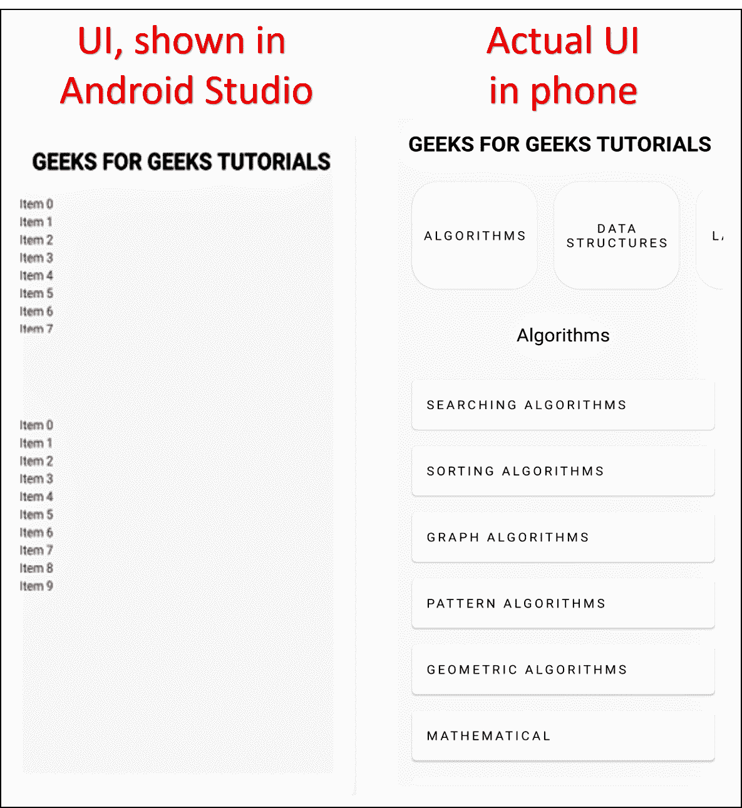

*   右键单击 com . wheic . recycle rgetout(您的可能有所不同)
*   **com . wheic . recyclergetout->New->样本数据目录**

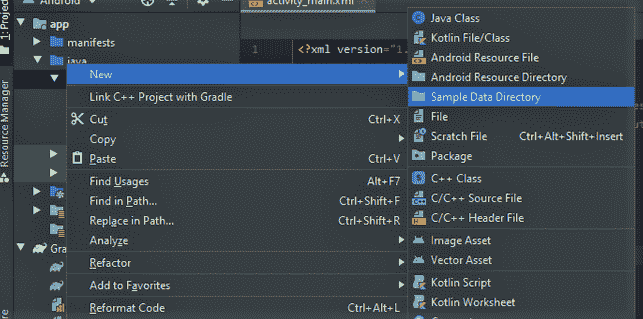

*   前往**建造- >重建项目**

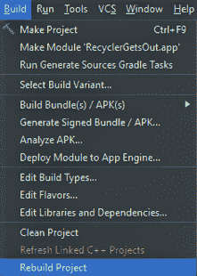

*   app 文件夹下会出现一个 **sampledata** 文件夹。

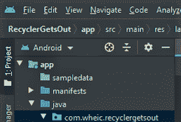

*   右击它。转到**重构- >重命名**。

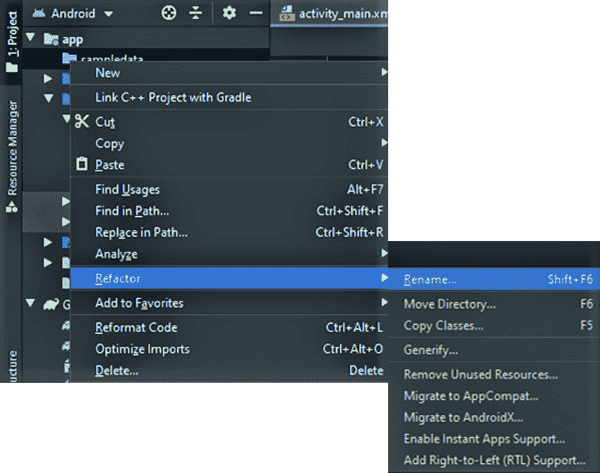

*   给出文件夹的名称。(这里我们将其命名为 RV1)。
*   点击**重构**。

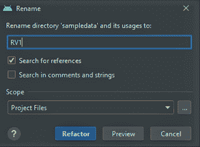

*   **将文件夹拖到**外面
*   在弹出窗口中点击**重构**。

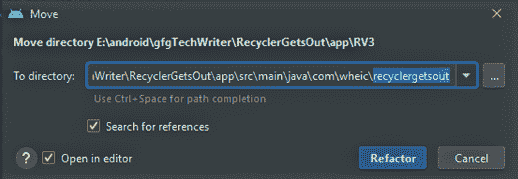

*   前往**建造- >重建项目**。
*   **或者**，如果不想做这些，直接去探索者那里做个目录就可以了。为此，右键单击浏览器中的**网站。然后在那里手动创建一个文件夹。**

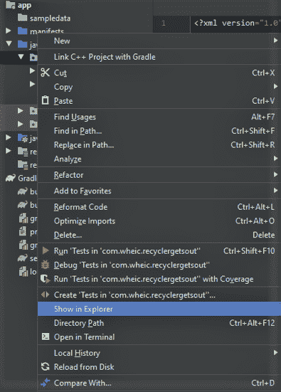

**开始相应的模型类工作:**

1.  右键点击刚刚创建的**文件夹** (RV1) **- >新建- > Java 类**。给出班级的名字。我把它命名为 **RVOneModel** 。
2.  所以基本上我使用两个变量，一个字符串类型，一个整数。字符串变量将用于存储列表项的标题，整数变量用于区分每个项。然后为这两个变量创建一个同时包含变量和 Getter 函数的构造函数。
3.  下面是模型类的 java 代码:

## Java 语言(一种计算机语言，尤用于创建网站)

```
public class RVOneModel {
       // this variable will store main-list item title
    private String name;

      // this will differentiate between the main-list items
    private int num;

    // parameterized constructor
    public RVOneModel(String name, int num) {
        this.name = name;
        this.num = num;
    }

    // getter functions for these two variables
    public String getName() {
        return name;
    }

    public int getNum() {
        return num;
    }
}
```

**开始处理水平回收视图的适配器类:**

1.  所以，右键点击刚刚创建的**文件夹** (RV1) **- >新建- > Java 类**。给出班级的名字。我把它命名为 **RVOneAdapter** 。
2.  所以有了适配器，我们还需要一个**viewpholder**类。
3.  这些类和其他方法的使用已经在 [**这个**](https://www.geeksforgeeks.org/android-recyclerview/) GFG 环节中有了清晰的描述。
4.  下面是带有视图持有者类的适配器类的 java 代码:

## Java 语言(一种计算机语言，尤用于创建网站)

```
import android.view.LayoutInflater;
import android.view.View;
import android.view.ViewGroup;
import android.widget.TextView;
import androidx.annotation.NonNull;
import androidx.cardview.widget.CardView;
import androidx.recyclerview.widget.RecyclerView;
import com.wheic.recyclergetsout.R;
import java.util.List;

public class RVOneAdapter extends RecyclerView.Adapter<RVOneAdapter.ViewHolder> {

    // Main-list item titles will be stored here
      private List<RVOneModel> tutorialList; 

    // Parameterized constructor of this 
      // class to initialize tutorialList
    public RVOneAdapter(List<RVOneModel> tutorialList) {
        this.tutorialList = tutorialList;

    }

    // Attach the item layout with the proper xml file
    @NonNull
    @Override
    public ViewHolder onCreateViewHolder(@NonNull ViewGroup parent, int viewType) {
        View view = LayoutInflater.from(parent.getContext()).inflate(R.layout.single_card_layout, parent, false);
        return new ViewHolder(view);
    }

    // It deals with the setting of different data and methods
    @Override
    public void onBindViewHolder(@NonNull ViewHolder holder, int position) {
        final RVOneModel modelItems = tutorialList.get(position);
        holder.setData(tutorialList.get(position).getName());
    }

    // It returns the length of the RecyclerView
    @Override
    public int getItemCount() {
        return tutorialList.size();
    }

    // The ViewHolder is a java class that stores 
      // the reference to the item layout views
    public class ViewHolder extends RecyclerView.ViewHolder{

        public CardView singleItemCardView;
        public TextView singleItemTextView;

        //Link up the Main-List items layout 
          // components with their respective id
        public ViewHolder(@NonNull View itemView) {
            super(itemView);
            singleItemCardView = itemView.findViewById(R.id.singleItemCardView);
            singleItemTextView = itemView.findViewById(R.id.singleItemTextView);
        }

        // setText in Main-List title text
        public void setData(String name){
            this.singleItemTextView.setText(name);
        }
    }
}
```

**开始在 MainActivity.java 上添加第一个回收视图:**

1.  **tutorialList** 与主列表项标题字符串变量逐个存储，然后适配器设置为水平循环视图。
2.  以下是 MainActivity.java 添加第一个回收视图的代码:

## Java 语言(一种计算机语言，尤用于创建网站)

```
import androidx.appcompat.app.AppCompatActivity;
import androidx.recyclerview.widget.LinearLayoutManager;
import androidx.recyclerview.widget.RecyclerView;
import android.os.Bundle;
import android.widget.LinearLayout;
import android.widget.TextView;
import com.wheic.recyclergetsout.RV1.RVOneAdapter;
import com.wheic.recyclergetsout.RV1.RVOneModel;
import java.util.ArrayList;
import java.util.List;

public class MainActivity extends AppCompatActivity {

      // reference for the Main-List RecyclerView
    private RecyclerView RVOne; 
      // Main-list item titles will be stored here
    private List<RVOneModel> tutorialList; 
      // reference for the RVOneAdapter class
    private RVOneAdapter rvOneAdapter; 

    @Override
    protected void onCreate(Bundle savedInstanceState) {
        super.onCreate(savedInstanceState);
        setContentView(R.layout.activity_main);

        // Linked up with its respective id 
          // used in the activity_main.xml
        RVOne = findViewById(R.id.recyclerViewOne);
        RVTwo = findViewById(R.id.recyclerViewTwo);

        // Setting the Main-List RecyclerView horizontally
        RVOne.setLayoutManager(new LinearLayoutManager(getApplicationContext(), LinearLayoutManager.HORIZONTAL, false));

        tutorialList = new ArrayList<>();

        // Static data are stored one by one in the tutorialList arrayList
        tutorialList.add(new RVOneModel("Algorithms", 1));
        tutorialList.add(new RVOneModel("Data Structures", 2));
        tutorialList.add(new RVOneModel("Languages", 3));
        tutorialList.add(new RVOneModel("Interview Corner", 4));
        tutorialList.add(new RVOneModel("GATE", 5));
        tutorialList.add(new RVOneModel("ISRO CS", 6));
        tutorialList.add(new RVOneModel("UGC NET CS", 7));
        tutorialList.add(new RVOneModel("CS Subjects", 8));
        tutorialList.add(new RVOneModel("Web Technologies", 9));

        rvOneAdapter = new RVOneAdapter(tutorialList);
        RVOne.setAdapter(rvOneAdapter);
    }
}
```

**步骤 5:为水平回收视图中的每个项目设置点击监听器:**

*   接下来的 4 个步骤在**RVOneAdapater.java**完成
*   首先，在**RVOneAdapater.java**为每个点击的项目创建一个界面，使用**的抽象方法。**

## Java 语言(一种计算机语言，尤用于创建网站)

```
// Interface to perform events on Main-List item click
public interface OnItemsClickListener{
    void onItemClick(RVOneModel rvOneModel);
}
```

*   创建接口的引用变量。

## Java 语言(一种计算机语言，尤用于创建网站)

```
// Need this for the Main-list item onClick events
private OnItemsClickListener listener;
```