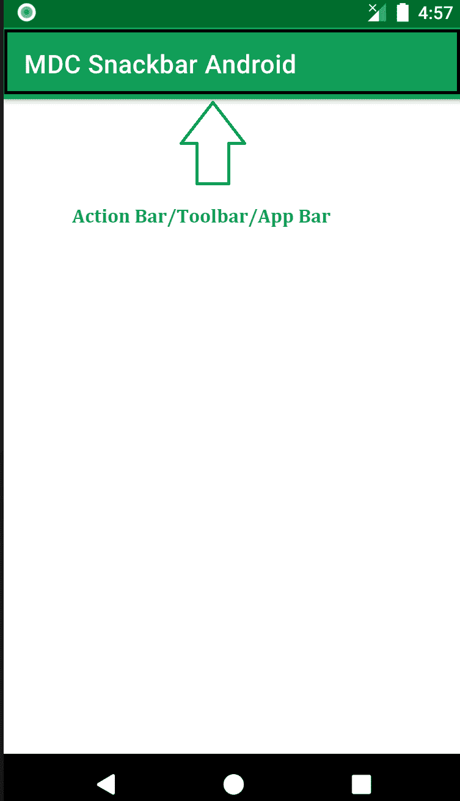

# 如何在安卓中添加和自定义动作栏的后退按钮？

> 原文:[https://www . geeksforgeeks . org/如何添加和定制安卓中的后退按钮操作栏/](https://www.geeksforgeeks.org/how-to-add-and-customize-back-button-of-action-bar-in-android/)

动作栏(有时也称为应用栏)，如果存在于活动中，将位于活动内容区域的顶部，通常直接位于状态栏的下方。这是一个菜单栏，运行在安卓系统的活动屏幕顶部。安卓操作栏可以包含当用户点击“菜单”按钮时变得可见的菜单项。通常，动作栏由以下四个组件组成:

*   **应用图标:**此处将显示应用品牌标志或图标
*   **视图控件:**显示应用程序标题的专用空间。还提供了通过添加微调器或选项卡式导航在视图之间切换的选项
*   **动作按钮:**可以在这里添加应用的主要动作
*   **动作溢出:**所有不重要的动作将显示为菜单

下面是一个示例图像，显示了操作栏/工具栏/应用程序栏在安卓设备上的位置。



动作栏是活动中的主要工具栏，可用于显示活动标题和其他交互式项目。最常用的项目之一是**返回导航按钮**。后退按钮用于从用户先前访问的屏幕向后移动。大多数安卓设备都有一个专用的后退按钮，但操作栏上的后退按钮可以增强用户体验。

## 动作栏中的添加后退按钮

要在安卓工作室创建新项目，请参考[如何在安卓工作室创建/启动新项目](https://www.geeksforgeeks.org/android-how-to-create-start-a-new-project-in-android-studio/)。不需要更改 **activity_main.xml** 文件中的任何内容。我们唯一要处理的文件是**处理主活动文件。**

*   创建动作栏变量，并在 java/kotlin 文件中调用函数 **getSupportActionBar()** 。
*   使用**操作栏显示后退按钮。设置显示主页设置(真)**这将启用后退按钮。
*   在选择的选项上自定义后退事件。这将启用印刷机按钮的后退功能。参考以下代码。我们为 MainActivity 提供了 **java 和 kotlin 代码。**

## Java 语言(一种计算机语言，尤用于创建网站)

```java
import android.os.Bundle;
import android.view.MenuItem;
import androidx.annotation.NonNull;
import androidx.appcompat.app.ActionBar;
import androidx.appcompat.app.AppCompatActivity;

public class MainActivity extends AppCompatActivity {

    @Override
    protected void onCreate(Bundle savedInstanceState) {
        super.onCreate(savedInstanceState);
        setContentView(R.layout.activity_main);

        // calling the action bar
        ActionBar actionBar = getSupportActionBar();

        // showing the back button in action bar
        actionBar.setDisplayHomeAsUpEnabled(true);
    }

    // this event will enable the back
    // function to the button on press
    @Override
    public boolean onOptionsItemSelected(@NonNull MenuItem item) {
        switch (item.getItemId()) {
            case android.R.id.home:
                this.finish();
                return true;
        }
        return super.onOptionsItemSelected(item);
    }
}
```

## 我的锅

```java
import android.os.Bundle
import android.view.MenuItem
import androidx.appcompat.app.AppCompatActivity

class MainActivity : AppCompatActivity() {
    override fun onCreate(savedInstanceState: Bundle?) {
        super.onCreate(savedInstanceState)
        setContentView(R.layout.activity_main)

          // calling the action bar
        var actionBar = getSupportActionBar()

          // showing the back button in action bar
        if (actionBar != null) {
            actionBar.setDisplayHomeAsUpEnabled(true)
        }
    }

    // this event will enable the back 
      // function to the button on press
    override fun onContextItemSelected(item: MenuItem): Boolean {
        when (item.itemId) {
            android.R.id.home -> {
                finish()
                return true
            }
        }
        return super.onContextItemSelected(item)
    }
}
```

### **输出:**


## 动作栏中的自定义后退按钮

我们可以通过使用 **getSupportActionBar()** 库并使用 java/kotlin 文件中的 **setHomeAsUpIndicator** 设置可绘制文件来轻松自定义后退按钮。

> //自定义后退按钮
> 
> action bar . sethome 气体指示符(r . drawable . my button)；

完整的代码如下。

## Java 语言(一种计算机语言，尤用于创建网站)

```java
import android.os.Bundle;
import android.view.MenuItem;
import androidx.annotation.NonNull;
import androidx.appcompat.app.ActionBar;
import androidx.appcompat.app.AppCompatActivity;

public class MainActivity extends AppCompatActivity {

    @Override
    protected void onCreate(Bundle savedInstanceState) {
        super.onCreate(savedInstanceState);
        setContentView(R.layout.activity_main);

        // calling the action bar
        ActionBar actionBar = getSupportActionBar();

        // Customize the back button
        actionBar.setHomeAsUpIndicator(R.drawable.mybutton);

        // showing the back button in action bar
        actionBar.setDisplayHomeAsUpEnabled(true);
    }

    // this event will enable the back
    // function to the button on press
    @Override
    public boolean onOptionsItemSelected(@NonNull MenuItem item) {
        switch (item.getItemId()) {
            case android.R.id.home:
                this.finish();
                return true;
        }
        return super.onOptionsItemSelected(item);
    }
}
```

## 我的锅

```java
import android.os.Bundle
import android.view.MenuItem
import androidx.appcompat.app.AppCompatActivity

class MainActivity : AppCompatActivity() {
    override fun onCreate(savedInstanceState: Bundle?) {
        super.onCreate(savedInstanceState)
        setContentView(R.layout.activity_main)

        // calling the action bar
        var actionBar = getSupportActionBar()

        if (actionBar != null) {

              // Customize the back button
            actionBar.setHomeAsUpIndicator(R.drawable.mybutton);

              // showing the back button in action bar
            actionBar.setDisplayHomeAsUpEnabled(true);
        }
    }

    // this event will enable the back 
      // function to the button on press
    override fun onContextItemSelected(item: MenuItem): Boolean {
        when (item.itemId) {
            android.R.id.home -> {
                finish()
                return true
            }
        }
        return super.onContextItemSelected(item)
    }
}
```

### 输出:

