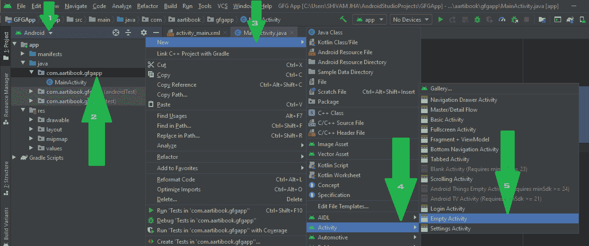
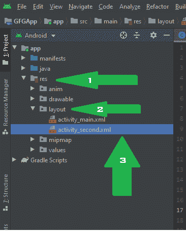
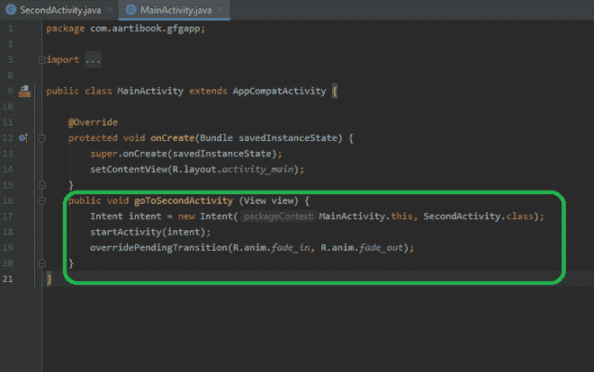

# 如何在安卓中的活动间添加 CrossFade 动画？

> 原文:[https://www . geeksforgeeks . org/how-add-cross ade-animation-intervention-in-Android/](https://www.geeksforgeeks.org/how-to-add-crossfade-animation-between-activities-in-android/)

[安卓动画](https://www.geeksforgeeks.org/animation-in-android-with-example/)可以说是安卓应用中更好的用户界面和用户体验的最重要因素。在一系列关于 GeeksforGeeks 以创造更好的用户界面的文章中，应用程序的 UX 也将是其中之一。在本文中，我们将了解如何在安卓系统中的两个[活动](https://www.geeksforgeeks.org/introduction-to-activities-in-android/)之间添加交叉渐变动画。**的意思**这里是两个活动之间的平稳过渡。通常，它意味着在一个活动中淡出，而在另一个活动中淡出。它创造了一个平稳的过渡，在短时间内，用户将对这两种活动都有所感受。这是我们将在活动之间创建的同一类型动画的示例。注意，我们将使用 **Java 和 Kotlin** 语言来实现这个项目。


### 逐步实施

**第一步:创建新项目**

要在安卓工作室创建新项目，请参考[如何在安卓工作室创建/启动新项目](https://www.geeksforgeeks.org/android-how-to-create-start-a-new-project-in-android-studio/)。您可以根据自己的选择选择语言，因为这里我们给出了 **kotlin** 以及 **java** 的代码。

**第二步:** **先去编码区之前你要做一些前置任务**

*   修改**字符串. xml** 文件:

## 可扩展标记语言

```java
<resources>
    <string name="app_name">GFG App</string>
    <string name="go_to_main_activity">GO TO MAIN ACTIVITY</string>
    <string name="go_to_second_activity">GO TO SECOND ACTIVITY</string>
</resources>
```

*   修改 **colors.xml** 文件:

## 可扩展标记语言

```java
<?xml version="1.0" encoding="utf-8"?>
<resources>
    <color name="colorPrimary">#00AC28</color>
    <color name="colorPrimaryDark">#09d639</color>
    <color name="colorAccent">#03DAC5</color>
</resources>
```

**第三步:创建另一个空活动**

确保您已经在屏幕左上角选择了安卓作为项目结构。然后导航到 **java/your_package_name** 。现在，右键单击您的包名称并在此选择新建，然后选择活动和空活动。



给它一个你选择的名字，就像我们给它的**秒活动**一样，然后点击完成。

**步骤 4:使用布局文件**

转到，**RES/layout/activity _ second**，粘贴下面的代码。这里，我们使用带有按钮的约束布局来切换到另一个活动。



下面是 **活动 _second.xml** 文件的代码。

## 可扩展标记语言

```java
<?xml version="1.0" encoding="utf-8"?>
<androidx.constraintlayout.widget.ConstraintLayout 
    xmlns:android="http://schemas.android.com/apk/res/android"
    xmlns:app="http://schemas.android.com/apk/res-auto"
    xmlns:tools="http://schemas.android.com/tools"
    android:layout_width="match_parent"
    android:layout_height="match_parent"
    android:background="#09d639"
    tools:context=".SecondActivity">

    <Button
        android:id="@+id/btnSecond"
        android:layout_width="130dp"
        android:layout_height="70dp"
        android:background="#fff"
        android:onClick="goToMainActivity"
        android:text="@string/go_to_main_activity"
        app:layout_constraintBottom_toBottomOf="parent"
        app:layout_constraintEnd_toEndOf="parent"
        app:layout_constraintStart_toStartOf="parent"
        app:layout_constraintTop_toTopOf="parent" />

    <TextView
        android:layout_width="wrap_content"
        android:layout_height="wrap_content"
        android:gravity="center"
        android:padding="5dp"
        android:text="AN GFG APP WAS MADE DURING TUTORIAL"
        android:textColor="@android:color/white"
        android:textSize="19sp"
        android:textStyle="bold"
        app:layout_constraintBottom_toBottomOf="parent"
        app:layout_constraintEnd_toEndOf="parent"
        app:layout_constraintStart_toStartOf="parent"
        app:layout_constraintTop_toBottomOf="@+id/btnSecond" />

</androidx.constraintlayout.widget.ConstraintLayout>
```

此外，导航至 **res/layout/activity_main** ，移除所有默认代码并粘贴以下代码。下面是**activity _ main . XML**文件的代码。

## 可扩展标记语言

```java
<?xml version="1.0" encoding="utf-8"?>
<androidx.constraintlayout.widget.ConstraintLayout 
    xmlns:android="http://schemas.android.com/apk/res/android"
    xmlns:app="http://schemas.android.com/apk/res-auto"
    xmlns:tools="http://schemas.android.com/tools"
    android:layout_width="match_parent"
    android:layout_height="match_parent"
    tools:context=".SecondActivity">

    <Button
        android:id="@+id/btnFirst"
        android:layout_width="130dp"
        android:layout_height="70dp"
        android:onClick="goToSecondActivity"
        android:text="@string/go_to_second_activity"
        app:layout_constraintBottom_toBottomOf="parent"
        app:layout_constraintEnd_toEndOf="parent"
        app:layout_constraintStart_toStartOf="parent"
        app:layout_constraintTop_toTopOf="parent"
        tools:ignore="OnClick" />

</androidx.constraintlayout.widget.ConstraintLayout>
```

**第五步:处理动画文件**

动画文件夹和动画文件的创建请参考[如何在安卓工作室](https://www.geeksforgeeks.org/how-to-create-anim-folder-animation-file-in-android-studio/)中创建动画文件夹&动画文件。我们已经创建了两个动画文件，并将文件命名为**淡入**和**淡出。**现在，从 fade_in 中移除所有默认代码，并粘贴下面的代码。下面是 **fade_in.xml** 文件的代码。

## 可扩展标记语言

```java
<?xml version="1.0" encoding="utf-8"?>
<alpha
    xmlns:android="http://schemas.android.com/apk/res/android"
    android:duration="400"
    android:fromAlpha="0.0"
    android:interpolator="@android:anim/accelerate_interpolator"
    android:toAlpha="1.0" />
```

下面是 **文件的代码。**

## 可扩展标记语言

```java
<?xml version="1.0" encoding="utf-8"?>
<alpha 
    xmlns:android="http://schemas.android.com/apk/res/android"
    android:duration="700"
    android:fillAfter="true"
    android:fromAlpha="1.0"
    android:interpolator="@android:anim/accelerate_interpolator"
    android:toAlpha="0.0" />
```

**步骤 6:使用主活动文件**

只需在 **onCreate()** 方法后的 **MainActivity** 类中添加以下代码。这是前往**第二活动**的代码，我们正在设置两者之间的动画。



## Java 语言(一种计算机语言，尤用于创建网站)

```java
public void goToSecondActivity (View view) {
        Intent intent = new Intent(MainActivity.this, SecondActivity.class);
        startActivity(intent);
        overridePendingTransition(R.anim.fade_in, R.anim.fade_out);
    }
```

## 我的锅

```java
fun goToSecondActivity(view: View?) {
        val intent = Intent(this@MainActivity, SecondActivity::class.java)
        startActivity(intent)
        overridePendingTransition(R.anim.fade_in, R.anim.fade_out)
    }
```

**步骤 7:使用第二个活动文件**

此外，在 **onCreate()** 方法后的**秒活动**中添加以下代码。

## Java 语言(一种计算机语言，尤用于创建网站)

```java
public void goToMainActivity (View view) {
        Intent intent = new Intent(SecondActivity.this, MainActivity.class);
        startActivity(intent);
        overridePendingTransition(R.anim.fade_in, R.anim.fade_out);
    }
```

## 我的锅

```java
fun goToMainActivity(view: View?) {
        val intent = Intent(this@SecondActivity, MainActivity::class.java)
        startActivity(intent)
        overridePendingTransition(R.anim.fade_in, R.anim.fade_out)
    }
```

### 输出:

<video class="wp-video-shortcode" id="video-533817-1" width="640" height="360" preload="metadata" controls=""><source type="video/mp4" src="https://media.geeksforgeeks.org/wp-content/uploads/20201226105747/output.mp4?_=1">[https://media.geeksforgeeks.org/wp-content/uploads/20201226105747/output.mp4](https://media.geeksforgeeks.org/wp-content/uploads/20201226105747/output.mp4)</video>

**github link:**[https://github . com/shivamparashar 165/cross path _ Android _ anim](https://github.com/shivamparashar165/crossfade_android_anim)