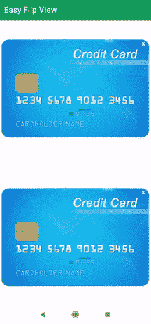
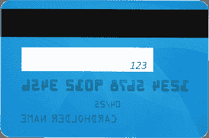

# 如何在安卓中添加轻松动画视图？

> 原文:[https://www . geesforgeks . org/how-add-easy-flipview-in-Android/](https://www.geeksforgeeks.org/how-to-add-easy-flipview-in-android/)

EasyFlipView 是一个安卓库，允许我们在安卓应用中轻松创建翻转视图。我们可以在许多应用程序中使用这一功能，例如我们存储用户信用卡或借记卡详细信息的应用程序(用户可以轻松翻转卡来查看卡的 CVV)。下面给出了一个示例 GIF，以了解我们将在本文中做什么。注意，我们将使用 **Java** 语言来实现这个项目。



### 属性表

<figure class="table">

| 

属性名

 | 

缺省值

 | 

描述

 |
| --- | --- | --- |
| app:翻转管接头 true " | 真实的 | 卡片是否应该在触摸时翻转。 |
| app:flipDuration="400 " | four hundred | 翻转动画的持续时间，以毫秒为单位。 |
| app:Flippenabled = " true " | 真实的 | 如果设置为假，则它在单视图中永远不会翻转，对于 RecyclerView，它必须始终为假 |
| app:flipType= "水平" | 垂直的 | 卡片应该垂直翻转还是水平翻转 |
| app:flipFrom= "右"app:flipFrom="back " | 左边的前面 | 卡片应该从左向右翻转还是从右向左翻转(水平型)还是汽车应该向前或向后翻转(垂直型) |
| app:autolipback = " true " | 错误的 | 如果设置为真，则在自动倒回时间中设置的时间后，卡片将被倒回原来的正面。 |
| app:autolip backtime = " 1000 " | One thousand | 卡片翻转回原始正面后的时间(毫秒)。 |

</figure>

### **分步实施**

**第一步:创建新项目**

要在安卓工作室创建新项目，请参考[如何在安卓工作室创建/启动新项目](https://www.geeksforgeeks.org/android-how-to-create-start-a-new-project-in-android-studio/)。注意选择 **Java** 作为编程语言。

**第二步:去编码区之前先做一些前置任务**

转到**应用程序->RES->values->colors . XML**文件，为应用程序设置颜色。

## 可扩展标记语言

```
<?xml version="1.0" encoding="utf-8"?>
<resources>

    <color name="colorPrimary">#0F9D58</color>
    <color name="colorPrimaryDark">#0F9D58</color>
    <color name="colorAccent">#05af9b</color>
    <color name="white">#ffffff</color>

</resources>
```

转到 Gradle **脚本- > build.gradle(模块:应用)**部分，导入以下依赖项，然后单击上面弹出的“the”。

> 实现' com . wajahatkarim3 . EasyFlipView:EasyFlipView:3 . 0 . 0 '

**第三步:设计 UI**

在 **activity_main.xml** 中，删除默认的 Text View，将布局改为**相对布局**并添加 **EasyFlipView** ，在其中，我们包括 2 个布局 **card_layout_back.xml** 和 **card_layout_front.xml** (我们在下一步创建 2 个布局)，按照相同的步骤，在**水平**类型的前面再添加一个 card_layout_front。下面是 **activity_main.xml** 文件的代码。

## 可扩展标记语言

```
<?xml version="1.0" encoding="utf-8"?>
<RelativeLayout
    xmlns:android="http://schemas.android.com/apk/res/android"
    xmlns:app="http://schemas.android.com/apk/res-auto"
    xmlns:tools="http://schemas.android.com/tools"
    android:layout_width="match_parent"
    android:layout_height="match_parent"
    tools:context=".MainActivity">

    <!-- Vertical Flip View -->
    <com.wajahatkarim3.easyflipview.EasyFlipView
        android:id="@+id/easyFlipViewVertical"
        android:layout_width="match_parent"
        android:layout_height="wrap_content"
        app:autoFlipBack="true"
        app:autoFlipBackTime="2000"
        app:flipDuration="400"
        app:flipEnabled="true"
        app:flipFrom="front"
        app:flipOnTouch="true"
        app:flipType="vertical">

        <!-- Back Layout  -->
        <include layout="@layout/card_layout_back" />

        <!-- Front Layout -->
        <include layout="@layout/card_layout_front" />

    </com.wajahatkarim3.easyflipview.EasyFlipView>

    <!-- Horizontal Flip View -->
    <com.wajahatkarim3.easyflipview.EasyFlipView
        android:id="@+id/easyFlipViewHorizontal"
        android:layout_width="match_parent"
        android:layout_height="wrap_content"
        android:layout_alignParentBottom="true"
        app:autoFlipBack="false"
        app:flipDuration="400"
        app:flipEnabled="true"
        app:flipFrom="right"
        app:flipOnTouch="true"
        app:flipType="horizontal">

        <!-- Back Layout -->
        <include layout="@layout/card_layout_back" />

        <!-- Front Layout  -->
        <include layout="@layout/card_layout_front" />

    </com.wajahatkarim3.easyflipview.EasyFlipView>

</RelativeLayout>
```

现在进入 **res - >布局**右键点击然后**新建- >布局资源文件**(命名文件 **card_layout_back** )。现在打开 **card_layout_back.xml** 文件，添加一个简单的 **ImageView** 、，将 src 设置为你想要的图像。下面是 **card_layout_back.xml** 文件的代码



## 可扩展标记语言

```
<?xml version="1.0" encoding="utf-8"?>
<androidx.constraintlayout.widget.ConstraintLayout 
    xmlns:android="http://schemas.android.com/apk/res/android"
    android:layout_width="match_parent"
    android:layout_height="match_parent">

    <!-- simple image view -->
    <ImageView
        android:layout_width="match_parent"
        android:layout_height="wrap_content"
        android:layout_margin="8dp"
        android:src="@drawable/card_back" />

</androidx.constraintlayout.widget.ConstraintLayout>
```