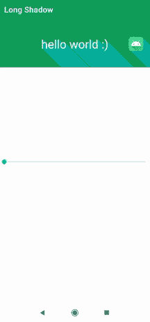

# 如何给安卓 App 添加 Florent LongShadow？

> 原文:[https://www . geesforgeks . org/how-add-florent-long shadow-to-Android-app/](https://www.geeksforgeeks.org/how-to-add-florent-longshadow-to-android-app/)

**LongShadow** 是一个安卓库，可以让我们在 Android Studio 中轻松对不同的视图进行长阴影。我们可以使用长阴影使应用程序更有吸引力和吸引力。下面给出一个 GIF 示例，了解一下我们在本文中要做什么。注意，我们将使用 **Java** 语言来实现这个项目。



### **分步实施**

**第一步:创建新项目**

要在安卓工作室创建新项目，请参考[如何在安卓工作室创建/启动新项目](https://www.geeksforgeeks.org/android-how-to-create-start-a-new-project-in-android-studio/)。注意选择 **Java** 作为编程语言。

**第二步:去编码区之前先做一些前置任务**

转到**应用程序>RES>values>colors . XML**文件，为项目设置颜色。

## 可扩展标记语言

```
<?xml version="1.0" encoding="utf-8"?>
<resources>

    <color name="colorPrimary">#0F9D58</color>
    <color name="colorPrimaryDark">#0F9D58</color>
    <color name="colorAccent">#05af9b</color>

</resources>
```

转到**梯度脚本>构建.梯度(模块:应用)**部分，导入以下依赖项，并单击上面弹出窗口中的“**立即同步**”。

> 实现' com . github . florent 37:long shadow:1 . 0 . 1 '

**第三步:设计 UI**

在 **activity_main.xml** 中，去掉默认的 Text View，将布局改为 relative layout，添加 **LongShadow** 在里面，我们添加了一个 [TextView](https://www.geeksforgeeks.org/textview-widget-in-android-using-java-with-examples/) 和 [ImageView](https://www.geeksforgeeks.org/imageview-in-android-with-example/) (我们可以在里面添加任意多的布局，从 1 到 n 个布局)在 Relative layout 里面，我们还添加了一个 [SeekBar](https://www.geeksforgeeks.org/android-creating-a-seekbar/) (我们用来改变阴影的角度)，如下图所示。导航到**应用程序> res >布局> activity_main.xml** 并将下面的代码添加到该文件中。下面是 **activity_main.xml** 文件的代码。

## 可扩展标记语言

```
<?xml version="1.0" encoding="utf-8"?>
<RelativeLayout 
    xmlns:android="http://schemas.android.com/apk/res/android"
    xmlns:app="http://schemas.android.com/apk/res-auto"
    xmlns:tools="http://schemas.android.com/tools"
    android:layout_width="match_parent"
    android:layout_height="match_parent"
    tools:context=".MainActivity">

    <!-- Long Shadow Container View  -->
    <com.github.florent37.longshadow.LongShadow
        android:id="@+id/longShadow"
        android:layout_width="match_parent"
        android:layout_height="wrap_content"
        android:layout_alignParentTop="true"
        android:background="@color/colorPrimary"
        app:shadow_angle="45"
        app:shadow_color="@color/colorAccent">

        <!-- simple android text view -->
        <TextView
            android:id="@+id/textView"
            android:layout_width="wrap_content"
            android:layout_height="120dp"
            android:layout_gravity="center"
            android:gravity="center"
            android:text="hello world :)"
            android:textColor="#FFF"
            android:textSize="30sp" />

        <!-- simple android image view -->
        <ImageView
            android:layout_width="40dp"
            android:layout_height="40dp"
            android:layout_gravity="right|center"
            android:layout_marginEnd="20dp"
            android:src="@mipmap/ic_launcher" />

    </com.github.florent37.longshadow.LongShadow>

    <!-- simple seek bar to change the shadow angle
         of the LongShadow -->
    <SeekBar
        android:id="@+id/seekBarShadow"
        android:layout_width="match_parent"
        android:layout_height="wrap_content"
        android:layout_centerInParent="true"
        android:layout_marginBottom="80dp"
        android:max="360" />

</RelativeLayout>
```