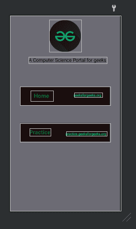

# 如何在安卓中给 TextView 添加超链接？

> 原文:[https://www . geesforgeks . org/how-add-hyperlink-to-textview-in-Android/](https://www.geeksforgeeks.org/how-to-add-hyperlink-to-textview-in-android/)

大家好，极客们，今天我们将制作一个应用程序，我们将看到如何在安卓系统中添加一个指向文本视图的链接，并使用这个概念在我们的应用程序中添加门户——主页和练习(极客)。因此，用户可以从我们的应用程序直接访问这些门户。

### **本文我们要构建什么？**

我们将使用 **strings.xml** 文件来完成我们的任务，然后将我们 **setMovementMethod()** 放在我们的 java 文件中，这样我们提供的任何链接都可以指向那里。下面是我们的应用程序的外观。

<video class="wp-video-shortcode" id="video-614875-1" width="640" height="360" preload="metadata" controls=""><source type="video/mp4" src="https://media.geeksforgeeks.org/wp-content/uploads/20210525114802/WhatsApp-Video-2021-05-25-at-11.45.02.mp4?_=1">[https://media.geeksforgeeks.org/wp-content/uploads/20210525114802/WhatsApp-Video-2021-05-25-at-11.45.02.mp4](https://media.geeksforgeeks.org/wp-content/uploads/20210525114802/WhatsApp-Video-2021-05-25-at-11.45.02.mp4)</video>

所以，现在让我们看看应用程序的逐步实现。

### **分步实施**

**第一步:创建新项目**

要在安卓工作室创建新项目，请参考[如何在安卓工作室创建/启动新项目](https://www.geeksforgeeks.org/android-how-to-create-start-a-new-project-in-android-studio/)。注意选择 **Java** 作为编程语言。

**步骤 2:处理字符串. xml 文件**

打开**值>字符串. xml** 文件。我们必须制作两个字符串来添加一个超链接，所以使用下面提供的代码。

## 可扩展标记语言

```
<resources>
    <string name="app_name">Hyperlink_textview</string>

    <!-- href tag is used to add link-->
    <!-- link for home text view-->
    <string name="hyperlink"><a href="https://www.geeksforgeeks.org/">geeksforgeeks.org</a></string>
    <!-- link for practice textview-->
    <string name="hyperlink2"><a href="https://practice.geeksforgeeks.org/">practice.geeksforgeeks.org</a></string>

</resources>
```

**步骤 3:使用 activity_main.xml 文件**

在 **activity_main.xml** 文件中，我们必须用我们在 strings.xml 文件中创建的字符串来命名 TextViews。下面是它的代码。

## 可扩展标记语言

```
<?xml version="1.0" encoding="utf-8"?>
<!-- Constraint layout is used to constrain all components easily-->
<androidx.constraintlayout.widget.ConstraintLayout 
    xmlns:android="http://schemas.android.com/apk/res/android"
    xmlns:app="http://schemas.android.com/apk/res-auto"
    xmlns:tools="http://schemas.android.com/tools"
    android:layout_width="match_parent"
    android:layout_height="match_parent"
    android:background="#6C6B74"
    tools:context=".MainActivity">

    <TextView
        android:id="@+id/textView11"
        android:layout_width="381dp"
        android:layout_height="78dp"
        android:layout_marginTop="252dp"
        android:background="#1B0D0D"
        app:layout_constraintEnd_toEndOf="parent"
        app:layout_constraintStart_toStartOf="parent"
        app:layout_constraintTop_toBottomOf="@+id/textView3" />

    <!-- ImageView for the logo-->
    <ImageView
        android:id="@+id/imageView"
        android:layout_width="135dp"
        android:layout_height="136dp"
        app:layout_constraintBottom_toBottomOf="parent"
        app:layout_constraintEnd_toEndOf="parent"
        app:layout_constraintStart_toStartOf="parent"
        app:layout_constraintTop_toTopOf="parent"
        app:layout_constraintVertical_bias="0.026"
        app:srcCompat="@drawable/gfg_round" />

    <!-- TextView for the tagline of geeksforgeeks -->
    <TextView
        android:id="@+id/textView3"
        android:layout_width="wrap_content"
        android:layout_height="wrap_content"
        android:layout_marginTop="141dp"
        android:text="A Computer Science Portal for geeks"
        android:textColor="#000C01"
        android:textSize="20sp"
        app:layout_constraintBottom_toBottomOf="parent"
        app:layout_constraintEnd_toEndOf="parent"
        app:layout_constraintHorizontal_bias="0.576"
        app:layout_constraintStart_toStartOf="parent"
        app:layout_constraintTop_toTopOf="@+id/imageView"
        app:layout_constraintVertical_bias="0.022" />

    <!-- textview as a container to other two text views-->
    <TextView
        android:id="@+id/textView4"
        android:layout_width="381dp"
        android:layout_height="78dp"
        android:layout_marginTop="76dp"
        android:background="#1B0D0D"
        app:layout_constraintBottom_toTopOf="@+id/textView11"
        app:layout_constraintEnd_toEndOf="parent"
        app:layout_constraintStart_toStartOf="parent"
        app:layout_constraintTop_toBottomOf="@+id/textView3"
        app:layout_constraintVertical_bias="0.235" />

    <!-- Home text view-->
    <TextView
        android:id="@+id/textView7"
        android:layout_width="96dp"
        android:layout_height="44dp"
        android:gravity="center"
        android:text="Home"
        android:textColor="#027507"
        android:textSize="24sp"
        android:textStyle="bold"
        app:layout_constraintBottom_toBottomOf="@+id/textView4"
        app:layout_constraintEnd_toEndOf="@+id/textView4"
        app:layout_constraintHorizontal_bias="0.15"
        app:layout_constraintStart_toStartOf="@+id/textView4"
        app:layout_constraintTop_toTopOf="@+id/textView4"
        app:layout_constraintVertical_bias="0.47" />

    <!-- Hyperlink number 1 to the textview-->
    <TextView
        android:id="@+id/textView8"
        android:layout_width="wrap_content"
        android:layout_height="wrap_content"
        android:text="@string/hyperlink"
        app:layout_constraintBottom_toBottomOf="@+id/textView4"
        app:layout_constraintEnd_toEndOf="@+id/textView4"
        app:layout_constraintHorizontal_bias="0.709"
        app:layout_constraintStart_toEndOf="@+id/textView7"
        app:layout_constraintTop_toBottomOf="@+id/textView3"
        app:layout_constraintVertical_bias="0.788" />

    <!-- Hyperlink number 2 to the textview-->
    <TextView
        android:id="@+id/textView12"
        android:layout_width="wrap_content"
        android:layout_height="wrap_content"
        android:text="Practice"
        android:textColor="#027507"
        android:textSize="24sp"
        android:textStyle="bold"
        app:layout_constraintBottom_toBottomOf="@+id/textView11"
        app:layout_constraintEnd_toEndOf="@+id/textView11"
        app:layout_constraintHorizontal_bias="0.133"
        app:layout_constraintStart_toStartOf="@+id/textView11"
        app:layout_constraintTop_toTopOf="@+id/textView11"
        app:layout_constraintVertical_bias="0.474" />

    <!-- Practice text view-->
    <TextView
        android:id="@+id/textView13"
        android:layout_width="wrap_content"
        android:layout_height="wrap_content"
        android:text="@string/hyperlink2"
        app:layout_constraintBottom_toBottomOf="@+id/textView11"
        app:layout_constraintEnd_toEndOf="@+id/textView11"
        app:layout_constraintHorizontal_bias="0.812"
        app:layout_constraintStart_toEndOf="@+id/textView12"
        app:layout_constraintTop_toTopOf="@+id/textView11"
        app:layout_constraintVertical_bias="0.593" />

</androidx.constraintlayout.widget.ConstraintLayout>
```

实现上述代码后，我们的用户界面如下所示。



**第四步:使用****MainActivity.java 文件**

我们将使用 **setMovementMethod()** 将用户重定向到提供的链接。我们还将使用 **setcolorlink()** 方法根据我们的方便更改链接的颜色。下面是它的代码。

## Java 语言(一种计算机语言，尤用于创建网站)

```
import android.graphics.Color;
import android.os.Bundle;
import android.text.method.LinkMovementMethod;
import android.widget.TextView;

import androidx.appcompat.app.AppCompatActivity;

public class MainActivity extends AppCompatActivity {

    @Override
    protected void onCreate(Bundle savedInstanceState) {
        super.onCreate(savedInstanceState);
        setContentView(R.layout.activity_main);

        // Text view number 1 to add hyperlink
        TextView linkTextView = findViewById(R.id.textView8);

        // method to redirect to provided link
        linkTextView.setMovementMethod(LinkMovementMethod.getInstance());

        // method to change color of link
        linkTextView.setLinkTextColor(Color.YELLOW);

        // Text view number 2 to add hyperlink
        TextView linkTextView2 = findViewById(R.id.textView13);

        // method to redirect to provided link
        linkTextView2.setMovementMethod(LinkMovementMethod.getInstance());

        // method to change color of link
        linkTextView2.setLinkTextColor(Color.YELLOW);
    }

}
```

祝贺您，您已经成功地使一个完整的应用程序运行并测试它。您可以使用此方法将应用程序的用户重定向到您的网站。这是您的应用程序的最终输出。

**输出:**

<video class="wp-video-shortcode" id="video-614875-2" width="640" height="360" preload="metadata" controls=""><source type="video/mp4" src="https://media.geeksforgeeks.org/wp-content/uploads/20210525114802/WhatsApp-Video-2021-05-25-at-11.45.02.mp4?_=2">[https://media.geeksforgeeks.org/wp-content/uploads/20210525114802/WhatsApp-Video-2021-05-25-at-11.45.02.mp4](https://media.geeksforgeeks.org/wp-content/uploads/20210525114802/WhatsApp-Video-2021-05-25-at-11.45.02.mp4)</video>