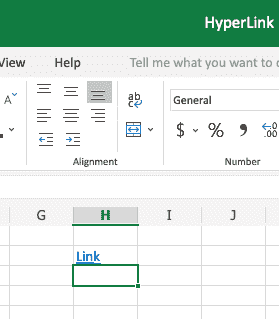

# 如何使用 Java 向单元格内容添加超链接？

> 原文:[https://www . geeksforgeeks . org/如何使用 java 向单元格内容添加超链接/](https://www.geeksforgeeks.org/how-to-add-hyperlink-to-the-contents-of-a-cell-using-java/)

使用 Java 和 Apache POI 向单元格的内容添加超链接。Apache POI 是一个用于处理微软办公文档的 Java 库。

**安装:**

有两种方法可以在我们的 java 项目中安装 Apache POI 依赖项:

1.  从 poi.apache.org/download.html:下载下面提到的 Jar 文件
    *   [然后-3.17.jar](https://mvnrepository.com/artifact/org.apache.poi/poi/3.17)
    *   [then-ooxml-3.17 . jar](https://mvnrepository.com/artifact/org.apache.poi/poi-ooxml/3.17)
    *   [commons-codec-1.10.jar](https://mvnrepository.com/artifact/commons-codec/commons-codec/1.10)
    *   [then-ooxml 模式-3.17.jar](https://mvnrepository.com/artifact/org.apache.poi/poi-ooxml-schemas/3.17)
    *   [XML API-1.0 . B2 . jar](https://mvnrepository.com/artifact/xml-apis/xml-apis/1.0.b2)
    *   [stax-api-1.0.1.jar](https://mvnrepository.com/artifact/stax/stax-api/1.0.1)
    *   [xmlbeans-2.6.0.jar](https://mvnrepository.com/artifact/org.apache.xmlbeans/xmlbeans/2.6.0)
    *   [dom4j-1.6.1.jar](https://mvnrepository.com/artifact/dom4j/dom4j/1.6.1)
2.  Maven 依赖项:在 maven 项目中将以下依赖项设置为:

```
    <dependency>  
        <groupId>org.apache.poi</groupId>  
        <artifactId>poi</artifactId>  
        <version>3.9</version>  
    </dependency>
```

**环境设置:**

*   使用 java maven 制作一个项目。
*   前往 poi.apache.org/download.html，将依赖项添加到您的项目中。这样，库就被导入到您的项目中。
*   现在，在源代码包中的 com.mycompany. <your project="" name="">下创建一个 java 类。</your>
*   很好，现在你可以用图书馆了。

**进场:**

*   创建工作簿。
*   在工作簿中创建电子表格。
*   创建一个单元格，并为其添加颜色、内容和样式。
*   添加地址并应用链接颜色。
*   在电子表格中添加单元格。
*   重复步骤 3 至 5 以写入更多数据

下面是上述方法的实现:

## Java 语言(一种计算机语言，尤用于创建网站)

```
// How to add hyperlink to the
// contents of a cell using Java?
import java.io.File;
import java.io.FileOutputStream;

import org.apache.poi.common.usermodel.Hyperlink;
import org.apache.poi.hssf.util.HSSFColor;
import org.apache.poi.ss.usermodel.CreationHelper;
import org.apache.poi.xssf.usermodel.XSSFCell;
import org.apache.poi.xssf.usermodel.XSSFCellStyle;
import org.apache.poi.xssf.usermodel.XSSFFont;
import org.apache.poi.xssf.usermodel.XSSFHyperlink;
import org.apache.poi.xssf.usermodel.XSSFSheet;
import org.apache.poi.xssf.usermodel.XSSFWorkbook;

public class HyperLink {
    public static void addLink()
    {
        // Create a Workbook
        XSSFWorkbook myWorkbook = new XSSFWorkbook();

        // Create a Spread Sheet
        XSSFSheet newSpreadsheet
            = myWorkbook.createSheet("Custom Links");
        XSSFCell cell;

        // Create Helpers
        CreationHelper helper
            = myWorkbook.getCreationHelper();
        XSSFCellStyle linkStyle
            = myWorkbook.createCellStyle();
        XSSFFont linkFont = myWorkbook.createFont();

        // Setting the Link Style
        linkFont.setUnderline(XSSFFont.U_SINGLE);
        linkFont.setColor(HSSFColor.BLUE.index);
        linkStyle.setFont(linkFont);

        // Adding a Link
        cell = newSpreadsheet.createRow(1).createCell(
            (short)2);
        cell.setCellValue("Link");
        XSSFHyperlink link
            = (XSSFHyperlink)helper.createHyperlink(
                Hyperlink.LINK_URL);

        link.setAddress("http://www.geeksforgeeks.com/");
        cell.setHyperlink((XSSFHyperlink)link);
        cell.setCellStyle(linkStyle);

        // Writing the File
        FileOutputStream output = new FileOutputStream(
            new File("C:/HyperLink.xlsx"));

        // Writing the content
        myWorkbook.write(output);
        output.close();
    }
    public static void main(String[] args) throws Exception
    {
        addLink();
    }
}
```

**输出:**

