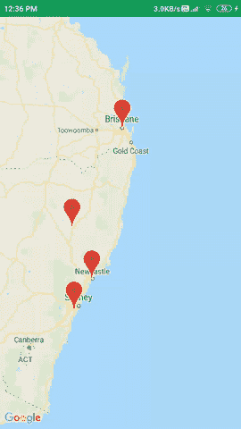

# 如何在安卓系统中给谷歌地图上的 Marker 添加 OnClickListner？

> 原文:[https://www . geesforgeks . org/how-add-onclicklistener-to-marker-on-Google-maps-in-Android/](https://www.geeksforgeeks.org/how-to-add-onclicklistner-to-marker-on-google-maps-in-android/)

我们已经看到在安卓系统的谷歌地图上实现[标记。现在，我们将在谷歌地图上看到为那个标记添加**的点击列表**。在本文中，我们将了解如何在安卓系统中向谷歌地图标记添加 OnClickListner。](https://www.geeksforgeeks.org/how-to-add-multiple-markers-on-google-maps-in-android/)

### 我们将在本文中构建什么？

我们将构建一个简单的应用程序，其中我们将在地图上的特定位置显示一个标记，我们将在谷歌地图上的标记中添加 OnClickListner。下面给出了一个 GIF 示例，来了解一下在本文中要做什么。请注意，我们将使用 **Java** 语言来实现这个项目。



### **分步实施**

**第一步:创建新项目**

要在安卓工作室创建新项目，请参考[如何在安卓工作室创建/启动新项目](https://www.geeksforgeeks.org/android-how-to-create-start-a-new-project-in-android-studio/)。注意选择 **Java** 作为编程语言。创建新项目时，确保选择**地图活动**。

**第二步:生成使用谷歌地图的应用编程接口密钥**

要为地图生成应用编程接口密钥，您可以参考[如何为在安卓系统中使用谷歌地图生成应用编程接口密钥](https://www.geeksforgeeks.org/how-to-generate-api-key-for-using-google-maps-in-android/)。在为谷歌地图生成你的应用编程接口密钥后。我们必须将这个密钥添加到我们的项目中。要在我们的应用程序中添加此密钥，请导航至**值文件夹> google_maps_api.xml** 文件，在第 23 行，您必须添加您的 api 密钥来代替 **YOUR_API_KEY** 。

**第三步:在谷歌地图**中向标记添加 OnClickListner

转到**文件，参考以下代码。以下是**MapsActivity.java**文件的代码。代码中添加了注释，以更详细地理解代码。**

## **Java 语言(一种计算机语言，尤用于创建网站)**

```java
import android.os.Bundle;
import android.widget.Toast;

import androidx.fragment.app.FragmentActivity;

import com.google.android.gms.maps.CameraUpdateFactory;
import com.google.android.gms.maps.GoogleMap;
import com.google.android.gms.maps.OnMapReadyCallback;
import com.google.android.gms.maps.SupportMapFragment;
import com.google.android.gms.maps.model.LatLng;
import com.google.android.gms.maps.model.Marker;
import com.google.android.gms.maps.model.MarkerOptions;

import java.util.ArrayList;

public class MapsActivity extends FragmentActivity implements OnMapReadyCallback {

    private GoogleMap mMap;

    // below are the latitude and longitude
    // of 4 different locations.
    LatLng sydney = new LatLng(-34, 151);
    LatLng TamWorth = new LatLng(-31.083332, 150.916672);
    LatLng NewCastle = new LatLng(-32.916668, 151.750000);
    LatLng Brisbane = new LatLng(-27.470125, 153.021072);

    // two array list for our lat long and location Name;
    private ArrayList<LatLng> latLngArrayList;
    private ArrayList<String> locationNameArraylist;

    @Override
    protected void onCreate(Bundle savedInstanceState) {
        super.onCreate(savedInstanceState);
        setContentView(R.layout.activity_maps);

        // Obtain the SupportMapFragment and get notified when the map is ready to be used.
        SupportMapFragment mapFragment = (SupportMapFragment) getSupportFragmentManager().findFragmentById(R.id.map);
        mapFragment.getMapAsync(this);

        // initializing our array lists.
        latLngArrayList = new ArrayList<>();
        locationNameArraylist = new ArrayList<>();

        // on below line we are adding
        // data to our array list.
        latLngArrayList.add(sydney);
        locationNameArraylist.add("Sydney");
        latLngArrayList.add(TamWorth);
        locationNameArraylist.add("TamWorth");
        latLngArrayList.add(NewCastle);
        locationNameArraylist.add("New Castle");
        latLngArrayList.add(Brisbane);
        locationNameArraylist.add("Brisbase");
    }

    @Override
    public void onMapReady(GoogleMap googleMap) {
        mMap = googleMap;

        // below line is to add marker to google maps
        for (int i = 0; i < latLngArrayList.size(); i++) {

            // adding marker to each location on google maps
            mMap.addMarker(new MarkerOptions().position(latLngArrayList.get(i)).title("Marker in " + locationNameArraylist.get(i)));

            // below line is use to move camera.
            mMap.moveCamera(CameraUpdateFactory.newLatLng(sydney));
        }

        // adding on click listener to marker of google maps.
        mMap.setOnMarkerClickListener(new GoogleMap.OnMarkerClickListener() {
            @Override
            public boolean onMarkerClick(Marker marker) {
                // on marker click we are getting the title of our marker 
                // which is clicked and displaying it in a toast message.
                String markerName = marker.getTitle();
                Toast.makeText(MapsActivity.this, "Clicked location is " + markerName, Toast.LENGTH_SHORT).show();
                return false;
            }
        });
    }
}
```

**添加此代码后。现在运行您的应用程序，并查看应用程序的输出。**

### ****输出:****

> *****注意:**在谷歌开发者控制台(*[](https://console.developers.google.com/)**)中，确保启用了“**谷歌地图安卓 API v2** ”。并确保您的应用编程接口密钥存在。****

***<video class="wp-video-shortcode" id="video-548085-1" width="640" height="360" preload="metadata" controls=""><source type="video/mp4" src="https://media.geeksforgeeks.org/wp-content/uploads/20210121123927/Screenrecorder-2021-01-21-12-36-21-911.mp4?_=1">[https://media.geeksforgeeks.org/wp-content/uploads/20210121123927/Screenrecorder-2021-01-21-12-36-21-911.mp4](https://media.geeksforgeeks.org/wp-content/uploads/20210121123927/Screenrecorder-2021-01-21-12-36-21-911.mp4)</video>***